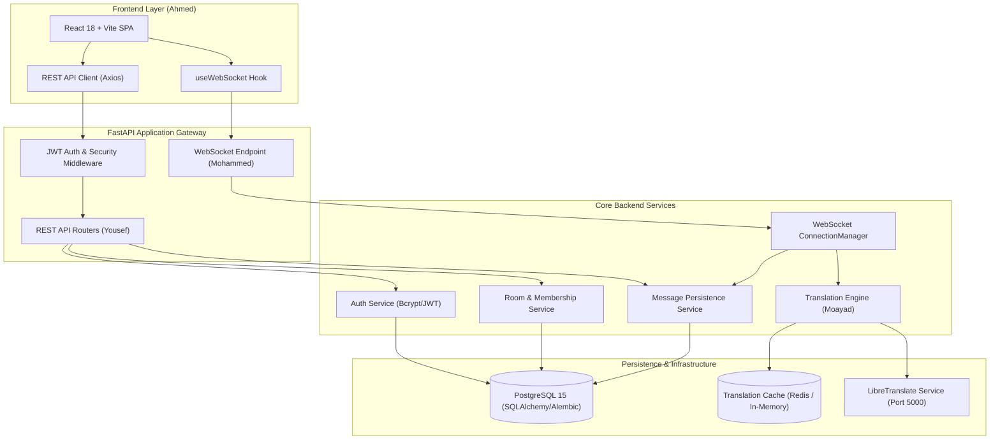

# 🌐 فهرس وثائق وأدلة فريق LinguaChat (Notion Workspace Hub)

> 💡 **دليل التنسيق:** هذا المستند مخصص للنسخ المباشر إلى Notion كصفحة رئيسية (Home Page / Hub) لإدارة وتوجيه أعضاء الفريق الأربعة.

---

## 👥 أعضاء الفريق والمسؤوليات الرسمية

| # | العضو | الدور الهندسي والوظيفي | نطاق الملكية البرمجية | دليل Notion المباشر |
|---|-------|------------------------|-----------------------|---------------------|
| 1 | **أحمد العماري** | قائد المشروع + مهندس واجهات المستخدم + التكامل النهائي والـ QA | `frontend/src/**`, `frontend/*` | [📘 دليل أحمد العماري](01_AHMED_NOTION_GUIDE.md) |
| 2 | **محمد الداعس** | مهندس الاتصال اللحظي وبروتوكول الـ WebSocket | `backend/app/websocket/**`, `backend/tests/websocket/**` | [📗 دليل محمد الداعس](02_MOHAMMED_NOTION_GUIDE.md) |
| 3 | **مؤيد الصوفي** | مهندس خدمات الترجمة الذكية والكاش وكشف اللغات | `backend/app/translation/**`, `backend/tests/unit/test_translation*` | [📙 دليل مؤيد الصوفي](03_MOAYAD_NOTION_GUIDE.md) |
| 4 | **يوسف خيري** | مهندس النواة وقواعد البيانات والمصادقة والـ REST API | `backend/app/database/**`, `backend/app/auth/**`, `backend/app/rooms/**`, `backend/app/messages/**`, `backend/app/dashboard/**`, `backend/alembic/**` | [📕 دليل يوسف خيري](04_YOUSEF_NOTION_GUIDE.md) |

---

## 🏗️ المعمارية الهندسية الموحدة للمشروع (Unified System Architecture)

---

## 📜 المبادئ الخمسة الصارمة للمشروع (The 5 Golden Rules)

> ⚠️ **تنبيه حرج لجميع الأعضاء:** مخالفة أي بند من هذه البنود يؤدي إلى رفض التسليم آلياً.

1. **عزل الملكية التام (Zero Cross-Editing):** لا يحق لأي مطور لمس أو تعديل أي ملف يقع خارج مجلداته المصرحة.
2. **تجميد العقود الرسمية (Frozen Contracts):** ممنوع تغيير أسماء مسارات الـ REST، أو أنواع رسائل الـ WebSocket الستة، أو أسماء حقول الجداول.
3. **قاعدة الترجمة الحتمية (Identity Rule):** يُحظر استخدام القيمة `"none"` نهائياً؛ عند تطابق لغة المصدر والهدف، تكون النتيجة الحتمية: `source_used = "identity"` و `confidence = 1.0`.
4. **حظر المفاتيح الثابتة (Zero Secrets in Code):** تُقرأ جميع القيم الحساسة من ملف `.env` عبر `app.core.config.settings`.
5. **قاعدة الـ Stop & Fail:** إذا فشل أي اختبار في `02_TEST_IDE.md`، يُمنع الانتقال للمهمة التالية حتى تصبح النتيجة خضراء `PASSED`.

---

## 📂 خريطة الوثائق والملفات المرجعية

- **الدستور وقواعد الفريق:** `_TEAM/00_SHARED/PROJECT_CONSTITUTION.md`
- **المعمارية الشاملة:** `_TEAM/00_SHARED/SYSTEM_ARCHITECTURE.md`
- **عقد الـ REST API:** `_TEAM/00_SHARED/API_CONTRACT.md`
- **عقد الـ WebSocket:** `_TEAM/00_SHARED/WEBSOCKET_CONTRACT.md`
- **عقد قاعدة البيانات:** `_TEAM/00_SHARED/DATABASE_CONTRACT.md`
- **عقد الترجمة والكاش:** `_TEAM/00_SHARED/TRANSLATION_CONTRACT.md`
- **عقد الأمان والتشفير:** `_TEAM/00_SHARED/SECURITY_CONTRACT.md`

---

## 📊 لوحة متابعة إنجاز الفريق (Global Progress Tracker)

- [ ] **أحمد العماري (Ahmed):** 11 مهام (من TASK-01 إلى TASK-11)
- [ ] **محمد الداعس (Mohammed):** 11 مهام (من TASK-01 إلى TASK-11)
- [ ] **مؤيد الصوفي (Moayad):** 9 مهام (من TASK-01 إلى TASK-09)
- [ ] **يوسف خيري (Yousef):** 12 مهام (من TASK-01 إلى TASK-12)
- **المجموع الكلي:** 43 مهمة هندسية موزعة ومنضبطة بالكامل.
