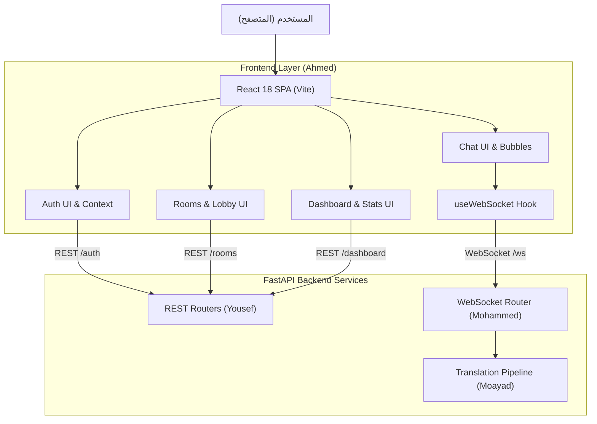
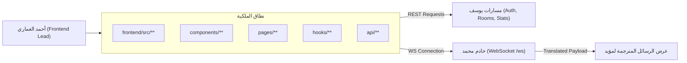
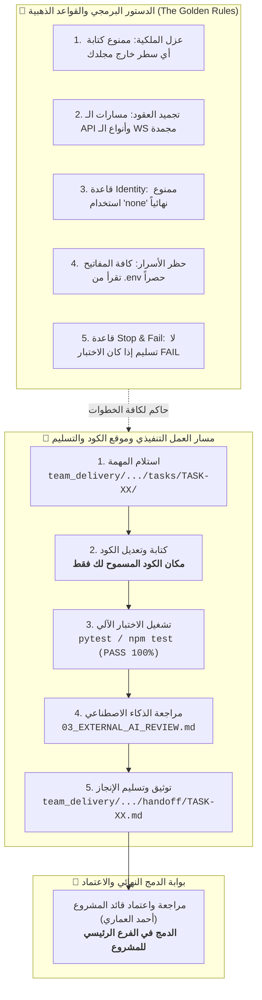
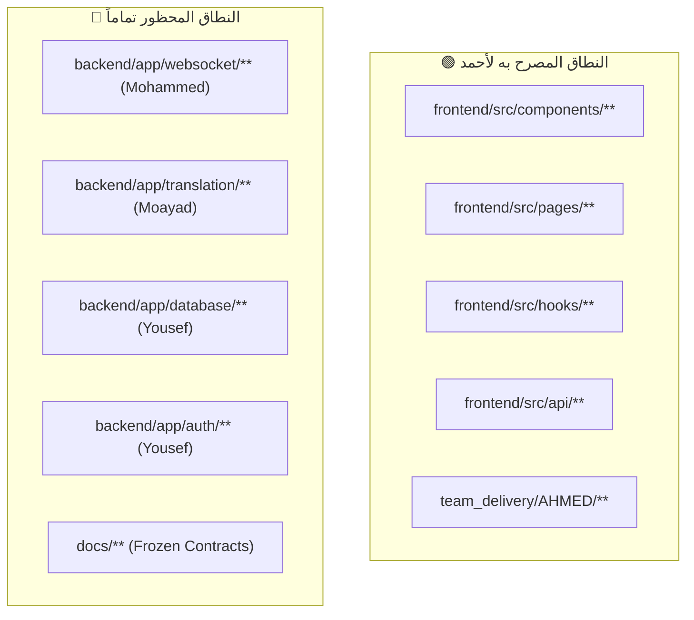
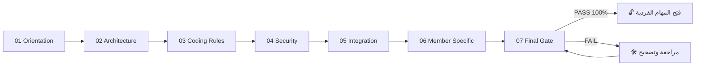
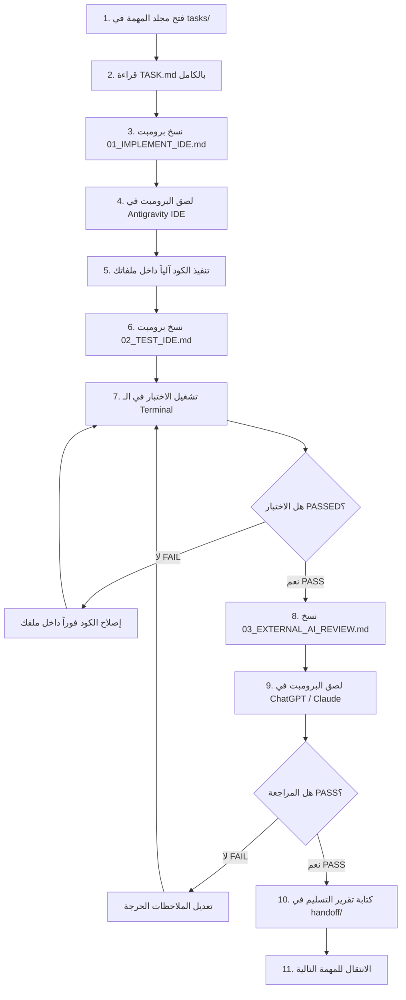
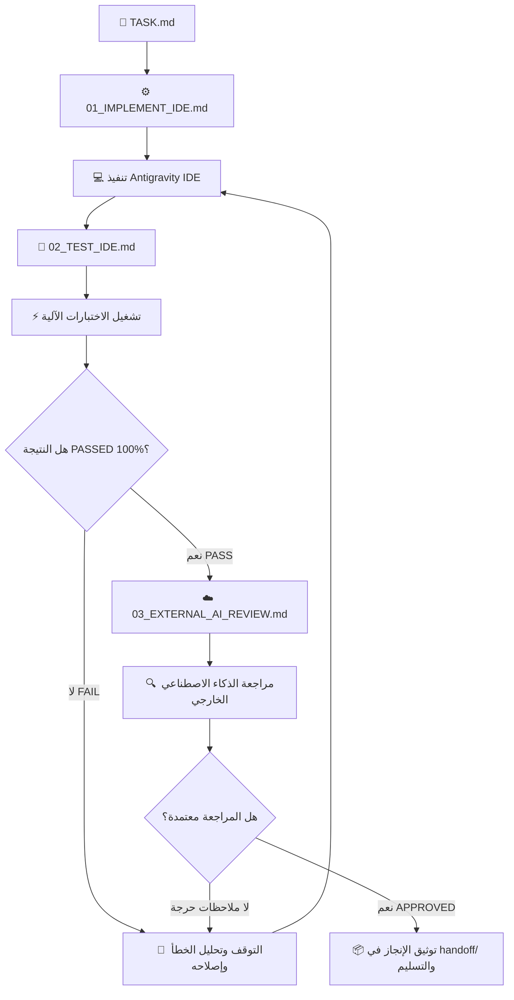
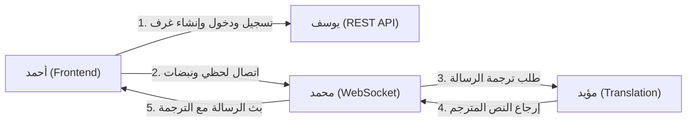
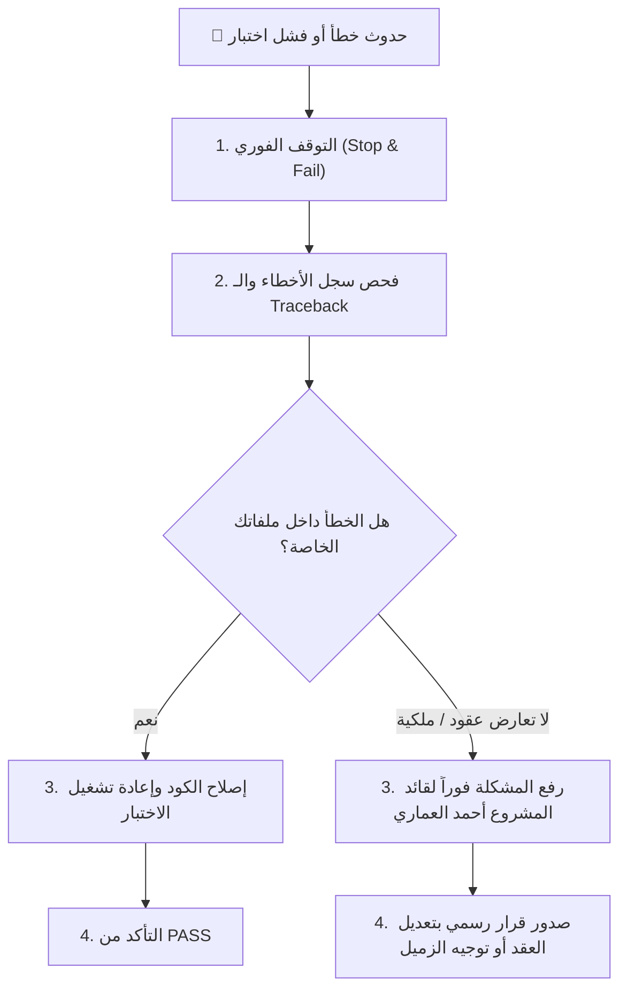
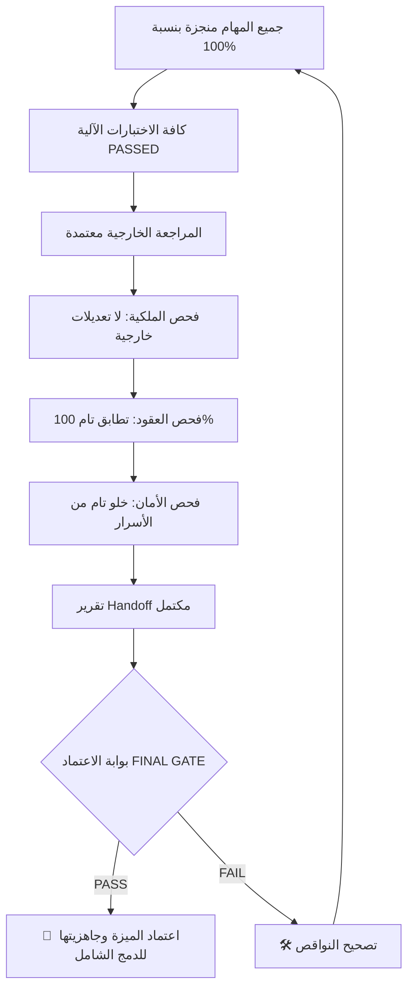

# 📘 دليل العمل الكامل — أحمد العماري (Ahmed Alammari)

## 👤 العضو
**أحمد العماري (Ahmed Alammari)**

## 🎯 الدور
**قائد المشروع + مهندس واجهات المستخدم (Frontend Lead) + التكامل النهائي والـ QA**

## 📦 نطاق العمل والملكية البرمجية
`frontend/src/**, frontend/*, _TEAM/AHMED/**, team_delivery/AHMED/**`

## 🚦 الحالة الحالية للمهام
- **ما تم إنجازه:** تجهيز البنية التحتية، الفهرسة، وهياكل المهام الـ 11 بالكامل.
- **ما لم يبدأ بعد:** تنفيذ واجهات React وربط خطاف الـ WebSocket وشاشات المحادثة والداشبورد.
- **ما ينتظر أعضاء آخرين:** اكتمال مسارات الـ REST من يوسف، ونقطة اتصال الـ WebSocket من محمد.

---

# 📑 فهرس الدليل

1. [🏗️ 1. صورة النظام كاملة](#-1-صورة-النظام-كاملة)
2. [🧭 2. مكان العضو داخل المعمارية](#-2-مكان-العضو-داخل-المعمارية)
3. [📜 3. الميثاق البصري للقواعد الذهبية ومسار التنفيذ والتسليم](#-3-الميثاق-البصري-للقواعد-الذهبية-ومسار-التنفيذ-والتسليم)
4. [🔐 4. حدود الملكية البرمجية](#-4-حدود-الملكية-البرمجية)
5. [📊 5. جدول الحصر التنفيذي لمهام العضو ومكان الكود ومسار التسليم](#-5-جدول-الحصر-التنفيذي-لمهام-العضو-ومكان-الكود-ومسار-التسليم)
6. [📚 6. الملفات المشتركة التي يجب قراءتها](#-6-الملفات-المشتركة-التي-يجب-قراءتها)
7. [🧱 7. مراحل التأسيس المشترك COMMON FOUNDATION](#-7-مراحل-التأسيس-المشترك-common-foundation)
8. [🤖 8. طريقة استخدام Antigravity IDE](#-8-طريقة-استخدام-antigravity-ide)
9. [🔄 9. دورة تنفيذ المهمة الواحدة](#-9-دورة-تنفيذ-المهمة-الواحدة)
10. [🧩 10. شرح المهام تفصيلياً خطوة بخطوة](#-10-شرح-المهام-تفصيلياً-خطوة-بخطوة)
11. [🧪 11. منظومة الاختبارات وطريقة التشغيل](#-11-منظومة-الاختبارات-وطريقة-التشغيل)
12. [🛡️ 12. الضوابط والمتطلبات الأمنية](#-12-الضوابط-والمتطلبات-الأمنية)
13. [🔌 13. مصفوفة التكامل والاعتمادية مع بقية الفريق](#-13-مصفوفة-التكامل-والاعتمادية-مع-بقية-الفريق)
14. [🚨 14. الحالات الحدية والمشاكل المحتملة](#-14-الحالات-الحدية-والمشاكل-المحتملة)
15. [🛑 15. بروتوكول التصعيد والتعامل مع الأخطاء](#-15-بروتوكول-التصعيد-والتعامل-مع-الأخطاء)
16. [📦 16. بروتوكول التسليم والاعتماد النهائي](#-16-بروتوكول-التسليم-والاعتماد-النهائي)
17. [📊 17. لوحة تتبع الإنجاز (Progress Tracker)](#-17-لوحة-تتبع-الإنجاز-progress-tracker)
18. [🏁 18. بوابة الاعتماد النهائي (FINAL GATE)](#-18-بوابة-الاعتماد-النهائي-final-gate)

---

# 🏗️ 1. صورة النظام كاملة

مشروع **LinguaChat** هو منصة محادثة جماعية فورية متعددة اللغات قائمة على معمارية معزولة تعتمد على FastAPI في الباك إند، React في الواجهة الأمامية، LibreTranslate لخدمات الترجمة الذكية، و PostgreSQL لحفظ البيانات.

### المشكلة التي يحلها النظام:
إتاحة المحادثة الفورية السلسة بين أشخاص يتحدثون لغات مختلفة، بحيث يكتب كل مستخدم بلغته الأم، ويستلم بقية الأعضاء الرسالة مترجمة تلقائياً إلى لغاتهم المفضلة في أجزاء من الثانية.



---

# 🧭 2. مكان العضو داخل المعمارية



---

# 📜 3. الميثاق البصري للقواعد الذهبية ومسار التنفيذ والتسليم

> 💡 **خريطة الطريق:** يوضح المخطط أدناه القواعد الصارمة الحاكمة لعملك، ومكان كتابة الكود، وكيفية فحص واختبار المهمة، وأين يتم تسليم التقرير النهائي تمهيداً للدمج في الفرع الرئيسي:



---

# 🔐 4. حدود الملكية البرمجية

> ⚠️ **تنبيه صارم:** لا يحق لك كتابة أو تعديل أي سطر برمجي خارج نطاق ملكيتك المباشرة المبينة في الجدول أدناه.

| المسار البرمجي | الحالة الرسمية | الشرح والمسؤولية |
|---|---|---|
| `frontend/src/**` | 🟢 مسموح ومملوك بالكامل | تطوير كافة مكونات وصفحات وهوكات الواجهة الأمامية |
| `frontend/package.json` | 🟢 مسموح | إدارة حزم الواجهة الأمامية (Vite, React, Lucide, Tailwind) |
| `team_delivery/AHMED/**` | 🟢 مسموح | تقارير التسليم والمراجعات الخاصة بأحمد |
| `backend/**` | 🔴 ممنوع منعاً باتاً | ملكية مطوري الباك إند (محمد، مؤيد، يوسف) |
| `_TEAM/00_SHARED/**` | 🟡 قراءة فقط | العقود الرسمية المشتركة |
| `docs/**` | 🟡 قراءة فقط | وثائق المعمارية والمواصفات المجمدة |



---

# 📊 5. جدول الحصر التنفيذي لمهام العضو ومكان الكود ومسار التسليم

> 🎯 **جدول الإدارة السريع:** يلخص هذا الجدول لكافة المهام: رقم المهمة، الهدف الهندسي، مكان الملفات المستهدفة بالكود، أمر الاختبار المطلوب، ومسار تسليم التقرير النهائي في `handoff/`:

| # | المهمة | الهدف من المهمة | مكان الكود والملفات المستهدفة | أمر الاختبار | مسار التسليم بعد الإنجاز |
|---|---|---|---|---|---|
| 01 | **`TASK-01-FRONTEND-ANALYSIS`** | فحص معمارية الواجهة الأمامية، قراءة عقود الـ REST API والـ WebSocket، والتأكد من توافق حزم Vite و Tailwind و Lucide. | `frontend/src/README.md (أو تقرير التحليل)` | `npm run dev` | `team_delivery/AHMED/handoff/TASK-01-FRONTEND-ANALYSIS.md` |
| 02 | **`TASK-02-FRONTEND-FOUNDATION`** | إعداد هيكلية المجلدات في src/ (components, pages, hooks, api, context)، وضبط نظام التوجيه والتنسيقات الأساسية. | `frontend/src/App.jsx`<br>`frontend/src/index.css`<br>*(+1 ملفات أخرى)* | `npm run build` | `team_delivery/AHMED/handoff/TASK-02-FRONTEND-FOUNDATION.md` |
| 03 | **`TASK-03-API-CLIENT`** | إنشاء Axios/Fetch Client معياري يتعامل مع الـ Base URL، يضيف الـ Bearer Token تلقائياً، ويعالج أخطاء 401. | `frontend/src/api/client.js` | `فحص وتشغيل` | `team_delivery/AHMED/handoff/TASK-03-API-CLIENT.md` |
| 04 | **`TASK-04-AUTH-UI`** | تصميم وبرمجة شاشات الدخول والتسجيل، مع التحقق من الحقول في المتصفح وعرض رسائل الخطأ بوضوح. | `frontend/src/pages/LoginPage.jsx`<br>`frontend/src/pages/RegisterPage.jsx` | `فحص وتشغيل` | `team_delivery/AHMED/handoff/TASK-04-AUTH-UI.md` |
| 05 | **`TASK-05-ROOMS-UI`** | إنشاء شاشة اللوبي (Lobby) لعرض قائمة الغرف المتاحة، نموذج إنشاء غرفة جديدة، وزر الانضمام. | `frontend/src/pages/LobbyPage.jsx` | `فحص وتشغيل` | `team_delivery/AHMED/handoff/TASK-05-ROOMS-UI.md` |
| 06 | **`TASK-06-CHAT-UI`** | بناء الشاشة المركزية للمحادثة: شريط العنوان، قائمة الرسائل المترجمة والأصلية، مربع الإدخال، وقائمة المتصلين. | `frontend/src/pages/ChatPage.jsx` | `فحص وتشغيل` | `team_delivery/AHMED/handoff/TASK-06-CHAT-UI.md` |
| 07 | **`TASK-07-WEBSOCKET-CLIENT`** | إنشاء Custom Hook `useWebSocket` للاتصال بمسار الـ WS، إرسال نبضات Heartbeat كل 30s، وإعادة الاتصال التلقائي. | `frontend/src/hooks/useWebSocket.js` | `فحص وتشغيل` | `team_delivery/AHMED/handoff/TASK-07-WEBSOCKET-CLIENT.md` |
| 08 | **`TASK-08-DASHBOARD-UI`** | تصميم شاشة إحصائيات النظام لعرض عدد المستخدمين، الغرف، إجمالي الرسائل، ومعدلات الترجمة والكاش. | `frontend/src/pages/DashboardPage.jsx` | `فحص وتشغيل` | `team_delivery/AHMED/handoff/TASK-08-DASHBOARD-UI.md` |
| 09 | **`TASK-09-FRONTEND-ERROR-STATES`** | بناء نظام إشعارات منبثقة (Toasts) ومكونات معالجة حالات الخطأ (Error Boundaries & Fallbacks). | `frontend/src/App.jsx` | `فحص وتشغيل` | `team_delivery/AHMED/handoff/TASK-09-FRONTEND-ERROR-STATES.md` |
| 10 | **`TASK-10-FRONTEND-FINAL-QA`** | إجراء فحص شامل لجميع شاشات الواجهة، التأكد من عدم وجود أخطاء في الـ Console، وتجاوب التصميم على الهواتف والأجهزة اللوحية. | `frontend/src/**` | `فحص وتشغيل` | `team_delivery/AHMED/handoff/TASK-10-FRONTEND-FINAL-QA.md` |
| 11 | **`TASK-11-FINAL-INTEGRATION`** | بصفتك قائد المشروع: الإشراف على دمج كافة أجزاء الفريق، تشغيل النظام بالكامل، والتأكد من عمل دورة المحادثة والترجمة والـ REST من البداية للنهاية. | `README.md`<br>`team_delivery/AHMED/reviews/FINAL_INTEGRATION_REPORT.md` | `فحص وتشغيل` | `team_delivery/AHMED/handoff/TASK-11-FINAL-INTEGRATION.md` |

---

# 📚 6. الملفات المشتركة التي يجب قراءتها

### 1. يجب قراءته أولاً (Mandatory First)
- **`_TEAM/00_SHARED/PROJECT_CONSTITUTION.md`**: دستور المشروع وقواعد عزل التعديلات.
- **`_TEAM/00_SHARED/API_CONTRACT.md`**: عقود مسارات الـ REST API للربط مع الباك إند.
- **`_TEAM/00_SHARED/WEBSOCKET_CONTRACT.md`**: عقد بروتوكول الـ WebSocket والأنواع الستة.

### 2. يجب قراءته قبل التنفيذ (Before Implementation)
- **`_TEAM/00_SHARED/CODING_RULES.md`**: معايير كود React و JavaScript وإدارة الحالة.
- **`_TEAM/00_SHARED/INTEGRATION_RULES.md`**: قواعد تكامل الواجهة مع الباك إند.

### 3. مرجع مستمر أثناء العمل (Ongoing Reference)
- **`_TEAM/00_SHARED/SECURITY_CONTRACT.md`**: قواعد تخزين الـ JWT والتعامل مع التوكنات.
- **`_TEAM/00_SHARED/DELIVERY_RULES.md`**: معايير الفحص النهائي والتسليم.

### 4. محظور التعديل (Never Edit)
- **`docs/**`**: العقود الأصلية المجمدة.

---

# 🧱 7. مراحل التأسيس المشترك COMMON FOUNDATION

قبل البدء في تنفيذ المهام الفردية، يمر العضو بمراحل التأسيس السبع لضمان استيعاب كافة القواعد والعقود:



- **01 Orientation:** فهم شامل لأهداف LinguaChat كمنصة محادثة متعددة اللغات.
- **02 Architecture:** استيعاب دور الواجهة كـ Single Page Application مبنية بـ React 18.
- **03 Coding Rules:** الالتزام بفصل المكونات والـ Custom Hooks والتنسيق النظيف.
- **04 Security:** عدم تسريب التوكنات ومعالجة حالات انتهاء الصلاحية 401.
- **05 Integration:** مطابقة نماذج الاستجابة `data/error` وتمرير معلمات الـ WebSocket بدقة.
- **06 Frontend Specific:** معالجة حالات التحميل والأخطاء وشاشات الفراغ.
- **07 Final Gate:** التحقق من خلو الواجهة من أي أخطاء بالـ Console ونجاح البناء الإنتاجي.

---

# 🤖 8. طريقة استخدام Antigravity IDE

اتبع هذا الدليل التفاعلي خطوة بخطوة عند تنفيذ أي مهمة داخل الـ IDE:



### الخطوات التفصيلية للعمل:
1. **افتح مجلد المهمة:** توجه إلى `team_delivery/AHMED/tasks/<TASK_ID>/`.
2. **اقرأ ملف `TASK.md`:** افهم الهدف، الملفات المسموحة والمحظورة، وشروط النجاح.
3. **انسخ محتوى `01_IMPLEMENT_IDE.md` بالكامل:** أرسله لمحادثة Antigravity IDE.
4. **دع الـ IDE ينفذ الكود:** راقب التعديلات وتأكد أنها تمت فقط داخل ملفاتك المصرحة.
5. **افتح `02_TEST_IDE.md`:** انسخ أمر الاختبار وشغله في الـ Terminal.
6. **تحقق من النتيجة:** ممنوع الانتقال إذا كانت النتيجة `FAIL`. أصلح الكود حتى يصبح `PASSED` باللون الأخضر.
7. **افتح `03_EXTERNAL_AI_REVIEW.md`:** انسخ البرومبت وافحصه عبر ذكاء اصطناعي خارجي مستقل.
8. **وثق الإنجاز:** أنشئ تقرير المهمة في مجلد `handoff/` وانتقل للمهمة التالية.

---

# 🔄 9. دورة تنفيذ المهمة الواحدة



---

# 🧩 10. شرح المهام تفصيلياً خطوة بخطوة

### 📌 TASK-01-FRONTEND-ANALYSIS — تحليل متطلبات الواجهة وهيكلية React ودراسة العقود

#### 🎯 الهدف الأساسي
فحص معمارية الواجهة الأمامية، قراءة عقود الـ REST API والـ WebSocket، والتأكد من توافق حزم Vite و Tailwind و Lucide.

#### 📁 مكان الكود والملفات التي سيتم تعديلها (Code Location)
- `frontend/src/README.md (أو تقرير التحليل)`

#### 📄 الملفات المتوقع إنشاؤها
- `team_delivery/AHMED/reviews/TASK-01-ANALYSIS-REPORT.md`

#### 🔒 الملفات الممنوع لمسها أو تعديلها
- `backend/**`
- `docs/**`

#### 🔗 الاعتماديات والعقود المرجعية
- `_TEAM/00_SHARED/API_CONTRACT.md`
- `_TEAM/00_SHARED/WEBSOCKET_CONTRACT.md`

#### 🧠 ماذا يجب أن يفهم المطور قبل التنفيذ؟
فهم تدفق البيانات: كيف يرسل المتصفح طلبات REST للمصادقة والغرف، وكيف يستقبل الرسائل اللحظية عبر WebSocket مع نصوصها المترجمة.

#### ⚙️ ماذا سينفذ Antigravity IDE تلقائياً؟
قراءة ملفات package.json و src/ ودراسة نقاط التكامل مع السيرفر.

#### 🧪 ماذا سيختبر المطور في خطوة الفحص؟
التأكد من تشغيل بيئة التطوير `npm run dev` بنجاح دون أي خطأ في البناء.

#### ☁️ ماذا ستراجع أداة الذكاء الاصطناعي الخارجية (Cloud AI Review)؟
مراجعة شمولية تقرير التحليل والتأكد من استيعاب كافة حالات الواجهة.

#### ⚠️ الحالات الحدية والطرفية (Edge Cases)
تضارب إصدارات حزم npm، اختلاف منافذ الخادم المحلي (5173 للواجهة و 8000 للباك إند).

#### 🔐 المتطلبات والضوابط الأمنية
عدم كتابة أي مفاتيح سرية في الواجهة، تخزين الـ JWT في التخزين المحلي واستخدامه في ترويسة Authorization.

#### 🔌 متطلبات التكامل والربط مع الفريق
استقبال نماذج الاستجابة المعيارية من يوسف، ونماذج رسائل المحادثة اللحظية من محمد.

#### ✅ شروط النجاح والانتقال للمهمة التالية (Success Criteria)
- [ ] تقرير التحليل مكتمل ومطابق للعقود
- [ ] بيئة Vite جاهزة للعمل

#### ❌ متى تتوقف فوراً وتمنع إكمال العمل؟ (Stop & Fail Triggers)
- 🛑 محاولة تعديل أي ملف في الباك إند
- 🛑 تغيير أسماء حقول العقود

#### 📦 مسار التسليم وماذا يتم توثيقه عند الانتهاء (Handoff Destination)
**أين تسلم بعد الإنجاز؟** `team_delivery/AHMED/handoff/TASK-01-FRONTEND-ANALYSIS.md`  
**محتوى التسليم:** تقرير التحليل معتمد في مجلد reviews/.

---

### 📌 TASK-02-FRONTEND-FOUNDATION — تأسيس بنية الواجهة ونظام التوجيه React Router وتنسيقات التصميم

#### 🎯 الهدف الأساسي
إعداد هيكلية المجلدات في src/ (components, pages, hooks, api, context)، وضبط نظام التوجيه والتنسيقات الأساسية.

#### 📁 مكان الكود والملفات التي سيتم تعديلها (Code Location)
- `frontend/src/App.jsx`
- `frontend/src/index.css`
- `frontend/src/main.jsx`

#### 📄 الملفات المتوقع إنشاؤها
- `frontend/src/routes/AppRoutes.jsx`
- `frontend/src/context/AuthContext.jsx`

#### 🔒 الملفات الممنوع لمسها أو تعديلها
- `backend/**`
- `docs/**`

#### 🔗 الاعتماديات والعقود المرجعية
- `frontend/package.json`
- `_TEAM/00_SHARED/CODING_RULES.md`

#### 🧠 ماذا يجب أن يفهم المطور قبل التنفيذ؟
فهم هيكل الصفحات: صفحة تسجيل الدخول، التسجيل، اللوبي/الغرف، وغرفة المحادثة.

#### ⚙️ ماذا سينفذ Antigravity IDE تلقائياً؟
بناء المكونات الأساسية وتوفير مزود المصادقة AuthProvider وموجه الصفحات المحمية PrivateRoutes.

#### 🧪 ماذا سيختبر المطور في خطوة الفحص؟
تشغيل `npm run build` والتأكد من عدم وجود أخطاء استيراد أو بناء.

#### ☁️ ماذا ستراجع أداة الذكاء الاصطناعي الخارجية (Cloud AI Review)؟
مراجعة جودة كود React وتطبيق أفضل الممارسات في الـ Hooks وإدارة الحالة.

#### ⚠️ الحالات الحدية والطرفية (Edge Cases)
محاولة دخول صفحة محمية بدون تسجيل دخول (يجب إعادة التوجيه لـ /login فوراً).

#### 🔐 المتطلبات والضوابط الأمنية
التحقق من حالة المصادقة محلياً قبل فتح شاشات الغرف.

#### 🔌 متطلبات التكامل والربط مع الفريق
تجهيز البنية لاستقبال دوال استدعاء الـ API من العميل.

#### ✅ شروط النجاح والانتقال للمهمة التالية (Success Criteria)
- [ ] التوجيه يعمل بسلاسة
- [ ] الحالة العامة للمستخدم مهيأة
- [ ] البناء ناجح 100%

#### ❌ متى تتوقف فوراً وتمنع إكمال العمل؟ (Stop & Fail Triggers)
- 🛑 فشل البناء في Vite
- 🛑 تضمين أكواد خارج نطاق مجلد frontend/src

#### 📦 مسار التسليم وماذا يتم توثيقه عند الانتهاء (Handoff Destination)
**أين تسلم بعد الإنجاز؟** `team_delivery/AHMED/handoff/TASK-02-FRONTEND-FOUNDATION.md`  
**محتوى التسليم:** ملفات التأسيس ونظام التوجيه والـ AuthContext.

---

### 📌 TASK-03-API-CLIENT — بناء عميل الـ REST API المعياري والـ Interceptors

#### 🎯 الهدف الأساسي
إنشاء Axios/Fetch Client معياري يتعامل مع الـ Base URL، يضيف الـ Bearer Token تلقائياً، ويعالج أخطاء 401.

#### 📁 مكان الكود والملفات التي سيتم تعديلها (Code Location)
- `frontend/src/api/client.js`

#### 📄 الملفات المتوقع إنشاؤها
- `frontend/src/api/auth.js`
- `frontend/src/api/rooms.js`
- `frontend/src/api/stats.js`

#### 🔒 الملفات الممنوع لمسها أو تعديلها
- `backend/**`
- `docs/**`

#### 🔗 الاعتماديات والعقود المرجعية
- `_TEAM/00_SHARED/API_CONTRACT.md`

#### 🧠 ماذا يجب أن يفهم المطور قبل التنفيذ؟
فهم نموذج الاستجابة المعياري: data/error، والتعامل مع الأخطاء (400, 401, 403, 404, 409).

#### ⚙️ ماذا سينفذ Antigravity IDE تلقائياً؟
بناء الـ Interceptors لإرفاق الـ Authorization Header، ومسح التوكن عند تلقي 401 وإعادة التوجيه لصفحة الدخول.

#### 🧪 ماذا سيختبر المطور في خطوة الفحص؟
اختبار استدعاءات الـ API الوهمية وفحص معالجة الأخطاء والـ Headers.

#### ☁️ ماذا ستراجع أداة الذكاء الاصطناعي الخارجية (Cloud AI Review)؟
مراجعة سلامة معالجة استثناءات الشبكة والـ Token Handling.

#### ⚠️ الحالات الحدية والطرفية (Edge Cases)
فشل الاتصال بالإنترنت Network Error، توكن منتهي الصلاحية أثناء الاستدعاء.

#### 🔐 المتطلبات والضوابط الأمنية
منع طباعة التوكن في الـ Console في بيئة الإنتاج.

#### 🔌 متطلبات التكامل والربط مع الفريق
تطابق تام مع مسارات يوسف خيري في الباك إند.

#### ✅ شروط النجاح والانتقال للمهمة التالية (Success Criteria)
- [ ] العميل يرسل التوكن تلقائياً
- [ ] معالجة 401 تؤدي إلى logout تلقائي
- [ ] الاستجابات موحدة

#### ❌ متى تتوقف فوراً وتمنع إكمال العمل؟ (Stop & Fail Triggers)
- 🛑 عدم الالتزام بمسارات الـ API الرسمية
- 🛑 تعديل نماذج الباك إند

#### 📦 مسار التسليم وماذا يتم توثيقه عند الانتهاء (Handoff Destination)
**أين تسلم بعد الإنجاز؟** `team_delivery/AHMED/handoff/TASK-03-API-CLIENT.md`  
**محتوى التسليم:** طبقة الـ API Client والخدمات المساعدة.

---

### 📌 TASK-04-AUTH-UI — بناء واجهات تسجيل الدخول والتسجيل واختيار اللغة المفضلة

#### 🎯 الهدف الأساسي
تصميم وبرمجة شاشات الدخول والتسجيل، مع التحقق من الحقول في المتصفح وعرض رسائل الخطأ بوضوح.

#### 📁 مكان الكود والملفات التي سيتم تعديلها (Code Location)
- `frontend/src/pages/LoginPage.jsx`
- `frontend/src/pages/RegisterPage.jsx`

#### 📄 الملفات المتوقع إنشاؤها
- `frontend/src/components/auth/AuthForm.jsx`
- `frontend/src/components/common/LanguageSelector.jsx`

#### 🔒 الملفات الممنوع لمسها أو تعديلها
- `backend/**`
- `docs/**`

#### 🔗 الاعتماديات والعقود المرجعية
- `frontend/src/api/auth.js`
- `_TEAM/00_SHARED/API_CONTRACT.md`

#### 🧠 ماذا يجب أن يفهم المطور قبل التنفيذ؟
المستخدم يسجل اسمه وكلمة مروره ولغته المفضلة (ar, en, fr, es, de, etc.) ويحصل على JWT.

#### ⚙️ ماذا سينفذ Antigravity IDE تلقائياً؟
بناء النماذج وتفعيل حالات التحميل Loading ومؤشرات التنبيه بالأخطاء (401 invalid credentials, 409 user exists).

#### 🧪 ماذا سيختبر المطور في خطوة الفحص؟
تجربة إدخال بيانات صحيحة وخاطئة وفحص الاستجابة والتنقل لصفحة الغرف.

#### ☁️ ماذا ستراجع أداة الذكاء الاصطناعي الخارجية (Cloud AI Review)؟
مراجعة تجربة المستخدم UX وتجاوب التصميم على الشاشات المختلفة.

#### ⚠️ الحالات الحدية والطرفية (Edge Cases)
حقول فارغة، كلمات مرور قصيرة، اسم مستخدم مكرر، انقطاع الخادم.

#### 🔐 المتطلبات والضوابط الأمنية
إخفاء حقل كلمة المرور، عدم حفظ كلمة المرور في أي مكان بالمتصفح.

#### 🔌 متطلبات التكامل والربط مع الفريق
تكامل مع `/api/v1/auth/register` و `/api/v1/auth/login` الخاصة بيوسف.

#### ✅ شروط النجاح والانتقال للمهمة التالية (Success Criteria)
- [ ] تسجيل الدخول والتسجيل يعملان بسلاسة
- [ ] حفظ الـ Token واللغة بنجاح
- [ ] التحقق يعمل بدقة

#### ❌ متى تتوقف فوراً وتمنع إكمال العمل؟ (Stop & Fail Triggers)
- 🛑 تجاوز رسائل الخطأ القادمة من الباك إند

#### 📦 مسار التسليم وماذا يتم توثيقه عند الانتهاء (Handoff Destination)
**أين تسلم بعد الإنجاز؟** `team_delivery/AHMED/handoff/TASK-04-AUTH-UI.md`  
**محتوى التسليم:** واجهات المصادقة واختيار اللغة.

---

### 📌 TASK-05-ROOMS-UI — بناء واجهات استعراض الغرف، إنشائها، والانضمام إليها

#### 🎯 الهدف الأساسي
إنشاء شاشة اللوبي (Lobby) لعرض قائمة الغرف المتاحة، نموذج إنشاء غرفة جديدة، وزر الانضمام.

#### 📁 مكان الكود والملفات التي سيتم تعديلها (Code Location)
- `frontend/src/pages/LobbyPage.jsx`

#### 📄 الملفات المتوقع إنشاؤها
- `frontend/src/components/rooms/RoomList.jsx`
- `frontend/src/components/rooms/CreateRoomModal.jsx`
- `frontend/src/components/rooms/RoomCard.jsx`

#### 🔒 الملفات الممنوع لمسها أو تعديلها
- `backend/**`
- `docs/**`

#### 🔗 الاعتماديات والعقود المرجعية
- `frontend/src/api/rooms.js`
- `_TEAM/00_SHARED/API_CONTRACT.md`

#### 🧠 ماذا يجب أن يفهم المطور قبل التنفيذ؟
عرض اسم الغرفة، لغة الغرفة، عدد الأعضاء، وحالة الانضمام.

#### ⚙️ ماذا سينفذ Antigravity IDE تلقائياً؟
جلب قائمة الغرف، تحديث القائمة فور إنشاء غرفة، والانتقال لصفحة المحادثة `/chat/:roomId`.

#### 🧪 ماذا سيختبر المطور في خطوة الفحص؟
اختبار إنشاء غرفة، فحص التجاوب والتأكد من معالجة حالة القائمة الفارغة Empty State.

#### ☁️ ماذا ستراجع أداة الذكاء الاصطناعي الخارجية (Cloud AI Review)؟
مراجعة أداء المكونات وتجنب الـ Re-renders غير الضرورية.

#### ⚠️ الحالات الحدية والطرفية (Edge Cases)
اسم غرفة مكرر، قائمة غرف فارغة، محاولة دخول غرفة محذوفة.

#### 🔐 المتطلبات والضوابط الأمنية
التحقق من صلاحية الجلسة قبل إرسال طلب إنشاء غرفة.

#### 🔌 متطلبات التكامل والربط مع الفريق
استدعاء مسارات `/api/v1/rooms` و `/api/v1/rooms/{id}/join` الخاصة بيوسف.

#### ✅ شروط النجاح والانتقال للمهمة التالية (Success Criteria)
- [ ] استعراض وإنشاء الغرف يعمل بنجاح
- [ ] الانتقال السلس لغرفة الشات

#### ❌ متى تتوقف فوراً وتمنع إكمال العمل؟ (Stop & Fail Triggers)
- 🛑 عدم إظهار حالات التحميل أو الخطأ

#### 📦 مسار التسليم وماذا يتم توثيقه عند الانتهاء (Handoff Destination)
**أين تسلم بعد الإنجاز؟** `team_delivery/AHMED/handoff/TASK-05-ROOMS-UI.md`  
**محتوى التسليم:** واجهات الغرف واللوبي.

---

### 📌 TASK-06-CHAT-UI — بناء واجهة المحادثة الرئيسية وعرض الرسائل المترجمة والفقاعات

#### 🎯 الهدف الأساسي
بناء الشاشة المركزية للمحادثة: شريط العنوان، قائمة الرسائل المترجمة والأصلية، مربع الإدخال، وقائمة المتصلين.

#### 📁 مكان الكود والملفات التي سيتم تعديلها (Code Location)
- `frontend/src/pages/ChatPage.jsx`

#### 📄 الملفات المتوقع إنشاؤها
- `frontend/src/components/chat/MessageList.jsx`
- `frontend/src/components/chat/MessageBubble.jsx`
- `frontend/src/components/chat/MessageInput.jsx`
- `frontend/src/components/chat/OnlineUsers.jsx`

#### 🔒 الملفات الممنوع لمسها أو تعديلها
- `backend/**`
- `docs/**`

#### 🔗 الاعتماديات والعقود المرجعية
- `_TEAM/00_SHARED/WEBSOCKET_CONTRACT.md`
- `_TEAM/00_SHARED/TRANSLATION_CONTRACT.md`

#### 🧠 ماذا يجب أن يفهم المطور قبل التنفيذ؟
عرض فقاعة الرسالة بحيث تظهر النص المترجم بلغة المستخدم بخط واضح، مع إمكانية عرض النص الأصلي ومصدر الترجمة (libretranslate/cache/identity).

#### ⚙️ ماذا سينفذ Antigravity IDE تلقائياً؟
بناء الفقاعات، ضبط التمرير التلقائي لأسفل (Auto-scroll)، وعرض شارة مصدر الترجمة.

#### 🧪 ماذا سيختبر المطور في خطوة الفحص؟
تجربة إدخال رسائل متنوعة والتأكد من ضبط التمرير والتجاوب على الموبايل.

#### ☁️ ماذا ستراجع أداة الذكاء الاصطناعي الخارجية (Cloud AI Review)؟
مراجعة التصميم والطباعة وقراءة النصوص باللغتين العربية والإنجليزية بسلاسة (RTL/LTR).

#### ⚠️ الحالات الحدية والطرفية (Edge Cases)
رسائل طويلة جداً، نصوص عربية مختلطة بالإنجليزية، صور تعبيرية Emojis.

#### 🔐 المتطلبات والضوابط الأمنية
تعقيم النصوص وتجنب ثغرات XSS عبر استخدام معالجة React الآمنة للنصوص.

#### 🔌 متطلبات التكامل والربط مع الفريق
استقبال بيانات الرسائل من خطاف الـ WebSocket الخاص بمحمد الداعس.

#### ✅ شروط النجاح والانتقال للمهمة التالية (Success Criteria)
- [ ] واجهة المحادثة أنيقة ومتكاملة
- [ ] عرض الترجمة والأصل واضح
- [ ] التمرير التلقائي يعمل بدقة

#### ❌ متى تتوقف فوراً وتمنع إكمال العمل؟ (Stop & Fail Triggers)
- 🛑 عرض نصوص غير معقمة أو كسر التصميم عند النصوص الطويلة

#### 📦 مسار التسليم وماذا يتم توثيقه عند الانتهاء (Handoff Destination)
**أين تسلم بعد الإنجاز؟** `team_delivery/AHMED/handoff/TASK-06-CHAT-UI.md`  
**محتوى التسليم:** واجهة المحادثة وفقاعات الرسائل وقائمة المتصلين.

---

### 📌 TASK-07-WEBSOCKET-CLIENT — بناء خطاف React للـ WebSocket وإدارة الاتصال اللحظي والنبضات

#### 🎯 الهدف الأساسي
إنشاء Custom Hook `useWebSocket` للاتصال بمسار الـ WS، إرسال نبضات Heartbeat كل 30s، وإعادة الاتصال التلقائي.

#### 📁 مكان الكود والملفات التي سيتم تعديلها (Code Location)
- `frontend/src/hooks/useWebSocket.js`

#### 📄 الملفات المتوقع إنشاؤها
- `frontend/src/utils/wsHelpers.js`

#### 🔒 الملفات الممنوع لمسها أو تعديلها
- `backend/**`
- `docs/**`

#### 🔗 الاعتماديات والعقود المرجعية
- `_TEAM/00_SHARED/WEBSOCKET_CONTRACT.md`

#### 🧠 ماذا يجب أن يفهم المطور قبل التنفيذ؟
الاتصال بالمسار `ws://localhost:8000/ws/{room_id}?token={token}`، إرسال واستقبال الأنواع الستة: JOIN, LEAVE, TEXT_MESSAGE, TYPING, HEARTBEAT, ERROR.

#### ⚙️ ماذا سينفذ Antigravity IDE تلقائياً؟
بناء الخطاف مع Exponential Backoff لإعادة الاتصال، وإرسال HEARTBEAT كل 30 ثانية.

#### 🧪 ماذا سيختبر المطور في خطوة الفحص؟
محاكاة قطع الاتصال وإعادة وصله والتأكد من عدم تكرار الاتصالات (Clean Disconnect on unmount).

#### ☁️ ماذا ستراجع أداة الذكاء الاصطناعي الخارجية (Cloud AI Review)؟
مراجعة إدارة الذاكرة وتجنب Memory Leaks وتكرار الـ WebSockets المفتوحة.

#### ⚠️ الحالات الحدية والطرفية (Edge Cases)
انقطاع مفاجئ، إغلاق المتصفح، استلام كود إغلاق 4001 (Unauthorized) أو 4003 (Forbidden).

#### 🔐 المتطلبات والضوابط الأمنية
تمرير التوكن في query param بأمان وعدم تسريبه.

#### 🔌 متطلبات التكامل والربط مع الفريق
توافق تام 100% مع خادم WebSocket الخاص بمحمد الداعس.

#### ✅ شروط النجاح والانتقال للمهمة التالية (Success Criteria)
- [ ] الاتصال والنبضات وإعادة الاتصال تعمل بامتياز
- [ ] استقبال الرسائل وبثها لحظياً

#### ❌ متى تتوقف فوراً وتمنع إكمال العمل؟ (Stop & Fail Triggers)
- 🛑 حلقات إعادة اتصال لا نهائية تتسبب في تجميد المتصفح

#### 📦 مسار التسليم وماذا يتم توثيقه عند الانتهاء (Handoff Destination)
**أين تسلم بعد الإنجاز؟** `team_delivery/AHMED/handoff/TASK-07-WEBSOCKET-CLIENT.md`  
**محتوى التسليم:** خطاف useWebSocket المعتمد.

---

### 📌 TASK-08-DASHBOARD-UI — بناء واجهة لوحة التحكم ومقاييس النظام الحية (Dashboard UI)

#### 🎯 الهدف الأساسي
تصميم شاشة إحصائيات النظام لعرض عدد المستخدمين، الغرف، إجمالي الرسائل، ومعدلات الترجمة والكاش.

#### 📁 مكان الكود والملفات التي سيتم تعديلها (Code Location)
- `frontend/src/pages/DashboardPage.jsx`

#### 📄 الملفات المتوقع إنشاؤها
- `frontend/src/components/dashboard/StatCard.jsx`
- `frontend/src/components/dashboard/MetricsChart.jsx`

#### 🔒 الملفات الممنوع لمسها أو تعديلها
- `backend/**`
- `docs/**`

#### 🔗 الاعتماديات والعقود المرجعية
- `frontend/src/api/stats.js`
- `_TEAM/00_SHARED/API_CONTRACT.md`

#### 🧠 ماذا يجب أن يفهم المطور قبل التنفيذ؟
استدعاء `/api/v1/dashboard/stats` وتحديث المقاييس دورياً كل 10 ثوانٍ.

#### ⚙️ ماذا سينفذ Antigravity IDE تلقائياً؟
بناء بطاقات الإحصائيات مع مؤشرات بصرية ونسب مئوية لنسبة استخدام الكاش.

#### 🧪 ماذا سيختبر المطور في خطوة الفحص؟
فحص استجابة الواجهة وتحديث البيانات دون وميض الشاشة.

#### ☁️ ماذا ستراجع أداة الذكاء الاصطناعي الخارجية (Cloud AI Review)؟
مراجعة وضوح الأرقام والمقاييس وتناسق الألوان.

#### ⚠️ الحالات الحدية والطرفية (Edge Cases)
قيم إحصائية صفرية، تعطل مسار الإحصائيات.

#### 🔐 المتطلبات والضوابط الأمنية
التحقق من صلاحية المستخدم لعرض لوحة التحكم.

#### 🔌 متطلبات التكامل والربط مع الفريق
استقبال البيانات من مسار الإحصائيات الخاص بيوسف خيري.

#### ✅ شروط النجاح والانتقال للمهمة التالية (Success Criteria)
- [ ] لوحة التحكم تعرض المقاييس بدقة
- [ ] التحديث الدوري يعمل بسلاسة

#### ❌ متى تتوقف فوراً وتمنع إكمال العمل؟ (Stop & Fail Triggers)
- 🛑 عدم معالجة استجابة الـ API في حالة القيم الفارغة

#### 📦 مسار التسليم وماذا يتم توثيقه عند الانتهاء (Handoff Destination)
**أين تسلم بعد الإنجاز؟** `team_delivery/AHMED/handoff/TASK-08-DASHBOARD-UI.md`  
**محتوى التسليم:** صفحة لوحة التحكم ومكونات المقاييس.

---

### 📌 TASK-09-FRONTEND-ERROR-STATES — معالجة حالات الأخطاء الشاملة والإشعارات التفاعلية (Toasts & Errors)

#### 🎯 الهدف الأساسي
بناء نظام إشعارات منبثقة (Toasts) ومكونات معالجة حالات الخطأ (Error Boundaries & Fallbacks).

#### 📁 مكان الكود والملفات التي سيتم تعديلها (Code Location)
- `frontend/src/App.jsx`

#### 📄 الملفات المتوقع إنشاؤها
- `frontend/src/components/common/Toast.jsx`
- `frontend/src/components/common/ErrorBoundary.jsx`
- `frontend/src/components/common/LoadingSpinner.jsx`

#### 🔒 الملفات الممنوع لمسها أو تعديلها
- `backend/**`
- `docs/**`

#### 🔗 الاعتماديات والعقود المرجعية
- `_TEAM/00_SHARED/CODING_RULES.md`

#### 🧠 ماذا يجب أن يفهم المطور قبل التنفيذ؟
إشعار المستخدم فور حدوث أي خطأ بالشبكة أو رفض الطلب، وتوفير تجربة مستخدم راقية.

#### ⚙️ ماذا سينفذ Antigravity IDE تلقائياً؟
بناء Toast Provider و ErrorBoundary لالتقاط أي خطأ غير متوقع في React.

#### 🧪 ماذا سيختبر المطور في خطوة الفحص؟
تعمد إحداث خطأ وفحص ظهور شاشة الخطأ البديلة والإشعار المنبثق.

#### ☁️ ماذا ستراجع أداة الذكاء الاصطناعي الخارجية (Cloud AI Review)؟
مراجعة المتانة ومنع الشاشات البيضاء (No White Screen of Death).

#### ⚠️ الحالات الحدية والطرفية (Edge Cases)
أخطاء غير متوقعة في الـ Render، استجابات سيرفر بتنسيق غير متوقع.

#### 🔐 المتطلبات والضوابط الأمنية
عدم عرض تفاصيل الـ Stack Trace البرمجية للمستخدم العادي.

#### 🔌 متطلبات التكامل والربط مع الفريق
التقاط أخطاء جميع واجهات المشروع وتنسيقها.

#### ✅ شروط النجاح والانتقال للمهمة التالية (Success Criteria)
- [ ] نظام إشعارات يعمل بسلاسة
- [ ] حماية التطبيق من الانهيار بالكامل

#### ❌ متى تتوقف فوراً وتمنع إكمال العمل؟ (Stop & Fail Triggers)
- 🛑 ظهور شاشة بيضاء عند حدوث خطأ

#### 📦 مسار التسليم وماذا يتم توثيقه عند الانتهاء (Handoff Destination)
**أين تسلم بعد الإنجاز؟** `team_delivery/AHMED/handoff/TASK-09-FRONTEND-ERROR-STATES.md`  
**محتوى التسليم:** مكونات Toast و ErrorBoundary.

---

### 📌 TASK-10-FRONTEND-FINAL-QA — الفحص النهائي الشامل للواجهة واختبارات الأداء والتجاوب (Frontend Final QA)

#### 🎯 الهدف الأساسي
إجراء فحص شامل لجميع شاشات الواجهة، التأكد من عدم وجود أخطاء في الـ Console، وتجاوب التصميم على الهواتف والأجهزة اللوحية.

#### 📁 مكان الكود والملفات التي سيتم تعديلها (Code Location)
- `frontend/src/**`

#### 📄 الملفات المتوقع إنشاؤها
- `team_delivery/AHMED/reviews/FRONTEND_QA_REPORT.md`

#### 🔒 الملفات الممنوع لمسها أو تعديلها
- `backend/**`
- `docs/**`

#### 🔗 الاعتماديات والعقود المرجعية
- `_TEAM/00_SHARED/DELIVERY_RULES.md`

#### 🧠 ماذا يجب أن يفهم المطور قبل التنفيذ؟
التأكد من جاهزية الواجهة بنسبة 100% للدمج والتسليم.

#### ⚙️ ماذا سينفذ Antigravity IDE تلقائياً؟
فحص الـ Linting، تشغيل `npm run build`، والتحقق من حجم الحزمة وخلو الـ Console من التحذيرات.

#### 🧪 ماذا سيختبر المطور في خطوة الفحص؟
تشغيل حزمة الاختبارات وتأكيد نجاح البناء الإنتاجي.

#### ☁️ ماذا ستراجع أداة الذكاء الاصطناعي الخارجية (Cloud AI Review)؟
مراجعة معايير الجودة والـ Production Readiness.

#### ⚠️ الحالات الحدية والطرفية (Edge Cases)
تغير حجم الشاشة أثناء المحادثة، بطء استجابة الشبكة.

#### 🔐 المتطلبات والضوابط الأمنية
فحص نهائي لعدم وجود أي بيانات حساسة مسربة.

#### 🔌 متطلبات التكامل والربط مع الفريق
جاهزية الواجهة للربط الحي مع الباك إند.

#### ✅ شروط النجاح والانتقال للمهمة التالية (Success Criteria)
- [ ] البناء الإنتاجي ناجح 100%
- [ ] خلو تام من الأخطاء
- [ ] تقرير QA معتمد

#### ❌ متى تتوقف فوراً وتمنع إكمال العمل؟ (Stop & Fail Triggers)
- 🛑 وجود أي خطأ في الـ Console أو فشل البناء

#### 📦 مسار التسليم وماذا يتم توثيقه عند الانتهاء (Handoff Destination)
**أين تسلم بعد الإنجاز؟** `team_delivery/AHMED/handoff/TASK-10-FRONTEND-FINAL-QA.md`  
**محتوى التسليم:** تقرير الـ QA النهائي للواجهة.

---

### 📌 TASK-11-FINAL-INTEGRATION — التكامل النهائي ودمج منظومة الفريق الأربعة (Final Team Integration & QA)

#### 🎯 الهدف الأساسي
بصفتك قائد المشروع: الإشراف على دمج كافة أجزاء الفريق، تشغيل النظام بالكامل، والتأكد من عمل دورة المحادثة والترجمة والـ REST من البداية للنهاية.

#### 📁 مكان الكود والملفات التي سيتم تعديلها (Code Location)
- `README.md`
- `team_delivery/AHMED/reviews/FINAL_INTEGRATION_REPORT.md`

#### 📄 الملفات المتوقع إنشاؤها
- `team_delivery/FINAL_INTEGRATION_VERIFICATION.md`

#### 🔒 الملفات الممنوع لمسها أو تعديلها
- `تغيير المعمارية الرسمية أو كسر العقود`

#### 🔗 الاعتماديات والعقود المرجعية
- `جميع تسليمات محمد ومؤيد ويوسف`

#### 🧠 ماذا يجب أن يفهم المطور قبل التنفيذ؟
التحقق من أن النظام المتكامل (React + FastAPI + WebSocket + LibreTranslate + PostgreSQL) يعمل كوحدة واحدة متناغمة.

#### ⚙️ ماذا سينفذ Antigravity IDE تلقائياً؟
تشغيل السيرفر وقاعدة البيانات والواجهة ومحاكاة محادثة متعددة اللغات بين مستخدمين حقيقيين.

#### 🧪 ماذا سيختبر المطور في خطوة الفحص؟
تشغيل الاختبارات الشاملة (Frontend + Backend Unit + WebSocket + Translation) وتأكيد نجاح 100%.

#### ☁️ ماذا ستراجع أداة الذكاء الاصطناعي الخارجية (Cloud AI Review)؟
مراجعة شمولية التقرير النهائي واعتماد المشروع للتسليم للمشرف والدكتور.

#### ⚠️ الحالات الحدية والطرفية (Edge Cases)
تزامن عدة مستخدمين بلغات مختلفة في نفس الغرفة.

#### 🔐 المتطلبات والضوابط الأمنية
التحقق النهائي من أمان المنظومة الكاملة.

#### 🔌 متطلبات التكامل والربط مع الفريق
دمج كافة جهود الفريق الأربعة في تسليم موحد ومتكامل.

#### ✅ شروط النجاح والانتقال للمهمة التالية (Success Criteria)
- [ ] النظام بالكامل يعمل بنجاح 100%
- [ ] المحادثة متعددة اللغات تعمل لحظياً
- [ ] تقرير التكامل النهائي معتمد

#### ❌ متى تتوقف فوراً وتمنع إكمال العمل؟ (Stop & Fail Triggers)
- 🛑 وجود أي تعارض عقود غير محلول بين الأعضاء

#### 📦 مسار التسليم وماذا يتم توثيقه عند الانتهاء (Handoff Destination)
**أين تسلم بعد الإنجاز؟** `team_delivery/AHMED/handoff/TASK-11-FINAL-INTEGRATION.md`  
**محتوى التسليم:** تقرير التكامل النهائي والاعتماد الشامل للمشروع.

---

---

# 🧪 11. منظومة الاختبارات وطريقة التشغيل

### كيفية تشغيل واختبار الواجهة الأمامية:
1. **تشغيل خادم التطوير المحلي:**
   ```bash
   cd frontend
   npm run dev
   ```
2. **فحص البناء والتحقق من الأخطاء البرمجية (Build Check):**
   ```bash
   cd frontend
   npm run build
   ```
3. **فحص الـ Linting ومعايير الكود:**
   ```bash
   npm run lint
   ```
> 💡 **معيار النجاح (PASS):** انتهاء أمر `npm run build` بنجاح دون أي خطأ وظهور ملفات `dist/` جاهزة للإنتاج.

---

# 🛡️ 12. الضوابط والمتطلبات الأمنية

- **حفظ التوكنات:** تخزين الـ JWT في `localStorage` وتمريره في ترويسة `Authorization: Bearer <token>`.
- **التعامل مع انتهاء الصلاحية:** إعداد Interceptor في Axios يلتقط كود `401` ويمسح التوكن ويعيد التوجيه لـ `/login`.
- **تعقيم المدخلات (XSS Prevention):** الاعتماد على حماية React التلقائية وتجنب استخدام `dangerouslySetInnerHTML`.
- **حظر الأسرار:** قراءة روابط الـ API من متغيرات البيئة `import.meta.env.VITE_API_URL` وعدم كتابة أي مفاتيح ثابتة.

---

# 🔌 13. مصفوفة التكامل والاعتمادية مع بقية الفريق

| العضو | ماذا يحتاج أحمد منه؟ | ماذا يقدم أحمد له؟ |
|---|---|---|
| **يوسف خيري** | مسارات الـ REST (Auth, Rooms, History, Stats) ونماذج الاستجابة الموحدة | استدعاء المسارات وإرسال بيانات التسجيل والدخول والغرف بدقة |
| **محمد الداعس** | نقطة اتصال WebSocket مستقرة وبث الرسائل والنبضات | إرسال رسائل TEXT_MESSAGE و TYPING و HEARTBEAT كل 30s |
| **مؤيد الصوفي** | تضمين نصوص الترجمة ومصدرها ومعدل الثقة داخل كائنات الرسائل | عرض شارة مصدر الترجمة (LibreTranslate/Google/Cache/Identity) في الفقاعة |



---

# 🚨 14. الحالات الحدية والمشاكل المحتملة

- **انقطاع الإنترنت المفاجئ:** يجب تفعيل إعادة الاتصال التلقائي في `useWebSocket` بنمط Exponential Backoff.
- **تلقي كود 401 Unauthorized:** مسح التوكن وإظهار رسالة تفيد بانتهاء الجلسة وإعادة التوجيه لصفحة تسجيل الدخول.
- **رسائل طويلة جداً في الشات:** ضبط خواص CSS `word-break: break-word` لمنع كسر تصميم الفقاعات.
- **استجابات بطيئة من السيرفر:** إظهار مؤشرات تحميل Skeleton أو Spinners لمنع تكرار النقر من المستخدم.
- **نصوص رموز تعبيرية فقط (Emojis):** عرضها بحجم مناسب دون كسر اتجاه النص (RTL/LTR).

---

# 🛑 15. بروتوكول التصعيد والتعامل مع الأخطاء

إذا واجهت أي خطأ برمجي أو تعارض أثناء العمل:



> ⚠️ **ممنوع قطيعاً:** محاولة عمل Workaround غير معتمد، أو تعديل ملف زميلك، أو تغيير أسماء حقول العقود لتجاوز الخطأ.

---

# 📦 16. بروتوكول التسليم والاعتماد النهائي

### شروط اعتبار المهمة منتهية وجاهزة للتسليم:
1. **الاختبارات الآلية:** نجاح كافة الاختبارات بنسبة **100% PASS** دون أي تخطٍّ.
2. **المراجعة الخارجية:** اجتياز فحص `03_EXTERNAL_AI_REVIEW.md` بدون ملاحظات حرجة.
3. **عزل التعديلات:** عدم تعديل أي ملف خارج نطاق ملكيتك المعتمد.
4. **خلو الأسرار:** خلو الكود تماماً من أي Hardcoded Keys أو كلمات مرور.
5. **تقرير التسليم:** إنشاء ملف التقرير داخل مجلد `team_delivery/AHMED/handoff/`.

---

# 📊 17. لوحة تتبع الإنجاز (Progress Tracker)

| # | المهمة | كود التنفيذ | الاختبار الآلي | المراجعة السحابية | حالة التسليم |
|---|--------|-------------|----------------|-------------------|--------------|
| 01 | `TASK-01-FRONTEND-ANALYSIS` | ⬜ قيد التنفيذ | ⬜ غير مكتمل | ⬜ بانتظار المراجعة | ⬜ غير مسلم |
| 02 | `TASK-02-FRONTEND-FOUNDATION` | ⬜ قيد التنفيذ | ⬜ غير مكتمل | ⬜ بانتظار المراجعة | ⬜ غير مسلم |
| 03 | `TASK-03-API-CLIENT` | ⬜ قيد التنفيذ | ⬜ غير مكتمل | ⬜ بانتظار المراجعة | ⬜ غير مسلم |
| 04 | `TASK-04-AUTH-UI` | ⬜ قيد التنفيذ | ⬜ غير مكتمل | ⬜ بانتظار المراجعة | ⬜ غير مسلم |
| 05 | `TASK-05-ROOMS-UI` | ⬜ قيد التنفيذ | ⬜ غير مكتمل | ⬜ بانتظار المراجعة | ⬜ غير مسلم |
| 06 | `TASK-06-CHAT-UI` | ⬜ قيد التنفيذ | ⬜ غير مكتمل | ⬜ بانتظار المراجعة | ⬜ غير مسلم |
| 07 | `TASK-07-WEBSOCKET-CLIENT` | ⬜ قيد التنفيذ | ⬜ غير مكتمل | ⬜ بانتظار المراجعة | ⬜ غير مسلم |
| 08 | `TASK-08-DASHBOARD-UI` | ⬜ قيد التنفيذ | ⬜ غير مكتمل | ⬜ بانتظار المراجعة | ⬜ غير مسلم |
| 09 | `TASK-09-FRONTEND-ERROR-STATES` | ⬜ قيد التنفيذ | ⬜ غير مكتمل | ⬜ بانتظار المراجعة | ⬜ غير مسلم |
| 10 | `TASK-10-FRONTEND-FINAL-QA` | ⬜ قيد التنفيذ | ⬜ غير مكتمل | ⬜ بانتظار المراجعة | ⬜ غير مسلم |
| 11 | `TASK-11-FINAL-INTEGRATION` | ⬜ قيد التنفيذ | ⬜ غير مكتمل | ⬜ بانتظار المراجعة | ⬜ غير مسلم |

---

# 🏁 18. بوابة الاعتماد النهائي (FINAL GATE)



> 🏆 **النتيجة:** بعد اجتياز بوابة الاعتماد، يكون عملك جاهزاً للدمج في الإصدار الرئيسي لمشروع LinguaChat تحت إشراف القائد أحمد العماري.
