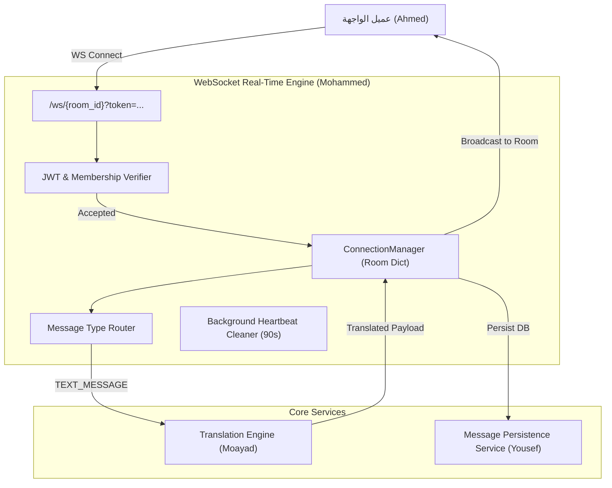
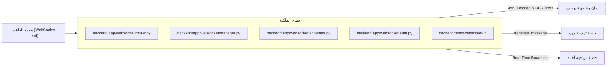
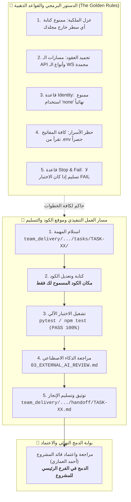
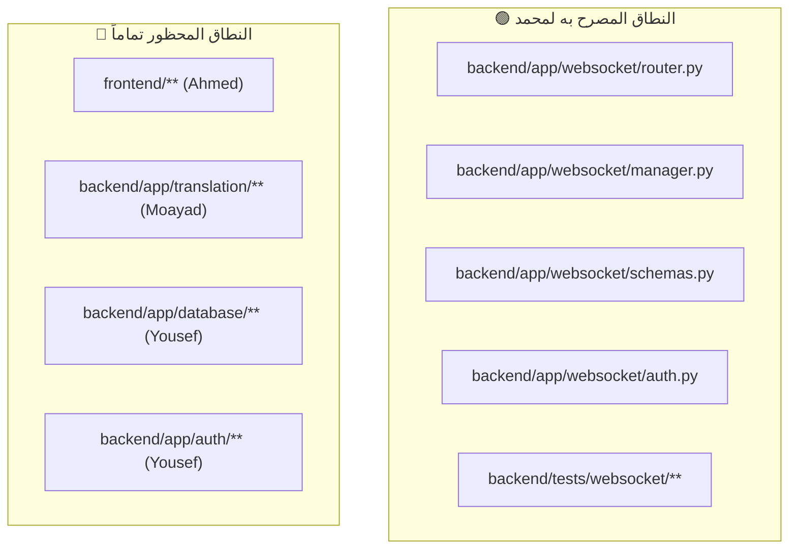
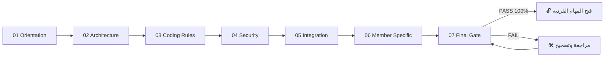
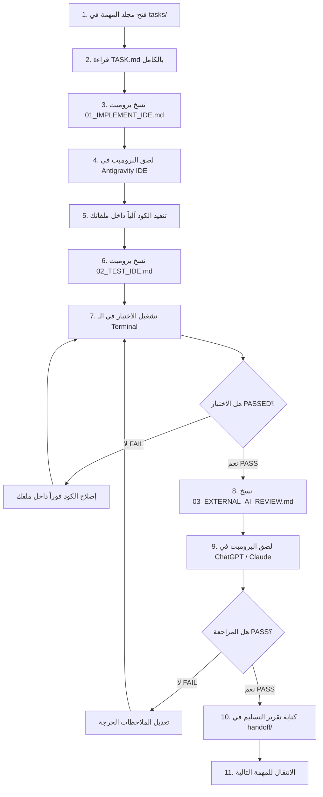
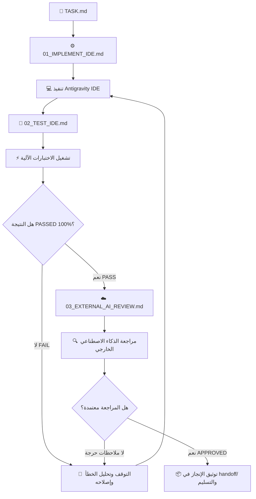
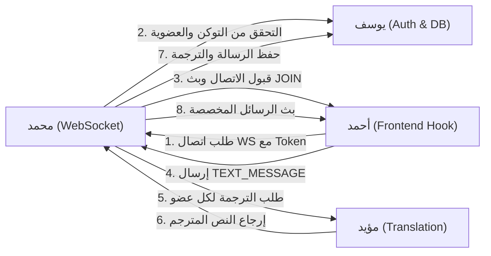
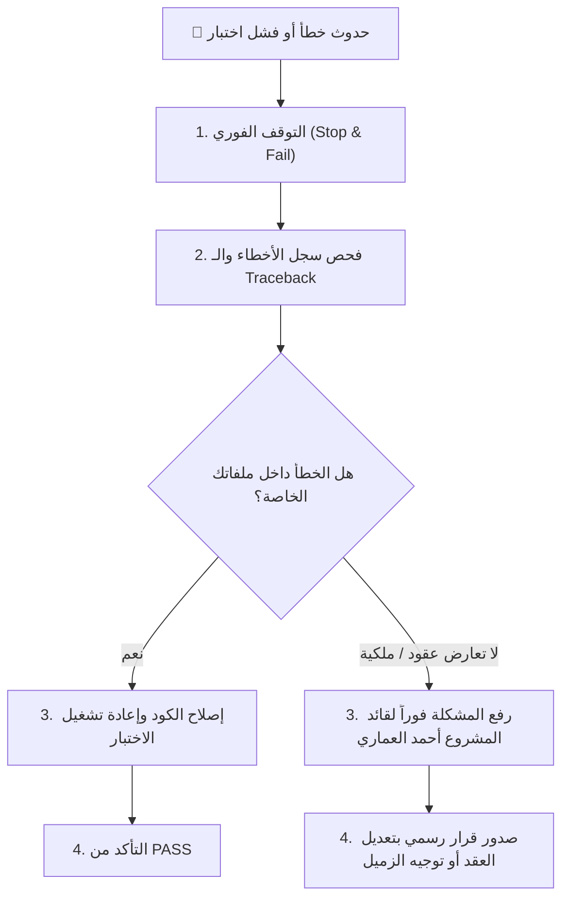
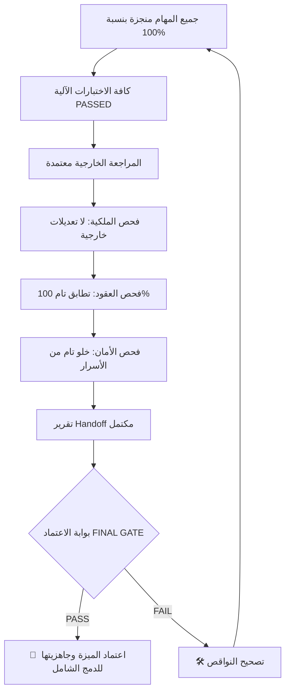

# 📘 دليل العمل الكامل — محمد الداعس (Mohammed Al-Daees)

## 👤 العضو
**محمد الداعس (Mohammed Al-Daees)**

## 🎯 الدور
**مهندس الاتصال اللحظي وبروتوكول الـ WebSocket (WebSocket Engineer)**

## 📦 نطاق العمل والملكية البرمجية
`backend/app/websocket/**, backend/tests/websocket/**, team_delivery/MOHAMMED/**`

## 🚦 الحالة الحالية للمهام
- **ما تم إنجازه:** تجهيز البنية التحتية، الفهرسة، وهياكل المهام الـ 11 بالكامل.
- **ما لم يبدأ بعد:** برمجة ConnectionManager، نماذج Pydantic، معالجة أحداث JOIN/LEAVE، والنبضات وتكامل الترجمة.
- **ما ينتظر أعضاء آخرين:** دوال فك التوكن والتحقق من العضوية من يوسف، ودالة translate_message من مؤيد.

---

# 📑 فهرس الدليل

1. [🏗️ 1. صورة النظام كاملة](#-1-صورة-النظام-كاملة)
2. [🧭 2. مكان العضو داخل المعمارية](#-2-مكان-العضو-داخل-المعمارية)
3. [📜 3. الميثاق البصري للقواعد الذهبية ومسار التنفيذ والتسليم](#-3-الميثاق-البصري-للقواعد-الذهبية-ومسار-التنفيذ-والتسليم)
4. [🔐 4. حدود الملكية البرمجية](#-4-حدود-الملكية-البرمجية)
5. [📊 5. جدول الحصر التنفيذي لمهام العضو ومكان الكود ومسار التسليم](#-5-جدول-الحصر-التنفيذي-لمهام-العضو-ومكان-الكود-ومسار-التسليم)
6. [📚 6. الملفات المشتركة التي يجب قراءتها](#-6-الملفات-المشتركة-التي-يجب-قراءتها)
7. [🧱 7. مراحل التأسيس المشترك COMMON FOUNDATION](#-7-مراحل-التأسيس-المشترك-common-foundation)
8. [🤖 8. طريقة استخدام Antigravity IDE](#-8-طريقة-استخدام-antigravity-ide)
9. [🔄 9. دورة تنفيذ المهمة الواحدة](#-9-دورة-تنفيذ-المهمة-الواحدة)
10. [🧩 10. شرح المهام تفصيلياً خطوة بخطوة](#-10-شرح-المهام-تفصيلياً-خطوة-بخطوة)
11. [🧪 11. منظومة الاختبارات وطريقة التشغيل](#-11-منظومة-الاختبارات-وطريقة-التشغيل)
12. [🛡️ 12. الضوابط والمتطلبات الأمنية](#-12-الضوابط-والمتطلبات-الأمنية)
13. [🔌 13. مصفوفة التكامل والاعتمادية مع بقية الفريق](#-13-مصفوفة-التكامل-والاعتمادية-مع-بقية-الفريق)
14. [🚨 14. الحالات الحدية والمشاكل المحتملة](#-14-الحالات-الحدية-والمشاكل-المحتملة)
15. [🛑 15. بروتوكول التصعيد والتعامل مع الأخطاء](#-15-بروتوكول-التصعيد-والتعامل-مع-الأخطاء)
16. [📦 16. بروتوكول التسليم والاعتماد النهائي](#-16-بروتوكول-التسليم-والاعتماد-النهائي)
17. [📊 17. لوحة تتبع الإنجاز (Progress Tracker)](#-17-لوحة-تتبع-الإنجاز-progress-tracker)
18. [🏁 18. بوابة الاعتماد النهائي (FINAL GATE)](#-18-بوابة-الاعتماد-النهائي-final-gate)

---

# 🏗️ 1. صورة النظام كاملة

مشروع **LinguaChat** هو منصة محادثة جماعية فورية متعددة اللغات قائمة على معمارية معزولة تعتمد على FastAPI في الباك إند، React في الواجهة الأمامية، LibreTranslate لخدمات الترجمة الذكية، و PostgreSQL لحفظ البيانات.

### المشكلة التي يحلها النظام:
إتاحة المحادثة الفورية السلسة بين أشخاص يتحدثون لغات مختلفة، بحيث يكتب كل مستخدم بلغته الأم، ويستلم بقية الأعضاء الرسالة مترجمة تلقائياً إلى لغاتهم المفضلة في أجزاء من الثانية.



---

# 🧭 2. مكان العضو داخل المعمارية



---

# 📜 3. الميثاق البصري للقواعد الذهبية ومسار التنفيذ والتسليم

> 💡 **خريطة الطريق:** يوضح المخطط أدناه القواعد الصارمة الحاكمة لعملك، ومكان كتابة الكود، وكيفية فحص واختبار المهمة، وأين يتم تسليم التقرير النهائي تمهيداً للدمج في الفرع الرئيسي:



---

# 🔐 4. حدود الملكية البرمجية

> ⚠️ **تنبيه صارم:** لا يحق لك كتابة أو تعديل أي سطر برمجي خارج نطاق ملكيتك المباشرة المبينة في الجدول أدناه.

| المسار البرمجي | الحالة الرسمية | الشرح والمسؤولية |
|---|---|---|
| `backend/app/websocket/**` | 🟢 مسموح ومملوك بالكامل | تطوير خادم الـ WebSocket، مدير الاتصالات، ونماذج الرسائل |
| `backend/tests/websocket/**` | 🟢 مسموح | اختبارات الـ WebSocket والاتصال اللحظي والنبضات |
| `team_delivery/MOHAMMED/**` | 🟢 مسموح | تقارير التسليم والمراجعات الخاصة بمحمد |
| `frontend/**` | 🔴 ممنوع منعاً باتاً | ملكية أحمد العماري |
| `backend/app/translation/**` | 🔴 ممنوع منعاً باتاً | ملكية مؤيد الصوفي |
| `backend/app/database/**` | 🔴 ممنوع منعاً باتاً | ملكية يوسف خيري |
| `_TEAM/00_SHARED/**` | 🟡 قراءة فقط | العقود الرسمية المشتركة |



---

# 📊 5. جدول الحصر التنفيذي لمهام العضو ومكان الكود ومسار التسليم

> 🎯 **جدول الإدارة السريع:** يلخص هذا الجدول لكافة المهام: رقم المهمة، الهدف الهندسي، مكان الملفات المستهدفة بالكود، أمر الاختبار المطلوب، ومسار تسليم التقرير النهائي في `handoff/`:

| # | المهمة | الهدف من المهمة | مكان الكود والملفات المستهدفة | أمر الاختبار | مسار التسليم بعد الإنجاز |
|---|---|---|---|---|---|
| 01 | **`TASK-01-WEBSOCKET-ANALYSIS`** | دراسة معمارية WebSocket في FastAPI، قراءة عقد WEBSOCKET_CONTRACT.md بدقة، وتحديد متطلبات إدارة الاتصالات. | `backend/app/websocket/README.md` | `فحص وتشغيل` | `team_delivery/MOHAMMED/handoff/TASK-01-WEBSOCKET-ANALYSIS.md` |
| 02 | **`TASK-02-WEBSOCKET-PROTOCOL`** | إنشاء نماذج Pydantic المعتمدة في schemas.py لتمثيل الغلاف الموحد للرسائل (type, payload, timestamp). | `backend/app/websocket/schemas.py` | `pytest backend/tests/websocket/test_schemas.py` | `team_delivery/MOHAMMED/handoff/TASK-02-WEBSOCKET-PROTOCOL.md` |
| 03 | **`TASK-03-CONNECTION-MANAGER`** | برمجة فئة ConnectionManager في manager.py لإدارة اتصالات الغرف (connect, disconnect, broadcast). | `backend/app/websocket/manager.py` | `pytest backend/tests/websocket/test_manager.py` | `team_delivery/MOHAMMED/handoff/TASK-03-CONNECTION-MANAGER.md` |
| 04 | **`TASK-04-WEBSOCKET-AUTH`** | بناء آلية فك والتحقق من توكن JWT في query param وفحص عضوية المستخدم في الغرفة قبل قبول الاتصال. | `backend/app/websocket/auth.py`<br>`backend/app/websocket/router.py` | `pytest backend/tests/websocket/test_auth.py` | `team_delivery/MOHAMMED/handoff/TASK-04-WEBSOCKET-AUTH.md` |
| 05 | **`TASK-05-JOIN-LEAVE-EVENTS`** | بث حدث JOIN لكافة أعضاء الغرفة عند دخول مستخدم جديد، وبث حدث LEAVE عند خروجه أو قطع اتصاله. | `backend/app/websocket/router.py` | `pytest backend/tests/websocket/test_events.py` | `team_delivery/MOHAMMED/handoff/TASK-05-JOIN-LEAVE-EVENTS.md` |
| 06 | **`TASK-06-TEXT-MESSAGE-HANDLING`** | استقبال رسائل TEXT_MESSAGE، التحقق من عدم تجاوز الحجم الأقصى 4096 بايت، والتحقق من صحة النص. | `backend/app/websocket/router.py` | `pytest backend/tests/websocket/test_messages.py` | `team_delivery/MOHAMMED/handoff/TASK-06-TEXT-MESSAGE-HANDLING.md` |
| 07 | **`TASK-07-TYPING-INDICATOR`** | استقبال حدث TYPING وبثه لبقية أعضاء الغرفة لإشعارهم بأن المستخدم يقوم بالكتابة حالياً. | `backend/app/websocket/router.py` | `pytest backend/tests/websocket/test_typing.py` | `team_delivery/MOHAMMED/handoff/TASK-07-TYPING-INDICATOR.md` |
| 08 | **`TASK-08-HEARTBEAT-AND-TIMEOUT`** | معالجة رسائل HEARTBEAT كل 30 ثانية، ومراقبة آخر نشاط وفصل أي عميل خامل يتجاوز 90 ثانية. | `backend/app/websocket/router.py`<br>`backend/app/websocket/manager.py` | `pytest backend/tests/websocket/test_heartbeat.py` | `team_delivery/MOHAMMED/handoff/TASK-08-HEARTBEAT-AND-TIMEOUT.md` |
| 09 | **`TASK-09-TRANSLATION-INTEGRATION`** | استدعاء خدمة `translate_message` لمؤيد الصوفي، وترجمة الرسالة لكل متلقٍّ حسب لغته المفضلة وبثها له. | `backend/app/websocket/router.py` | `pytest backend/tests/websocket/test_translation_integration.py` | `team_delivery/MOHAMMED/handoff/TASK-09-TRANSLATION-INTEGRATION.md` |
| 10 | **`TASK-10-MESSAGE-PERSISTENCE`** | استدعاء خدمة حفظ الرسائل ليوسف خيري لتخزين الرسالة الأصلية وترجماتها في جدول messages و message_translations. | `backend/app/websocket/router.py` | `pytest backend/tests/websocket/test_persistence.py` | `team_delivery/MOHAMMED/handoff/TASK-10-MESSAGE-PERSISTENCE.md` |
| 11 | **`TASK-11-WEBSOCKET-FINAL-QA`** | تشغيل حزمة اختبارات الـ WebSocket الكاملة، التحقق من تغطية كافة الحالات الحدية، وإعداد تقرير الجودة النهائي. | `backend/tests/websocket/**` | `فحص وتشغيل` | `team_delivery/MOHAMMED/handoff/TASK-11-WEBSOCKET-FINAL-QA.md` |

---

# 📚 6. الملفات المشتركة التي يجب قراءتها

### 1. يجب قراءته أولاً (Mandatory First)
- **`_TEAM/00_SHARED/WEBSOCKET_CONTRACT.md`**: العقد الحاكم لبروتوكول الـ WebSocket والأنواع الستة.
- **`_TEAM/00_SHARED/PROJECT_CONSTITUTION.md`**: قواعد المشروع وميثاق الفريق.

### 2. يجب قراءته قبل التنفيذ (Before Implementation)
- **`_TEAM/00_SHARED/SECURITY_CONTRACT.md`**: معايير التحقق من التوكن وأكواد إغلاق الاتصال (4001, 4003, 4004).
- **`_TEAM/00_SHARED/TRANSLATION_CONTRACT.md`**: طريقة استدعاء دالة الترجمة ونماذج البيانات العائدة.

### 3. مرجع مستمر أثناء العمل (Ongoing Reference)
- **`_TEAM/00_SHARED/CODING_RULES.md`**: قواعد الـ Async/Await وتجنب الـ Blocking Loops.
- **`_TEAM/00_SHARED/DELIVERY_RULES.md`**: معايير تسليم واختبار الـ WebSocket.

---

# 🧱 7. مراحل التأسيس المشترك COMMON FOUNDATION

قبل البدء في تنفيذ المهام الفردية، يمر العضو بمراحل التأسيس السبع لضمان استيعاب كافة القواعد والعقود:



- **01 Orientation:** فهم طبيعة الاتصال الحي ثنائي الاتجاه Full-Duplex في LinguaChat.
- **02 Architecture:** دور FastAPI WebSocket Endpoints وعزل قنوات الغرف.
- **03 Coding Rules:** كتابة كود Async غير حاظر واستخدام Concurrency Patterns آمنة.
- **04 Security:** إغلاق الاتصالات غير المصرحة فورياً بأكواد قياسية محددة.
- **05 Integration:** مطابقة نماذج الرسائل الستة بدقة تامة.
- **06 WebSocket Specific:** إدارة النبضات وإغلاق الاتصالات الخاملة بعد 90 ثانية.
- **07 Final Gate:** نجاح 100% لكافة اختبارات `pytest backend/tests/websocket/`.

---

# 🤖 8. طريقة استخدام Antigravity IDE

اتبع هذا الدليل التفاعلي خطوة بخطوة عند تنفيذ أي مهمة داخل الـ IDE:



### الخطوات التفصيلية للعمل:
1. **افتح مجلد المهمة:** توجه إلى `team_delivery/MOHAMMED/tasks/<TASK_ID>/`.
2. **اقرأ ملف `TASK.md`:** افهم الهدف، الملفات المسموحة والمحظورة، وشروط النجاح.
3. **انسخ محتوى `01_IMPLEMENT_IDE.md` بالكامل:** أرسله لمحادثة Antigravity IDE.
4. **دع الـ IDE ينفذ الكود:** راقب التعديلات وتأكد أنها تمت فقط داخل ملفاتك المصرحة.
5. **افتح `02_TEST_IDE.md`:** انسخ أمر الاختبار وشغله في الـ Terminal.
6. **تحقق من النتيجة:** ممنوع الانتقال إذا كانت النتيجة `FAIL`. أصلح الكود حتى يصبح `PASSED` باللون الأخضر.
7. **افتح `03_EXTERNAL_AI_REVIEW.md`:** انسخ البرومبت وافحصه عبر ذكاء اصطناعي خارجي مستقل.
8. **وثق الإنجاز:** أنشئ تقرير المهمة في مجلد `handoff/` وانتقل للمهمة التالية.

---

# 🔄 9. دورة تنفيذ المهمة الواحدة



---

# 🧩 10. شرح المهام تفصيلياً خطوة بخطوة

### 📌 TASK-01-WEBSOCKET-ANALYSIS — تحليل متطلبات الاتصال اللحظي والبروتوكول المعياري

#### 🎯 الهدف الأساسي
دراسة معمارية WebSocket في FastAPI، قراءة عقد WEBSOCKET_CONTRACT.md بدقة، وتحديد متطلبات إدارة الاتصالات.

#### 📁 مكان الكود والملفات التي سيتم تعديلها (Code Location)
- `backend/app/websocket/README.md`

#### 📄 الملفات المتوقع إنشاؤها
- `team_delivery/MOHAMMED/reviews/TASK-01-ANALYSIS-REPORT.md`

#### 🔒 الملفات الممنوع لمسها أو تعديلها
- `frontend/**`
- `backend/app/translation/**`
- `backend/app/database/**`

#### 🔗 الاعتماديات والعقود المرجعية
- `_TEAM/00_SHARED/WEBSOCKET_CONTRACT.md`

#### 🧠 ماذا يجب أن يفهم المطور قبل التنفيذ؟
فهم دورة الاتصال: التوثيق عبر Token، قنوات الغرف، الأنواع الستة، والنبضات كل 30 ثانية.

#### ⚙️ ماذا سينفذ Antigravity IDE تلقائياً؟
توثيق تحليل البروتوكول وتحديد هياكل البيانات المطلوبة للـ ConnectionManager.

#### 🧪 ماذا سيختبر المطور في خطوة الفحص؟
مراجعة ملف التحليل والتأكد من تغطية كافة شروط العقد.

#### ☁️ ماذا ستراجع أداة الذكاء الاصطناعي الخارجية (Cloud AI Review)؟
مراجعة شمولية تقرير التحليل ومطابقته للعقد الرسمي.

#### ⚠️ الحالات الحدية والطرفية (Edge Cases)
انقطاع مفاجئ، إرسال رسائل بحجم يفوق 4096 بايت.

#### 🔐 المتطلبات والضوابط الأمنية
التحقق من توكن JWT في نقطة الاتصال وعدم قبول أي اتصال مجهول.

#### 🔌 متطلبات التكامل والربط مع الفريق
التوافق مع خطاف الواجهة لأحمد وتكامل الترجمة مع مؤيد والحفظ مع يوسف.

#### ✅ شروط النجاح والانتقال للمهمة التالية (Success Criteria)
- [ ] تقرير التحليل مكتمل ومطابق 100% للعقد

#### ❌ متى تتوقف فوراً وتمنع إكمال العمل؟ (Stop & Fail Triggers)
- 🛑 محاولة تعديل أي ملف خارج backend/app/websocket

#### 📦 مسار التسليم وماذا يتم توثيقه عند الانتهاء (Handoff Destination)
**أين تسلم بعد الإنجاز؟** `team_delivery/MOHAMMED/handoff/TASK-01-WEBSOCKET-ANALYSIS.md`  
**محتوى التسليم:** تقرير التحليل المعتمد.

---

### 📌 TASK-02-WEBSOCKET-PROTOCOL — بناء نماذج Pydantic للغلاف الموحد والرسائل الستة

#### 🎯 الهدف الأساسي
إنشاء نماذج Pydantic المعتمدة في schemas.py لتمثيل الغلاف الموحد للرسائل (type, payload, timestamp).

#### 📁 مكان الكود والملفات التي سيتم تعديلها (Code Location)
- `backend/app/websocket/schemas.py`

#### 📄 الملفات المتوقع إنشاؤها
- `backend/tests/websocket/test_schemas.py`

#### 🔒 الملفات الممنوع لمسها أو تعديلها
- `frontend/**`
- `backend/app/translation/**`

#### 🔗 الاعتماديات والعقود المرجعية
- `_TEAM/00_SHARED/WEBSOCKET_CONTRACT.md`

#### 🧠 ماذا يجب أن يفهم المطور قبل التنفيذ؟
تمثيل الأنواع الستة: JOIN, LEAVE, TEXT_MESSAGE, TYPING, HEARTBEAT, ERROR بدقة وتحديد حقول كل نوع.

#### ⚙️ ماذا سينفذ Antigravity IDE تلقائياً؟
كتابة نماذج Pydantic مع قيود الحجم (max 4096B) والتحقق من صحة الحقول.

#### 🧪 ماذا سيختبر المطور في خطوة الفحص؟
تشغيل `pytest backend/tests/websocket/test_schemas.py` والتأكد من نجاح كافة الاختبارات.

#### ☁️ ماذا ستراجع أداة الذكاء الاصطناعي الخارجية (Cloud AI Review)؟
مراجعة صرامة النماذج والـ Schema Validation.

#### ⚠️ الحالات الحدية والطرفية (Edge Cases)
رسالة بنوع غير معروف، رسالة بحجم أكبر من 4KB، غياب حقول إلزامية.

#### 🔐 المتطلبات والضوابط الأمنية
رفض أي payload غير مطابق للمواصفات تلقائياً.

#### 🔌 متطلبات التكامل والربط مع الفريق
توفير النماذج لكافة معالجات الـ WebSocket.

#### ✅ شروط النجاح والانتقال للمهمة التالية (Success Criteria)
- [ ] كافة النماذج معرفة بدقة
- [ ] اختبارات الـ Schemas تمر بنسبة 100%

#### ❌ متى تتوقف فوراً وتمنع إكمال العمل؟ (Stop & Fail Triggers)
- 🛑 ابتكار نوع رسالة سابع خارج العقد

#### 📦 مسار التسليم وماذا يتم توثيقه عند الانتهاء (Handoff Destination)
**أين تسلم بعد الإنجاز؟** `team_delivery/MOHAMMED/handoff/TASK-02-WEBSOCKET-PROTOCOL.md`  
**محتوى التسليم:** ملف schemas.py واختباراته.

---

### 📌 TASK-03-CONNECTION-MANAGER — بناء مدير الاتصالات المركزية (ConnectionManager)

#### 🎯 الهدف الأساسي
برمجة فئة ConnectionManager في manager.py لإدارة اتصالات الغرف (connect, disconnect, broadcast).

#### 📁 مكان الكود والملفات التي سيتم تعديلها (Code Location)
- `backend/app/websocket/manager.py`

#### 📄 الملفات المتوقع إنشاؤها
- `backend/tests/websocket/test_manager.py`

#### 🔒 الملفات الممنوع لمسها أو تعديلها
- `frontend/**`
- `backend/app/database/**`

#### 🔗 الاعتماديات والعقود المرجعية
- `backend/app/websocket/schemas.py`

#### 🧠 ماذا يجب أن يفهم المطور قبل التنفيذ؟
إدارة قاموس الغرف `dict[str, set[WebSocket]]` وعزل قنوات الغرف عن بعضها تماماً.

#### ⚙️ ماذا سينفذ Antigravity IDE تلقائياً؟
تنفيذ دوال الاتصال والفصل والبث الجماعي والبث الفردي.

#### 🧪 ماذا سيختبر المطور في خطوة الفحص؟
تشغيل `pytest backend/tests/websocket/test_manager.py`.

#### ☁️ ماذا ستراجع أداة الذكاء الاصطناعي الخارجية (Cloud AI Review)؟
مراجعة كفاءة الـ Thread-Safety والتعامل غير المتزامن في الـ Manager.

#### ⚠️ الحالات الحدية والطرفية (Edge Cases)
بث رسالة لغرفة فارغة، فصل عميل غير موجود.

#### 🔐 المتطلبات والضوابط الأمنية
منع تسريب رسائل غرفة إلى غرفة أخرى.

#### 🔌 متطلبات التكامل والربط مع الفريق
استخدامه في الـ Router المركزي لبث الرسائل.

#### ✅ شروط النجاح والانتقال للمهمة التالية (Success Criteria)
- [ ] مدير الاتصالات يعمل بكفاءة
- [ ] اختبارات الـ Manager تنجح 100%

#### ❌ متى تتوقف فوراً وتمنع إكمال العمل؟ (Stop & Fail Triggers)
- 🛑 استخدام هياكل بيانات تسبب مشاكل Concurrency

#### 📦 مسار التسليم وماذا يتم توثيقه عند الانتهاء (Handoff Destination)
**أين تسلم بعد الإنجاز؟** `team_delivery/MOHAMMED/handoff/TASK-03-CONNECTION-MANAGER.md`  
**محتوى التسليم:** ملف manager.py واختباراته.

---

### 📌 TASK-04-WEBSOCKET-AUTH — توثيق اتصال الـ WebSocket عبر JWT والتحقق من العضوية

#### 🎯 الهدف الأساسي
بناء آلية فك والتحقق من توكن JWT في query param وفحص عضوية المستخدم في الغرفة قبل قبول الاتصال.

#### 📁 مكان الكود والملفات التي سيتم تعديلها (Code Location)
- `backend/app/websocket/auth.py`
- `backend/app/websocket/router.py`

#### 📄 الملفات المتوقع إنشاؤها
- `backend/tests/websocket/test_auth.py`

#### 🔒 الملفات الممنوع لمسها أو تعديلها
- `backend/app/auth/**`
- `frontend/**`

#### 🔗 الاعتماديات والعقود المرجعية
- `_TEAM/00_SHARED/SECURITY_CONTRACT.md`
- `_TEAM/00_SHARED/WEBSOCKET_CONTRACT.md`

#### 🧠 ماذا يجب أن يفهم المطور قبل التنفيذ؟
إغلاق الاتصال بكود 4001 عند فشل التوكن، وبكود 4003 عند عدم وجود عضوية، وبكود 4004 عند عدم وجود الغرفة.

#### ⚙️ ماذا سينفذ Antigravity IDE تلقائياً؟
برمجة دالة `authenticate_websocket` وإغلاق الاتصال بالأكواد القياسية.

#### 🧪 ماذا سيختبر المطور في خطوة الفحص؟
تشغيل `pytest backend/tests/websocket/test_auth.py`.

#### ☁️ ماذا ستراجع أداة الذكاء الاصطناعي الخارجية (Cloud AI Review)؟
مراجعة سلامة التحقق الأمني ومطابقة أكواد الإغلاق للعقد.

#### ⚠️ الحالات الحدية والطرفية (Edge Cases)
توكن منتهي، توكن مزور، مستخدم غير مسجل، غرفة غير موجودة.

#### 🔐 المتطلبات والضوابط الأمنية
إغلاق الاتصال فوراً قبل إرسال أي بايت من البيانات إذا فشل التوثيق.

#### 🔌 متطلبات التكامل والربط مع الفريق
استدعاء دوال فك التوكن والتحقق من العضوية الخاصة بيوسف خيري.

#### ✅ شروط النجاح والانتقال للمهمة التالية (Success Criteria)
- [ ] التوثيق يمنع الاتصالات غير المصرحة
- [ ] أكواد الإغلاق مطابقة 100%

#### ❌ متى تتوقف فوراً وتمنع إكمال العمل؟ (Stop & Fail Triggers)
- 🛑 قبول اتصال غير موثق أو استخدام أكواد إغلاق عشوائية

#### 📦 مسار التسليم وماذا يتم توثيقه عند الانتهاء (Handoff Destination)
**أين تسلم بعد الإنجاز؟** `team_delivery/MOHAMMED/handoff/TASK-04-WEBSOCKET-AUTH.md`  
**محتوى التسليم:** ملف auth.py ونظام التوثيق.

---

### 📌 TASK-05-JOIN-LEAVE-EVENTS — معالجة وبث أحداث الانضمام والمغادرة اللحظية (JOIN / LEAVE)

#### 🎯 الهدف الأساسي
بث حدث JOIN لكافة أعضاء الغرفة عند دخول مستخدم جديد، وبث حدث LEAVE عند خروجه أو قطع اتصاله.

#### 📁 مكان الكود والملفات التي سيتم تعديلها (Code Location)
- `backend/app/websocket/router.py`

#### 📄 الملفات المتوقع إنشاؤها
- `backend/tests/websocket/test_events.py`

#### 🔒 الملفات الممنوع لمسها أو تعديلها
- `frontend/**`
- `backend/app/translation/**`

#### 🔗 الاعتماديات والعقود المرجعية
- `backend/app/websocket/manager.py`
- `backend/app/websocket/schemas.py`

#### 🧠 ماذا يجب أن يفهم المطور قبل التنفيذ؟
إشعار كافة المتصلين في الغرفة بهوية المستخدم المنضم أو المغادر ولغته المفضلة.

#### ⚙️ ماذا سينفذ Antigravity IDE تلقائياً؟
توليد وبث أحداث JOIN و LEAVE تلقائياً وتحديث قائمة المتصلين.

#### 🧪 ماذا سيختبر المطور في خطوة الفحص؟
تشغيل `pytest backend/tests/websocket/test_events.py`.

#### ☁️ ماذا ستراجع أداة الذكاء الاصطناعي الخارجية (Cloud AI Review)؟
مراجعة دقة بث الأحداث وعدم فقدان أي إشعار مغادرة.

#### ⚠️ الحالات الحدية والطرفية (Edge Cases)
انقطاع مفاجئ للمتصفح دون إرسال رسالة LEAVE رسمية (التقاط WebSocketDisconnect).

#### 🔐 المتطلبات والضوابط الأمنية
عدم بث أي بيانات سرية في حدث الانضمام سوى username و user_id و preferred_language.

#### 🔌 متطلبات التكامل والربط مع الفريق
استقبال الواجهة لأحمد للأحداث لتحديث قائمة المستخدمين المتصلين.

#### ✅ شروط النجاح والانتقال للمهمة التالية (Success Criteria)
- [ ] أحداث JOIN و LEAVE تبث بدقة لكافة الأعضاء

#### ❌ متى تتوقف فوراً وتمنع إكمال العمل؟ (Stop & Fail Triggers)
- 🛑 فشل بث إشعار المغادرة عند انقطاع الاتصال

#### 📦 مسار التسليم وماذا يتم توثيقه عند الانتهاء (Handoff Destination)
**أين تسلم بعد الإنجاز؟** `team_delivery/MOHAMMED/handoff/TASK-05-JOIN-LEAVE-EVENTS.md`  
**محتوى التسليم:** معالجات الأحداث واختباراتها.

---

### 📌 TASK-06-TEXT-MESSAGE-HANDLING — معالجة الرسائل النصية والتحقق من القيود والحدود

#### 🎯 الهدف الأساسي
استقبال رسائل TEXT_MESSAGE، التحقق من عدم تجاوز الحجم الأقصى 4096 بايت، والتحقق من صحة النص.

#### 📁 مكان الكود والملفات التي سيتم تعديلها (Code Location)
- `backend/app/websocket/router.py`

#### 📄 الملفات المتوقع إنشاؤها
- `backend/tests/websocket/test_messages.py`

#### 🔒 الملفات الممنوع لمسها أو تعديلها
- `frontend/**`
- `backend/app/database/**`

#### 🔗 الاعتماديات والعقود المرجعية
- `backend/app/websocket/schemas.py`

#### 🧠 ماذا يجب أن يفهم المطور قبل التنفيذ؟
استلام النص الأصلي من المرسل وتجهيزه للتوزيع والترجمة.

#### ⚙️ ماذا سينفذ Antigravity IDE تلقائياً؟
التحقق من حجم الرسالة، إرجاع رسالة خطأ ERROR إذا تجاوزت 4096 بايت، وتمرير الرسالة السليمة.

#### 🧪 ماذا سيختبر المطور في خطوة الفحص؟
تشغيل `pytest backend/tests/websocket/test_messages.py`.

#### ☁️ ماذا ستراجع أداة الذكاء الاصطناعي الخارجية (Cloud AI Review)؟
مراجعة متانة معالجة النصوص وحالات تجاوز الحجم.

#### ⚠️ الحالات الحدية والطرفية (Edge Cases)
رسالة فارغة، رسالة تحتوي مسافات فقط، رسالة تفوق 4KB.

#### 🔐 المتطلبات والضوابط الأمنية
منع هجمات الـ Denial of Service عبر الرسائل الضخمة.

#### 🔌 متطلبات التكامل والربط مع الفريق
تجهيز الرسائل للتمرير إلى محرك الترجمة الخاص بمؤيد الصوفي.

#### ✅ شروط النجاح والانتقال للمهمة التالية (Success Criteria)
- [ ] معالجة الرسائل النصية تعمل بانضباط تام وفق العقد

#### ❌ متى تتوقف فوراً وتمنع إكمال العمل؟ (Stop & Fail Triggers)
- 🛑 قبول رسائل تفوق 4096 بايت

#### 📦 مسار التسليم وماذا يتم توثيقه عند الانتهاء (Handoff Destination)
**أين تسلم بعد الإنجاز؟** `team_delivery/MOHAMMED/handoff/TASK-06-TEXT-MESSAGE-HANDLING.md`  
**محتوى التسليم:** معالج الرسائل النصية واختباراته.

---

### 📌 TASK-07-TYPING-INDICATOR — بناء مؤشر الكتابة اللحظي (TYPING Indicator)

#### 🎯 الهدف الأساسي
استقبال حدث TYPING وبثه لبقية أعضاء الغرفة لإشعارهم بأن المستخدم يقوم بالكتابة حالياً.

#### 📁 مكان الكود والملفات التي سيتم تعديلها (Code Location)
- `backend/app/websocket/router.py`

#### 📄 الملفات المتوقع إنشاؤها
- `backend/tests/websocket/test_typing.py`

#### 🔒 الملفات الممنوع لمسها أو تعديلها
- `frontend/**`

#### 🔗 الاعتماديات والعقود المرجعية
- `backend/app/websocket/manager.py`

#### 🧠 ماذا يجب أن يفهم المطور قبل التنفيذ؟
بث حالة `is_typing: true/false` لبقية المتصلين باستثناء المرسل نفسه.

#### ⚙️ ماذا سينفذ Antigravity IDE تلقائياً؟
تنفيذ بث مؤشر الكتابة مع تجاهل المرسل (broadcast_to_others).

#### 🧪 ماذا سيختبر المطور في خطوة الفحص؟
تشغيل `pytest backend/tests/websocket/test_typing.py`.

#### ☁️ ماذا ستراجع أداة الذكاء الاصطناعي الخارجية (Cloud AI Review)؟
مراجعة كفاءة بث مؤشرات الكتابة دون استهلاك زائد للباندويث.

#### ⚠️ الحالات الحدية والطرفية (Edge Cases)
إرسال متكرر وسريع لمؤشرات الكتابة.

#### 🔐 المتطلبات والضوابط الأمنية
التحقق من أن المرسل عضو فعلي في الغرفة.

#### 🔌 متطلبات التكامل والربط مع الفريق
استقبال الواجهة للحدث لعرض 'فلان يكتب الآن...'.

#### ✅ شروط النجاح والانتقال للمهمة التالية (Success Criteria)
- [ ] مؤشر الكتابة يبث بسلاسة لجميع الأعضاء عدا المرسل

#### ❌ متى تتوقف فوراً وتمنع إكمال العمل؟ (Stop & Fail Triggers)
- 🛑 إعادة إرسال مؤشر الكتابة إلى نفس الشخص الذي يكتب

#### 📦 مسار التسليم وماذا يتم توثيقه عند الانتهاء (Handoff Destination)
**أين تسلم بعد الإنجاز؟** `team_delivery/MOHAMMED/handoff/TASK-07-TYPING-INDICATOR.md`  
**محتوى التسليم:** معالج مؤشر الكتابة واختباراته.

---

### 📌 TASK-08-HEARTBEAT-AND-TIMEOUT — بناء نظام النبضات وإغلاق الاتصالات الخاملة (Heartbeat & Timeout)

#### 🎯 الهدف الأساسي
معالجة رسائل HEARTBEAT كل 30 ثانية، ومراقبة آخر نشاط وفصل أي عميل خامل يتجاوز 90 ثانية.

#### 📁 مكان الكود والملفات التي سيتم تعديلها (Code Location)
- `backend/app/websocket/router.py`
- `backend/app/websocket/manager.py`

#### 📄 الملفات المتوقع إنشاؤها
- `backend/tests/websocket/test_heartbeat.py`

#### 🔒 الملفات الممنوع لمسها أو تعديلها
- `frontend/**`

#### 🔗 الاعتماديات والعقود المرجعية
- `_TEAM/00_SHARED/WEBSOCKET_CONTRACT.md`

#### 🧠 ماذا يجب أن يفهم المطور قبل التنفيذ؟
العميل يرسل HEARTBEAT والخادم يرد بـ HEARTBEAT، وإذا انقطع العميل لأكثر من 90 ثانية يُفصل الاتصال تلقائياً.

#### ⚙️ ماذا سينفذ Antigravity IDE تلقائياً؟
تسجيل `last_ping` لكل اتصال ومهمة خلفية Background Task لفصل الاتصالات الخاملة.

#### 🧪 ماذا سيختبر المطور في خطوة الفحص؟
تشغيل `pytest backend/tests/websocket/test_heartbeat.py`.

#### ☁️ ماذا ستراجع أداة الذكاء الاصطناعي الخارجية (Cloud AI Review)؟
مراجعة كفاءة مهمة التنظيف الخلفية وعدم تسريب الذاكرة.

#### ⚠️ الحالات الحدية والطرفية (Edge Cases)
عميل يتوقف عن إرسال النبضات، عميل يرسل نبضات سريعة جداً.

#### 🔐 المتطلبات والضوابط الأمنية
تحرير موارد السيرفر ومنع تراكم الـ Zombie Connections.

#### 🔌 متطلبات التكامل والربط مع الفريق
تكامل مع خطاف useWebSocket لأحمد العماري.

#### ✅ شروط النجاح والانتقال للمهمة التالية (Success Criteria)
- [ ] نظام النبضات والتنظيف التلقائي يعمل بدقة

#### ❌ متى تتوقف فوراً وتمنع إكمال العمل؟ (Stop & Fail Triggers)
- 🛑 فشل فصل الاتصالات المعلقة بعد 90 ثانية

#### 📦 مسار التسليم وماذا يتم توثيقه عند الانتهاء (Handoff Destination)
**أين تسلم بعد الإنجاز؟** `team_delivery/MOHAMMED/handoff/TASK-08-HEARTBEAT-AND-TIMEOUT.md`  
**محتوى التسليم:** نظام الـ Heartbeat ومهمة التنظيف.

---

### 📌 TASK-09-TRANSLATION-INTEGRATION — ربط محرك الترجمة وبث الرسائل المترجمة لكل مستخدم حسب لغته

#### 🎯 الهدف الأساسي
استدعاء خدمة `translate_message` لمؤيد الصوفي، وترجمة الرسالة لكل متلقٍّ حسب لغته المفضلة وبثها له.

#### 📁 مكان الكود والملفات التي سيتم تعديلها (Code Location)
- `backend/app/websocket/router.py`

#### 📄 الملفات المتوقع إنشاؤها
- `backend/tests/websocket/test_translation_integration.py`

#### 🔒 الملفات الممنوع لمسها أو تعديلها
- `backend/app/translation/**`
- `frontend/**`

#### 🔗 الاعتماديات والعقود المرجعية
- `backend/app/translation/service.py`
- `_TEAM/00_SHARED/TRANSLATION_CONTRACT.md`

#### 🧠 ماذا يجب أن يفهم المطور قبل التنفيذ؟
المرسل يرسل بالعربية -> المتلقي الإنجليزي يستلم ترجمة إنجليزية مع شارة المصدر -> المتلقي العربي يستلم النص الأصلي مع `source_used='identity'`.

#### ⚙️ ماذا سينفذ Antigravity IDE تلقائياً؟
استدعاء دالة الترجمة بالتوازي عبر `asyncio.gather` وتوزيع الرسائل المخصصة.

#### 🧪 ماذا سيختبر المطور في خطوة الفحص؟
تشغيل `pytest backend/tests/websocket/test_translation_integration.py`.

#### ☁️ ماذا ستراجع أداة الذكاء الاصطناعي الخارجية (Cloud AI Review)؟
مراجعة كفاءة التوزيع والترجمة غير المتزامنة ومطابقة حقول العقد.

#### ⚠️ الحالات الحدية والطرفية (Edge Cases)
متلقٍّ لغته مطابقة للغة الرسالة (قاعدة identity)، تعطل خدمة الترجمة الخارجية.

#### 🔐 المتطلبات والضوابط الأمنية
التعامل السليم مع حالات الخطأ دون كسر تدفق الرسائل.

#### 🔌 متطلبات التكامل والربط مع الفريق
تكامل وثيق مع محرك مؤيد الصوفي.

#### ✅ شروط النجاح والانتقال للمهمة التالية (Success Criteria)
- [ ] كل مستخدم يستلم الرسالة مترجمة بلغته المفضلة بدقة
- [ ] تطبيق صارم لقاعدة identity

#### ❌ متى تتوقف فوراً وتمنع إكمال العمل؟ (Stop & Fail Triggers)
- 🛑 استخدام القيمة المحظورة 'none'

#### 📦 مسار التسليم وماذا يتم توثيقه عند الانتهاء (Handoff Destination)
**أين تسلم بعد الإنجاز؟** `team_delivery/MOHAMMED/handoff/TASK-09-TRANSLATION-INTEGRATION.md`  
**محتوى التسليم:** تكامل الترجمة داخل الـ WebSocket.

---

### 📌 TASK-10-MESSAGE-PERSISTENCE — حفظ الرسائل المترجمة في قاعدة البيانات بشكل غير متزامن

#### 🎯 الهدف الأساسي
استدعاء خدمة حفظ الرسائل ليوسف خيري لتخزين الرسالة الأصلية وترجماتها في جدول messages و message_translations.

#### 📁 مكان الكود والملفات التي سيتم تعديلها (Code Location)
- `backend/app/websocket/router.py`

#### 📄 الملفات المتوقع إنشاؤها
- `backend/tests/websocket/test_persistence.py`

#### 🔒 الملفات الممنوع لمسها أو تعديلها
- `backend/app/database/**`
- `backend/app/messages/**`

#### 🔗 الاعتماديات والعقود المرجعية
- `backend/app/messages/service.py`
- `_TEAM/00_SHARED/DATABASE_CONTRACT.md`

#### 🧠 ماذا يجب أن يفهم المطور قبل التنفيذ؟
حفظ الرسائل دون تأخير البث اللحظي للعملاء.

#### ⚙️ ماذا سينفذ Antigravity IDE تلقائياً؟
استدعاء دالة الحفظ وحفظ سجل الرسالة في قاعدة البيانات.

#### 🧪 ماذا سيختبر المطور في خطوة الفحص؟
تشغيل `pytest backend/tests/websocket/test_persistence.py`.

#### ☁️ ماذا ستراجع أداة الذكاء الاصطناعي الخارجية (Cloud AI Review)؟
مراجعة إدارة جلسات قاعدة البيانات وتجنب الأخطاء غير المتزامنة.

#### ⚠️ الحالات الحدية والطرفية (Edge Cases)
بطء استجابة قاعدة البيانات، فشل كتابة السجل.

#### 🔐 المتطلبات والضوابط الأمنية
التحقق من صحة المعرفات قبل الحفظ.

#### 🔌 متطلبات التكامل والربط مع الفريق
تكامل مع طبقة الـ Database والخدمات الخاصة بيوسف خيري.

#### ✅ شروط النجاح والانتقال للمهمة التالية (Success Criteria)
- [ ] الرسائل تحفظ بنجاح في قاعدة البيانات وتظهر في سجل التاريخ

#### ❌ متى تتوقف فوراً وتمنع إكمال العمل؟ (Stop & Fail Triggers)
- 🛑 حظر حلقة الـ WebSocket أثناء عمليات الـ I/O الخاصة بقاعدة البيانات

#### 📦 مسار التسليم وماذا يتم توثيقه عند الانتهاء (Handoff Destination)
**أين تسلم بعد الإنجاز؟** `team_delivery/MOHAMMED/handoff/TASK-10-MESSAGE-PERSISTENCE.md`  
**محتوى التسليم:** نظام حفظ الرسائل في الـ WebSocket.

---

### 📌 TASK-11-WEBSOCKET-FINAL-QA — الفحص النهائي الشامل واختبارات الضغط للـ WebSocket (WebSocket Final QA)

#### 🎯 الهدف الأساسي
تشغيل حزمة اختبارات الـ WebSocket الكاملة، التحقق من تغطية كافة الحالات الحدية، وإعداد تقرير الجودة النهائي.

#### 📁 مكان الكود والملفات التي سيتم تعديلها (Code Location)
- `backend/tests/websocket/**`

#### 📄 الملفات المتوقع إنشاؤها
- `team_delivery/MOHAMMED/reviews/WEBSOCKET_QA_REPORT.md`

#### 🔒 الملفات الممنوع لمسها أو تعديلها
- `frontend/**`
- `backend/app/translation/**`

#### 🔗 الاعتماديات والعقود المرجعية
- `_TEAM/00_SHARED/DELIVERY_RULES.md`

#### 🧠 ماذا يجب أن يفهم المطور قبل التنفيذ؟
التأكد من جاهزية طبقة الـ WebSocket بنسبة 100% للتسليم والدمج.

#### ⚙️ ماذا سينفذ Antigravity IDE تلقائياً؟
تشغيل `pytest backend/tests/websocket/` والتأكد من نجاح كافة الاختبارات.

#### 🧪 ماذا سيختبر المطور في خطوة الفحص؟
تأكيد نجاح 100% PASS لكافة سيناريوهات الاتصال والأحداث والترجمة والنبضات.

#### ☁️ ماذا ستراجع أداة الذكاء الاصطناعي الخارجية (Cloud AI Review)؟
مراجعة التقرير النهائي واعتماد طبقة الـ WebSocket.

#### ⚠️ الحالات الحدية والطرفية (Edge Cases)
اختبارات الضغط، محاكاة اتصالات متعددة متزامنة.

#### 🔐 المتطلبات والضوابط الأمنية
التأكد من مناعة خادم الـ WebSocket ضد الثغرات.

#### 🔌 متطلبات التكامل والربط مع الفريق
جاهزية تامة للتكامل مع الواجهة والباك إند والترجمة.

#### ✅ شروط النجاح والانتقال للمهمة التالية (Success Criteria)
- [ ] جميع اختبارات الـ WebSocket تمر بنسبة 100% خضراء
- [ ] تقرير QA معتمد

#### ❌ متى تتوقف فوراً وتمنع إكمال العمل؟ (Stop & Fail Triggers)
- 🛑 وجود أي اختبار فاشل أو تسريب اتصالات

#### 📦 مسار التسليم وماذا يتم توثيقه عند الانتهاء (Handoff Destination)
**أين تسلم بعد الإنجاز؟** `team_delivery/MOHAMMED/handoff/TASK-11-WEBSOCKET-FINAL-QA.md`  
**محتوى التسليم:** تقرير الجودة النهائي للـ WebSocket.

---

---

# 🧪 11. منظومة الاختبارات وطريقة التشغيل

### كيفية تشغيل واختبار الـ WebSocket:
1. **تشغيل حزمة اختبارات الـ WebSocket الكاملة:**
   ```bash
   pytest backend/tests/websocket/ -v
   ```
2. **اختبار التوثيق والأمان فقط:**
   ```bash
   pytest backend/tests/websocket/test_auth.py -v
   ```
3. **اختبار تكامل الترجمة والنبضات:**
   ```bash
   pytest backend/tests/websocket/test_translation_integration.py backend/tests/websocket/test_heartbeat.py -v
   ```
> 💡 **معيار النجاح (PASS):** ظهور تقرير pytest باللون الأخضر مع نسبة نجاح **100% PASSED** دون أي فشل أو تخطٍّ.

---

# 🛡️ 12. الضوابط والمتطلبات الأمنية

- **التوثيق الإلزامي:** فحص توكن JWT في query param قبل قبول الاتصال `websocket.accept()`.
- **أكواد الإغلاق الصارمة:**
  - `4001`: توكن غير صالح أو منتهي الصلاحية (Unauthorized).
  - `4003`: المستخدم ليس عضواً في هذه الغرفة (Forbidden).
  - `4004`: الغرفة غير موجودة في قاعدة البيانات (Not Found).
  - `1000`: إغلاق طبيعي عند المغادرة (Normal Closure).
- **التحكم في حجم الرسائل (Max Payload):** رفض وإسقاط أي رسالة تتجاوز 4096 بايت بإرسال رسالة `ERROR` بكود `MESSAGE_TOO_LONG`.

---

# 🔌 13. مصفوفة التكامل والاعتمادية مع بقية الفريق

| العضو | ماذا يحتاج محمد منه؟ | ماذا يقدم محمد له؟ |
|---|---|---|
| **يوسف خيري** | دوال فك التوكن `decode_access_token` والتحقق من عضوية الغرفة ودوال حفظ الرسائل | استدعاء دوال الحفظ وتمرير الرسائل المترجمة لتخزينها في DB |
| **مؤيد الصوفي** | دالة `translate_message(text, target_lang, source_lang)` | تمرير النصوص واستلام الكائنات المترجمة وبثها لكل متلقٍّ حسب لغته |
| **أحمد العماري** | إرسال رسائل مطابقة للنماذج والنبضات كل 30 ثانية | بث الرسائل اللحظية المترجمة، مؤشرات الكتابة، وقوائم المتصلين |



---

# 🚨 14. الحالات الحدية والمشاكل المحتملة

- **انقطاع المتصفح المفاجئ بدون LEAVE:** التقاط استثناء `WebSocketDisconnect` وفصل العميل وبث حدث `LEAVE` في كتلة `finally`.
- **تعديل قاموس الاتصالات أثناء البث (Dictionary changed size):** المرور على نسخة من القائمة `list(self.rooms[room_id])` لمنع أخطاء التزامن.
- **تأخر خدمة الترجمة:** تنفيذ استدعاءات الترجمة لجميع المستلمين بالتوازي عبر `asyncio.gather`.
- **عميل يرسل JSON تالف:** التقاط خطأ الـ Parsing وإرجاع رسالة `ERROR` بكود `INVALID_JSON` دون قطع الاتصال.
- **عميل يتوقف عن إرسال النبضات:** مهمة خلفية Background Task تفحص `last_ping` وتفصل العميل بعد 90 ثانية خمول.

---

# 🛑 15. بروتوكول التصعيد والتعامل مع الأخطاء

إذا واجهت أي خطأ برمجي أو تعارض أثناء العمل:



> ⚠️ **ممنوع قطيعاً:** محاولة عمل Workaround غير معتمد، أو تعديل ملف زميلك، أو تغيير أسماء حقول العقود لتجاوز الخطأ.

---

# 📦 16. بروتوكول التسليم والاعتماد النهائي

### شروط اعتبار المهمة منتهية وجاهزة للتسليم:
1. **الاختبارات الآلية:** نجاح كافة الاختبارات بنسبة **100% PASS** دون أي تخطٍّ.
2. **المراجعة الخارجية:** اجتياز فحص `03_EXTERNAL_AI_REVIEW.md` بدون ملاحظات حرجة.
3. **عزل التعديلات:** عدم تعديل أي ملف خارج نطاق ملكيتك المعتمد.
4. **خلو الأسرار:** خلو الكود تماماً من أي Hardcoded Keys أو كلمات مرور.
5. **تقرير التسليم:** إنشاء ملف التقرير داخل مجلد `team_delivery/MOHAMMED/handoff/`.

---

# 📊 17. لوحة تتبع الإنجاز (Progress Tracker)

| # | المهمة | كود التنفيذ | الاختبار الآلي | المراجعة السحابية | حالة التسليم |
|---|--------|-------------|----------------|-------------------|--------------|
| 01 | `TASK-01-WEBSOCKET-ANALYSIS` | ⬜ قيد التنفيذ | ⬜ غير مكتمل | ⬜ بانتظار المراجعة | ⬜ غير مسلم |
| 02 | `TASK-02-WEBSOCKET-PROTOCOL` | ⬜ قيد التنفيذ | ⬜ غير مكتمل | ⬜ بانتظار المراجعة | ⬜ غير مسلم |
| 03 | `TASK-03-CONNECTION-MANAGER` | ⬜ قيد التنفيذ | ⬜ غير مكتمل | ⬜ بانتظار المراجعة | ⬜ غير مسلم |
| 04 | `TASK-04-WEBSOCKET-AUTH` | ⬜ قيد التنفيذ | ⬜ غير مكتمل | ⬜ بانتظار المراجعة | ⬜ غير مسلم |
| 05 | `TASK-05-JOIN-LEAVE-EVENTS` | ⬜ قيد التنفيذ | ⬜ غير مكتمل | ⬜ بانتظار المراجعة | ⬜ غير مسلم |
| 06 | `TASK-06-TEXT-MESSAGE-HANDLING` | ⬜ قيد التنفيذ | ⬜ غير مكتمل | ⬜ بانتظار المراجعة | ⬜ غير مسلم |
| 07 | `TASK-07-TYPING-INDICATOR` | ⬜ قيد التنفيذ | ⬜ غير مكتمل | ⬜ بانتظار المراجعة | ⬜ غير مسلم |
| 08 | `TASK-08-HEARTBEAT-AND-TIMEOUT` | ⬜ قيد التنفيذ | ⬜ غير مكتمل | ⬜ بانتظار المراجعة | ⬜ غير مسلم |
| 09 | `TASK-09-TRANSLATION-INTEGRATION` | ⬜ قيد التنفيذ | ⬜ غير مكتمل | ⬜ بانتظار المراجعة | ⬜ غير مسلم |
| 10 | `TASK-10-MESSAGE-PERSISTENCE` | ⬜ قيد التنفيذ | ⬜ غير مكتمل | ⬜ بانتظار المراجعة | ⬜ غير مسلم |
| 11 | `TASK-11-WEBSOCKET-FINAL-QA` | ⬜ قيد التنفيذ | ⬜ غير مكتمل | ⬜ بانتظار المراجعة | ⬜ غير مسلم |

---

# 🏁 18. بوابة الاعتماد النهائي (FINAL GATE)



> 🏆 **النتيجة:** بعد اجتياز بوابة الاعتماد، يكون عملك جاهزاً للدمج في الإصدار الرئيسي لمشروع LinguaChat تحت إشراف القائد أحمد العماري.
