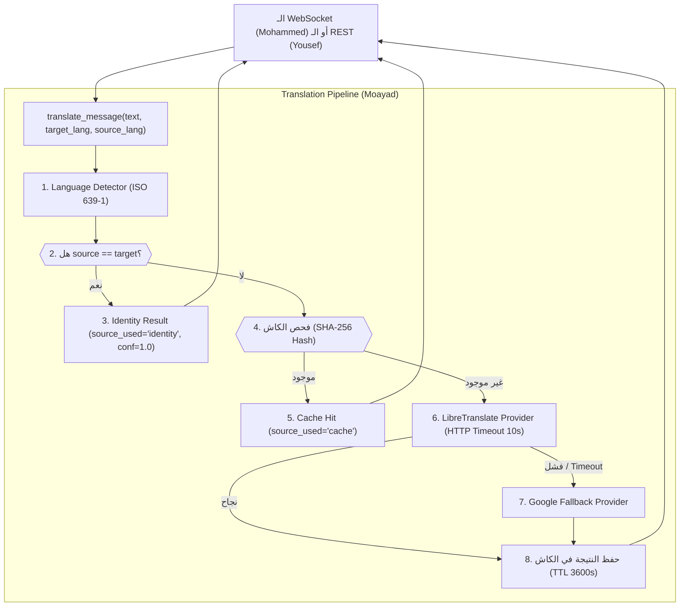
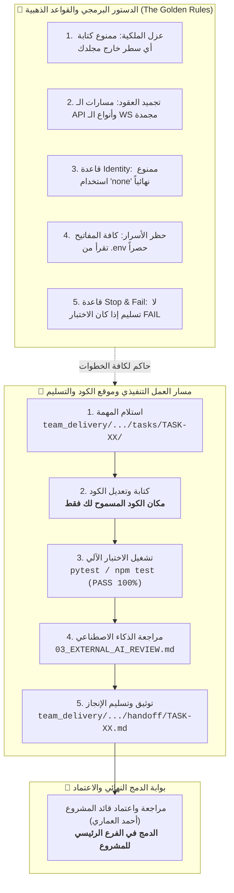
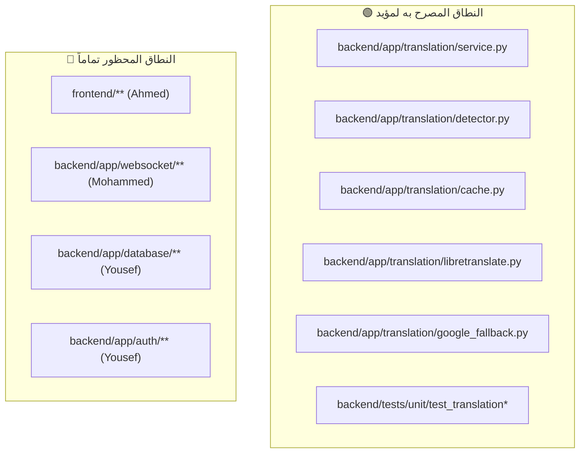
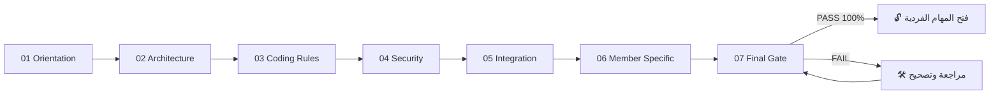
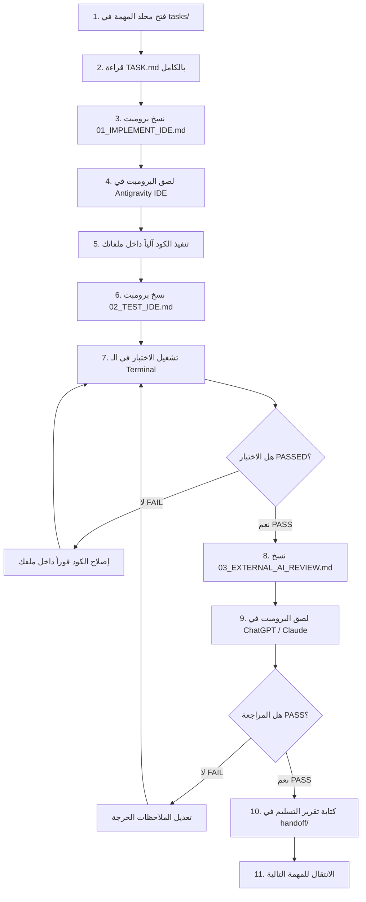
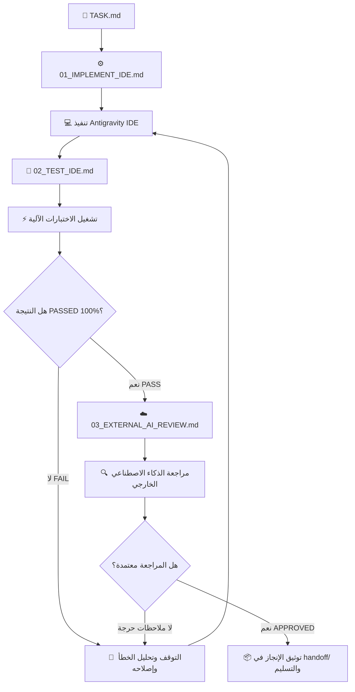
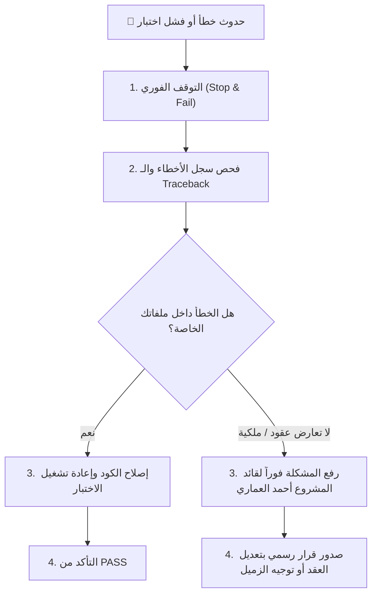
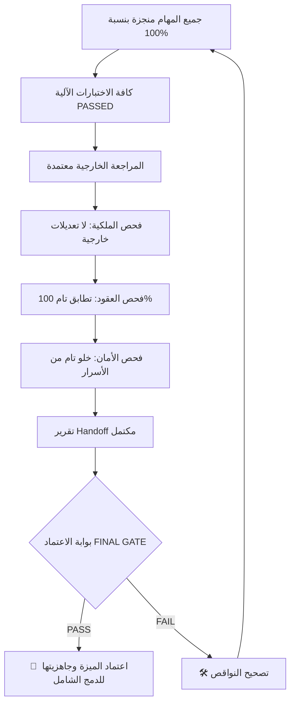

# 📘 دليل العمل الكامل — مؤيد الصوفي (Moayad Al-Soufi)

## 👤 العضو
**مؤيد الصوفي (Moayad Al-Soufi)**

## 🎯 الدور
**مهندس خدمات الترجمة والذكاء الاصطناعي والكاش (Translation & AI Engineer)**

## 📦 نطاق العمل والملكية البرمجية
`backend/app/translation/**, backend/tests/unit/test_translation*, team_delivery/MOAYAD/**`

## 🚦 الحالة الحالية للمهام
- **ما تم إنجازه:** تجهيز البنية التحتية، الفهرسة، وهياكل المهام الـ 9 بالكامل.
- **ما لم يبدأ بعد:** برمجة كاشف اللغات، مزود LibreTranslate، الكاش SHA-256، قاعدة Identity، والمزود الاحتياطي.
- **ما ينتظر أعضاء آخرين:** جاهز للعمل بشكل مستقل تماماً، ويوفر خدماته لمحمد ويوسف.

---

# 📑 فهرس الدليل

1. [🏗️ 1. صورة النظام كاملة](#-1-صورة-النظام-كاملة)
2. [🧭 2. مكان العضو داخل المعمارية](#-2-مكان-العضو-داخل-المعمارية)
3. [📜 3. الميثاق البصري للقواعد الذهبية ومسار التنفيذ والتسليم](#-3-الميثاق-البصري-للقواعد-الذهبية-ومسار-التنفيذ-والتسليم)
4. [🔐 4. حدود الملكية البرمجية](#-4-حدود-الملكية-البرمجية)
5. [📊 5. جدول الحصر التنفيذي لمهام العضو ومكان الكود ومسار التسليم](#-5-جدول-الحصر-التنفيذي-لمهام-العضو-ومكان-الكود-ومسار-التسليم)
6. [📚 6. الملفات المشتركة التي يجب قراءتها](#-6-الملفات-المشتركة-التي-يجب-قراءتها)
7. [🧱 7. مراحل التأسيس المشترك COMMON FOUNDATION](#-7-مراحل-التأسيس-المشترك-common-foundation)
8. [🤖 8. طريقة استخدام Antigravity IDE](#-8-طريقة-استخدام-antigravity-ide)
9. [🔄 9. دورة تنفيذ المهمة الواحدة](#-9-دورة-تنفيذ-المهمة-الواحدة)
10. [🧩 10. شرح المهام تفصيلياً خطوة بخطوة](#-10-شرح-المهام-تفصيلياً-خطوة-بخطوة)
11. [🧪 11. منظومة الاختبارات وطريقة التشغيل](#-11-منظومة-الاختبارات-وطريقة-التشغيل)
12. [🛡️ 12. الضوابط والمتطلبات الأمنية](#-12-الضوابط-والمتطلبات-الأمنية)
13. [🔌 13. مصفوفة التكامل والاعتمادية مع بقية الفريق](#-13-مصفوفة-التكامل-والاعتمادية-مع-بقية-الفريق)
14. [🚨 14. الحالات الحدية والمشاكل المحتملة](#-14-الحالات-الحدية-والمشاكل-المحتملة)
15. [🛑 15. بروتوكول التصعيد والتعامل مع الأخطاء](#-15-بروتوكول-التصعيد-والتعامل-مع-الأخطاء)
16. [📦 16. بروتوكول التسليم والاعتماد النهائي](#-16-بروتوكول-التسليم-والاعتماد-النهائي)
17. [📊 17. لوحة تتبع الإنجاز (Progress Tracker)](#-17-لوحة-تتبع-الإنجاز-progress-tracker)
18. [🏁 18. بوابة الاعتماد النهائي (FINAL GATE)](#-18-بوابة-الاعتماد-النهائي-final-gate)

---

# 🏗️ 1. صورة النظام كاملة

مشروع **LinguaChat** هو منصة محادثة جماعية فورية متعددة اللغات قائمة على معمارية معزولة تعتمد على FastAPI في الباك إند، React في الواجهة الأمامية، LibreTranslate لخدمات الترجمة الذكية، و PostgreSQL لحفظ البيانات.

### المشكلة التي يحلها النظام:
إتاحة المحادثة الفورية السلسة بين أشخاص يتحدثون لغات مختلفة، بحيث يكتب كل مستخدم بلغته الأم، ويستلم بقية الأعضاء الرسالة مترجمة تلقائياً إلى لغاتهم المفضلة في أجزاء من الثانية.



---

# 🧭 2. مكان العضو داخل المعمارية

```mermaid
flowchart LR
    MOAYAD["مؤيد الصوفي (Translation Lead)"]
    subgraph OWNED["نطاق الملكية"]
        SERVICE["backend/app/translation/service.py"]
        DETECTOR["backend/app/translation/detector.py"]
        CACHE["backend/app/translation/cache.py"]
        LIBRE["backend/app/translation/libretranslate.py"]
        FALLBACK["backend/app/translation/google_fallback.py"]
        EXCEPTIONS["backend/app/translation/exceptions.py"]
        TESTS["backend/tests/unit/test_translation*"]
    end
    MOAYAD --> OWNED
    OWNED -->|translate_message| MOHAMMED_WS["بث الرسائل المترجمة لمحمد"]
    OWNED -->|Translation Pipeline| YOUSEF_HIST["حفظ واسترجاع الرسائل ليوسف"]
```



---

# 📜 3. الميثاق البصري للقواعد الذهبية ومسار التنفيذ والتسليم

> 💡 **خريطة الطريق:** يوضح المخطط أدناه القواعد الصارمة الحاكمة لعملك، ومكان كتابة الكود، وكيفية فحص واختبار المهمة، وأين يتم تسليم التقرير النهائي تمهيداً للدمج في الفرع الرئيسي:



---

# 🔐 4. حدود الملكية البرمجية

> ⚠️ **تنبيه صارم:** لا يحق لك كتابة أو تعديل أي سطر برمجي خارج نطاق ملكيتك المباشرة المبينة في الجدول أدناه.

| المسار البرمجي | الحالة الرسمية | الشرح والمسؤولية |
|---|---|---|
| `backend/app/translation/**` | 🟢 مسموح ومملوك بالكامل | تطوير محرك الترجمة، الكاش، كاشف اللغات، والمزودات |
| `backend/tests/unit/test_translation*` | 🟢 مسموح | اختبارات محرك الترجمة والكاش وقاعدة Identity |
| `team_delivery/MOAYAD/**` | 🟢 مسموح | تقارير التسليم والمراجعات الخاصة بمؤيد |
| `frontend/**` | 🔴 ممنوع منعاً باتاً | ملكية أحمد العماري |
| `backend/app/websocket/**` | 🔴 ممنوع منعاً باتاً | ملكية محمد الداعس |
| `backend/app/database/**` | 🔴 ممنوع منعاً باتاً | ملكية يوسف خيري |
| `_TEAM/00_SHARED/**` | 🟡 قراءة فقط | العقود الرسمية المشتركة |



---

# 📊 5. جدول الحصر التنفيذي لمهام العضو ومكان الكود ومسار التسليم

> 🎯 **جدول الإدارة السريع:** يلخص هذا الجدول لكافة المهام: رقم المهمة، الهدف الهندسي، مكان الملفات المستهدفة بالكود، أمر الاختبار المطلوب، ومسار تسليم التقرير النهائي في `handoff/`:

| # | المهمة | الهدف من المهمة | مكان الكود والملفات المستهدفة | أمر الاختبار | مسار التسليم بعد الإنجاز |
|---|---|---|---|---|---|
| 01 | **`TASK-01-TRANSLATION-ANALYSIS`** | دراسة عقد الترجمة TRANSLATION_CONTRACT.md، تحديد واجهات المزودين، وقواعد الكاش وكشف اللغات. | `backend/app/translation/README.md` | `فحص وتشغيل` | `team_delivery/MOAYAD/handoff/TASK-01-TRANSLATION-ANALYSIS.md` |
| 02 | **`TASK-02-LANGUAGE-DETECTION`** | برمجة دالة `detect_language` في detector.py لكشف لغة النص وإرجاع رمز ISO 639-1 (مثل 'ar', 'en', 'fr'). | `backend/app/translation/detector.py` | `pytest backend/tests/unit/test_translation_detector.py` | `team_delivery/MOAYAD/handoff/TASK-02-LANGUAGE-DETECTION.md` |
| 03 | **`TASK-03-LIBRETRANSLATE-PROVIDER`** | إنشاء فئة `LibreTranslateProvider` في libretranslate.py للاتصال بمحرك LibreTranslate عبر HTTP مع Timeout 10s. | `backend/app/translation/libretranslate.py` | `pytest backend/tests/unit/test_translation_libre.py` | `team_delivery/MOAYAD/handoff/TASK-03-LIBRETRANSLATE-PROVIDER.md` |
| 04 | **`TASK-04-GOOGLE-FALLBACK-PROVIDER`** | إنشاء مزود احتياطي `GoogleFallbackProvider` في google_fallback.py للعمل تلقائياً عند فشل المزود الأساسي. | `backend/app/translation/google_fallback.py` | `pytest backend/tests/unit/test_translation_fallback.py` | `team_delivery/MOAYAD/handoff/TASK-04-GOOGLE-FALLBACK-PROVIDER.md` |
| 05 | **`TASK-05-TRANSLATION-CACHE`** | برمجة فئة `TranslationCache` في cache.py لتخزين الترجمات بمفتاح SHA-256 ومدة صلاحية TTL 3600 ثانية. | `backend/app/translation/cache.py` | `pytest backend/tests/unit/test_translation_cache.py` | `team_delivery/MOAYAD/handoff/TASK-05-TRANSLATION-CACHE.md` |
| 06 | **`TASK-06-IDENTITY-TRANSLATION`** | تطبيق قاعدة Identity الصارمة: إذا كانت لغة المصدر هي نفس لغة الهدف (`source == target`)، تُرجع النتيجة فوراً دون استدعاء أي مزود خارجي. | `backend/app/translation/service.py` | `pytest backend/tests/unit/test_translation_identity.py` | `team_delivery/MOAYAD/handoff/TASK-06-IDENTITY-TRANSLATION.md` |
| 07 | **`TASK-07-TRANSLATION-ERROR-HANDLING`** | إنشاء فئات الاستثناءات المخصصة `TranslationError`, `ProviderUnavailableError` وضمان المعالجة المتينة. | `backend/app/translation/exceptions.py`<br>`backend/app/translation/service.py` | `pytest backend/tests/unit/test_translation_errors.py` | `team_delivery/MOAYAD/handoff/TASK-07-TRANSLATION-ERROR-HANDLING.md` |
| 08 | **`TASK-08-TRANSLATION-SERVICE-INTEGRATION`** | بناء الخدمة المركزية `TranslationService` في service.py التي تجمع الكاشف، الكاش، المزود الأساسي، المزود الاحتياطي، وقاعدة Identity. | `backend/app/translation/service.py` | `pytest backend/tests/unit/test_translation_service.py` | `team_delivery/MOAYAD/handoff/TASK-08-TRANSLATION-SERVICE-INTEGRATION.md` |
| 09 | **`TASK-09-TRANSLATION-FINAL-QA`** | تشغيل حزمة اختبارات الترجمة الكاملة، التحقق من تغطية 100%، وتأكيد الامتثال التام لعقد الترجمة والدستور البرمجي. | `backend/tests/unit/test_translation*` | `فحص وتشغيل` | `team_delivery/MOAYAD/handoff/TASK-09-TRANSLATION-FINAL-QA.md` |

---

# 📚 6. الملفات المشتركة التي يجب قراءتها

### 1. يجب قراءته أولاً (Mandatory First)
- **`_TEAM/00_SHARED/TRANSLATION_CONTRACT.md`**: العقد الحاكم لخدمات الترجمة والكاش وقيم `source_used`.
- **`_TEAM/00_SHARED/PROJECT_CONSTITUTION.md`**: الدستور البرمجي وقاعدة حظر القيمة `"none"`.

### 2. يجب قراءته قبل التنفيذ (Before Implementation)
- **`_TEAM/00_SHARED/CODING_RULES.md`**: معايير استدعاءات HTTP غير المتزامنة والـ Timeouts.
- **`_TEAM/00_SHARED/INTEGRATION_RULES.md`**: نموذج الكائن العائد من دالة `translate_message`.

### 3. مرجع مستمر أثناء العمل (Ongoing Reference)
- **`_TEAM/00_SHARED/DELIVERY_RULES.md`**: معايير فحص واختبار الترجمة.

---

# 🧱 7. مراحل التأسيس المشترك COMMON FOUNDATION

قبل البدء في تنفيذ المهام الفردية، يمر العضو بمراحل التأسيس السبع لضمان استيعاب كافة القواعد والعقود:



- **01 Orientation:** استيعاب دور الترجمة الذكية كجوهر لمنصة LinguaChat.
- **02 Architecture:** تسلسل خط الأنابيب Pipeline وسرعة الاستجابة.
- **03 Coding Rules:** استخدام `httpx.AsyncClient` وضبط المهلة 10s.
- **04 Security:** قراءة روابط ومفاتيح الـ API من متغيرات البيئة.
- **05 Integration:** الالتزام الصارم بالقيم الأربع لمصدر الترجمة: `["libretranslate", "google", "cache", "identity"]`.
- **06 Translation Specific:** التطبيق الحتمي لقاعدة Identity عند تطابق اللغات.
- **07 Final Gate:** نجاح كافة اختبارات `pytest backend/tests/unit/test_translation*`.

---

# 🤖 8. طريقة استخدام Antigravity IDE

اتبع هذا الدليل التفاعلي خطوة بخطوة عند تنفيذ أي مهمة داخل الـ IDE:



### الخطوات التفصيلية للعمل:
1. **افتح مجلد المهمة:** توجه إلى `team_delivery/MOAYAD/tasks/<TASK_ID>/`.
2. **اقرأ ملف `TASK.md`:** افهم الهدف، الملفات المسموحة والمحظورة، وشروط النجاح.
3. **انسخ محتوى `01_IMPLEMENT_IDE.md` بالكامل:** أرسله لمحادثة Antigravity IDE.
4. **دع الـ IDE ينفذ الكود:** راقب التعديلات وتأكد أنها تمت فقط داخل ملفاتك المصرحة.
5. **افتح `02_TEST_IDE.md`:** انسخ أمر الاختبار وشغله في الـ Terminal.
6. **تحقق من النتيجة:** ممنوع الانتقال إذا كانت النتيجة `FAIL`. أصلح الكود حتى يصبح `PASSED` باللون الأخضر.
7. **افتح `03_EXTERNAL_AI_REVIEW.md`:** انسخ البرومبت وافحصه عبر ذكاء اصطناعي خارجي مستقل.
8. **وثق الإنجاز:** أنشئ تقرير المهمة في مجلد `handoff/` وانتقل للمهمة التالية.

---

# 🔄 9. دورة تنفيذ المهمة الواحدة



---

# 🧩 10. شرح المهام تفصيلياً خطوة بخطوة

### 📌 TASK-01-TRANSLATION-ANALYSIS — تحليل متطلبات الترجمة والذكاء الاصطناعي وهيكلية الكاش

#### 🎯 الهدف الأساسي
دراسة عقد الترجمة TRANSLATION_CONTRACT.md، تحديد واجهات المزودين، وقواعد الكاش وكشف اللغات.

#### 📁 مكان الكود والملفات التي سيتم تعديلها (Code Location)
- `backend/app/translation/README.md`

#### 📄 الملفات المتوقع إنشاؤها
- `team_delivery/MOAYAD/reviews/TASK-01-ANALYSIS-REPORT.md`

#### 🔒 الملفات الممنوع لمسها أو تعديلها
- `frontend/**`
- `backend/app/websocket/**`
- `backend/app/database/**`

#### 🔗 الاعتماديات والعقود المرجعية
- `_TEAM/00_SHARED/TRANSLATION_CONTRACT.md`

#### 🧠 ماذا يجب أن يفهم المطور قبل التنفيذ؟
فهم سلسلة الترجمة: كشف اللغة -> فحص الكاش -> قاعدة Identity -> المزود الأساسي -> المزود الاحتياطي -> تخزين الكاش.

#### ⚙️ ماذا سينفذ Antigravity IDE تلقائياً؟
توثيق معمارية الترجمة وخطة بناء المزودات وتطبيق قاعدة Identity.

#### 🧪 ماذا سيختبر المطور في خطوة الفحص؟
مراجعة تقرير التحليل ومطابقته للعقد الرسمي.

#### ☁️ ماذا ستراجع أداة الذكاء الاصطناعي الخارجية (Cloud AI Review)؟
مراجعة شمولية تقرير التحليل وتأكيد حظر القيمة 'none' قطيعاً.

#### ⚠️ الحالات الحدية والطرفية (Edge Cases)
نصوص بلغات غير مدعومة، رموز تعبيرية، انقطاع المزود الخارجي.

#### 🔐 المتطلبات والضوابط الأمنية
التعامل الآمن مع مفاتيح الـ API وقراءتها من الإعدادات.

#### 🔌 متطلبات التكامل والربط مع الفريق
توفير دالة `translate_message` لمحمد الداعس ويوسف خيري.

#### ✅ شروط النجاح والانتقال للمهمة التالية (Success Criteria)
- [ ] تقرير التحليل مكتمل ومطابق 100% للعقد

#### ❌ متى تتوقف فوراً وتمنع إكمال العمل؟ (Stop & Fail Triggers)
- 🛑 افتراض استخدام القيمة 'none' أو كسر سلسلة الترجمة

#### 📦 مسار التسليم وماذا يتم توثيقه عند الانتهاء (Handoff Destination)
**أين تسلم بعد الإنجاز؟** `team_delivery/MOAYAD/handoff/TASK-01-TRANSLATION-ANALYSIS.md`  
**محتوى التسليم:** تقرير تحليل الترجمة المعتمد.

---

### 📌 TASK-02-LANGUAGE-DETECTION — بناء كاشف لغة النص التلقائي (Language Detection)

#### 🎯 الهدف الأساسي
برمجة دالة `detect_language` في detector.py لكشف لغة النص وإرجاع رمز ISO 639-1 (مثل 'ar', 'en', 'fr').

#### 📁 مكان الكود والملفات التي سيتم تعديلها (Code Location)
- `backend/app/translation/detector.py`

#### 📄 الملفات المتوقع إنشاؤها
- `backend/tests/unit/test_translation_detector.py`

#### 🔒 الملفات الممنوع لمسها أو تعديلها
- `frontend/**`
- `backend/app/websocket/**`

#### 🔗 الاعتماديات والعقود المرجعية
- `_TEAM/00_SHARED/TRANSLATION_CONTRACT.md`

#### 🧠 ماذا يجب أن يفهم المطور قبل التنفيذ؟
التعرف على اللغة بسرعة فائقة دون تعطيل الخادم، وإرجاع 'unknown' في الحالات غير الواضحة دون كسر.

#### ⚙️ ماذا سينفذ Antigravity IDE تلقائياً؟
بناء الكاشف والتعامل مع النصوص القصيرة والرموز التعبيرية.

#### 🧪 ماذا سيختبر المطور في خطوة الفحص؟
تشغيل `pytest backend/tests/unit/test_translation_detector.py`.

#### ☁️ ماذا ستراجع أداة الذكاء الاصطناعي الخارجية (Cloud AI Review)؟
مراجعة دقة الكشف وسرعة الاستجابة.

#### ⚠️ الحالات الحدية والطرفية (Edge Cases)
نصوص تحتوي إيموجي فقط، أرقام فقط، نصوص متعددة اللغات في سطر واحد.

#### 🔐 المتطلبات والضوابط الأمنية
منع أي استثناءات غير معالجة تتسبب في انهيار السيرفر.

#### 🔌 متطلبات التكامل والربط مع الفريق
استخدام الكاشف في خدمة الترجمة لتحديد لغة المصدر عند عدم تحديدها.

#### ✅ شروط النجاح والانتقال للمهمة التالية (Success Criteria)
- [ ] الكاشف يتعرف على اللغات بدقة عالية
- [ ] اختبارات الكاشف تنجح 100%

#### ❌ متى تتوقف فوراً وتمنع إكمال العمل؟ (Stop & Fail Triggers)
- 🛑 رفع أخطاء Unhandled Exceptions عند استقبال نصوص غير اعتيادية

#### 📦 مسار التسليم وماذا يتم توثيقه عند الانتهاء (Handoff Destination)
**أين تسلم بعد الإنجاز؟** `team_delivery/MOAYAD/handoff/TASK-02-LANGUAGE-DETECTION.md`  
**محتوى التسليم:** ملف detector.py واختباراته.

---

### 📌 TASK-03-LIBRETRANSLATE-PROVIDER — بناء مزود الترجمة الأساسي LibreTranslate عبر HTTP

#### 🎯 الهدف الأساسي
إنشاء فئة `LibreTranslateProvider` في libretranslate.py للاتصال بمحرك LibreTranslate عبر HTTP مع Timeout 10s.

#### 📁 مكان الكود والملفات التي سيتم تعديلها (Code Location)
- `backend/app/translation/libretranslate.py`

#### 📄 الملفات المتوقع إنشاؤها
- `backend/tests/unit/test_translation_libre.py`

#### 🔒 الملفات الممنوع لمسها أو تعديلها
- `frontend/**`
- `backend/app/database/**`

#### 🔗 الاعتماديات والعقود المرجعية
- `backend/app/core/config.py`
- `_TEAM/00_SHARED/TRANSLATION_CONTRACT.md`

#### 🧠 ماذا يجب أن يفهم المطور قبل التنفيذ؟
إرسال طلب الترجمة، استلام النتيجة، وإرجاع `source_used='libretranslate'` ومعدل الثقة.

#### ⚙️ ماذا سينفذ Antigravity IDE تلقائياً؟
بناء عميل غير متزامن باستخدام `httpx.AsyncClient` وضبط مهلة 10 ثوانٍ ومعالجة الأخطاء.

#### 🧪 ماذا سيختبر المطور في خطوة الفحص؟
تشغيل `pytest backend/tests/unit/test_translation_libre.py`.

#### ☁️ ماذا ستراجع أداة الذكاء الاصطناعي الخارجية (Cloud AI Review)؟
مراجعة التعامل مع أخطاء الشبكة والـ Timeouts.

#### ⚠️ الحالات الحدية والطرفية (Edge Cases)
خادم LibreTranslate مغلق، استجابة برمز 500، استجابة بطيئة تتجاوز 10 ثوانٍ.

#### 🔐 المتطلبات والضوابط الأمنية
قراءة رابط الخادم ومفتاح API من ملف الإعدادات البيئية.

#### 🔌 متطلبات التكامل والربط مع الفريق
استخدامه كمزود أساسي في خدمة الترجمة العامة.

#### ✅ شروط النجاح والانتقال للمهمة التالية (Success Criteria)
- [ ] المزود يتصل بنجاح ويعالج الأخطاء بانضباط
- [ ] اختبارات المزود تمر 100%

#### ❌ متى تتوقف فوراً وتمنع إكمال العمل؟ (Stop & Fail Triggers)
- 🛑 تعليق الاتصال إلى ما لا نهاية بدون Timeout

#### 📦 مسار التسليم وماذا يتم توثيقه عند الانتهاء (Handoff Destination)
**أين تسلم بعد الإنجاز؟** `team_delivery/MOAYAD/handoff/TASK-03-LIBRETRANSLATE-PROVIDER.md`  
**محتوى التسليم:** ملف libretranslate.py واختباراته.

---

### 📌 TASK-04-GOOGLE-FALLBACK-PROVIDER — بناء مزود الترجمة الاحتياطي (Google Fallback Provider)

#### 🎯 الهدف الأساسي
إنشاء مزود احتياطي `GoogleFallbackProvider` في google_fallback.py للعمل تلقائياً عند فشل المزود الأساسي.

#### 📁 مكان الكود والملفات التي سيتم تعديلها (Code Location)
- `backend/app/translation/google_fallback.py`

#### 📄 الملفات المتوقع إنشاؤها
- `backend/tests/unit/test_translation_fallback.py`

#### 🔒 الملفات الممنوع لمسها أو تعديلها
- `frontend/**`

#### 🔗 الاعتماديات والعقود المرجعية
- `_TEAM/00_SHARED/TRANSLATION_CONTRACT.md`

#### 🧠 ماذا يجب أن يفهم المطور قبل التنفيذ؟
عند تعطل LibreTranslate، يتم التحويل التلقائي للمزود الاحتياطي وإرجاع `source_used='google'`.

#### ⚙️ ماذا سينفذ Antigravity IDE تلقائياً؟
تنفيذ المزود الاحتياطي والتقاط أي أخطاء شبكة لمنع توقف المحادثة.

#### 🧪 ماذا سيختبر المطور في خطوة الفحص؟
تشغيل `pytest backend/tests/unit/test_translation_fallback.py`.

#### ☁️ ماذا ستراجع أداة الذكاء الاصطناعي الخارجية (Cloud AI Review)؟
مراجعة سلاسة التبديل بين المزودات (Failover Mechanism).

#### ⚠️ الحالات الحدية والطرفية (Edge Cases)
فشل كلا المزودين (التحويل التلقائي لتسليم النص الأصلي كخيار أخير).

#### 🔐 المتطلبات والضوابط الأمنية
التعامل الآمن مع استدعاءات الـ Fallback.

#### 🔌 متطلبات التكامل والربط مع الفريق
تكامل مع المحرك المركزي للترجمة.

#### ✅ شروط النجاح والانتقال للمهمة التالية (Success Criteria)
- [ ] التبديل الاحتياطي يعمل بسلاسة عند تعطل المزود الأساسي

#### ❌ متى تتوقف فوراً وتمنع إكمال العمل؟ (Stop & Fail Triggers)
- 🛑 فشل المنظومة بالكامل عند توقف سيرفر الترجمة الأساسي

#### 📦 مسار التسليم وماذا يتم توثيقه عند الانتهاء (Handoff Destination)
**أين تسلم بعد الإنجاز؟** `team_delivery/MOAYAD/handoff/TASK-04-GOOGLE-FALLBACK-PROVIDER.md`  
**محتوى التسليم:** ملف google_fallback.py واختباراته.

---

### 📌 TASK-05-TRANSLATION-CACHE — بناء طبقة التخزين المؤقت للترجمة (Translation Cache)

#### 🎯 الهدف الأساسي
برمجة فئة `TranslationCache` في cache.py لتخزين الترجمات بمفتاح SHA-256 ومدة صلاحية TTL 3600 ثانية.

#### 📁 مكان الكود والملفات التي سيتم تعديلها (Code Location)
- `backend/app/translation/cache.py`

#### 📄 الملفات المتوقع إنشاؤها
- `backend/tests/unit/test_translation_cache.py`

#### 🔒 الملفات الممنوع لمسها أو تعديلها
- `frontend/**`
- `backend/app/database/**`

#### 🔗 الاعتماديات والعقود المرجعية
- `_TEAM/00_SHARED/TRANSLATION_CONTRACT.md`

#### 🧠 ماذا يجب أن يفهم المطور قبل التنفيذ؟
توليد المفتاح من `hash(source_lang + target_lang + text)`، إرجاع النتيجة الفورية وتعيين `source_used='cache'`.

#### ⚙️ ماذا سينفذ Antigravity IDE تلقائياً؟
بناء الكاش مع دعم قاموس الذاكرة In-Memory وتوافق Redis، وتنفيذ الفحص والاسترجاع والتخزين.

#### 🧪 ماذا سيختبر المطور في خطوة الفحص؟
تشغيل `pytest backend/tests/unit/test_translation_cache.py`.

#### ☁️ ماذا ستراجع أداة الذكاء الاصطناعي الخارجية (Cloud AI Review)؟
مراجعة سرعة الاستجابة واستقرار مفاتيح التجزئة SHA-256.

#### ⚠️ الحالات الحدية والطرفية (Edge Cases)
انتهاء مدة الكاش TTL، امتلاء الذاكرة، نصوص متطابقة بمسافات زائدة.

#### 🔐 المتطلبات والضوابط الأمنية
تنظيف النصوص ومنع هجمات التسميم Cache Poisoning.

#### 🔌 متطلبات التكامل والربط مع الفريق
فحص الكاش قبل استدعاء أي مزود خارجي لتوفير الموارد.

#### ✅ شروط النجاح والانتقال للمهمة التالية (Success Criteria)
- [ ] استرجاع الكاش يتم في زمن فوري (0ms)
- [ ] اختبارات الكاش تنجح 100%

#### ❌ متى تتوقف فوراً وتمنع إكمال العمل؟ (Stop & Fail Triggers)
- 🛑 إرجاع قيمة غير معتمدة لمصدر الترجمة

#### 📦 مسار التسليم وماذا يتم توثيقه عند الانتهاء (Handoff Destination)
**أين تسلم بعد الإنجاز؟** `team_delivery/MOAYAD/handoff/TASK-05-TRANSLATION-CACHE.md`  
**محتوى التسليم:** ملف cache.py واختباراته.

---

### 📌 TASK-06-IDENTITY-TRANSLATION — تطبيق قاعدة الترجمة الحتمية (Identity Translation Rule)

#### 🎯 الهدف الأساسي
تطبيق قاعدة Identity الصارمة: إذا كانت لغة المصدر هي نفس لغة الهدف (`source == target`)، تُرجع النتيجة فوراً دون استدعاء أي مزود خارجي.

#### 📁 مكان الكود والملفات التي سيتم تعديلها (Code Location)
- `backend/app/translation/service.py`

#### 📄 الملفات المتوقع إنشاؤها
- `backend/tests/unit/test_translation_identity.py`

#### 🔒 الملفات الممنوع لمسها أو تعديلها
- `استخدام القيمة 'none'`

#### 🔗 الاعتماديات والعقود المرجعية
- `_TEAM/00_SHARED/TRANSLATION_CONTRACT.md`

#### 🧠 ماذا يجب أن يفهم المطور قبل التنفيذ؟
القاعدة الحتمية: `translated_text = original_text`, `source_used = 'identity'`, `confidence = 1.0`. يمنع منعاً باتاً استخدام 'none'.

#### ⚙️ ماذا سينفذ Antigravity IDE تلقائياً؟
وضع فحص تطابق اللغات في أعلى دالة الترجمة لضمان استجابة صفرية التأخير.

#### 🧪 ماذا سيختبر المطور في خطوة الفحص؟
تشغيل `pytest backend/tests/unit/test_translation_identity.py` والتأكد من فحص عدم وجود 'none' نهائياً.

#### ☁️ ماذا ستراجع أداة الذكاء الاصطناعي الخارجية (Cloud AI Review)؟
مراجعة الامتثال المطلق لقاعدة Identity في الدستور البرمجي.

#### ⚠️ الحالات الحدية والطرفية (Edge Cases)
نصوص طويلة مرسلة لنفس لغة المتلقي، اختلاف حالة الأحرف في رموز اللغات ('AR' مقابل 'ar').

#### 🔐 المتطلبات والضوابط الأمنية
حماية موارد الخوادم الخارجية من الطلبات غير الضرورية.

#### 🔌 متطلبات التكامل والربط مع الفريق
توفير النتيجة الفورية لمحمد الداعس في الـ WebSocket.

#### ✅ شروط النجاح والانتقال للمهمة التالية (Success Criteria)
- [ ] قاعدة Identity مطبقة بنسبة 100%
- [ ] حظر تام للقيمة 'none'
- [ ] الاختبارات تنجح بالكامل

#### ❌ متى تتوقف فوراً وتمنع إكمال العمل؟ (Stop & Fail Triggers)
- 🛑 ظهور القيمة 'none' في أي استجابة

#### 📦 مسار التسليم وماذا يتم توثيقه عند الانتهاء (Handoff Destination)
**أين تسلم بعد الإنجاز؟** `team_delivery/MOAYAD/handoff/TASK-06-IDENTITY-TRANSLATION.md`  
**محتوى التسليم:** تنفيذ قاعدة Identity واختباراتها.

---

### 📌 TASK-07-TRANSLATION-ERROR-HANDLING — بناء نظام استثناءات الترجمة والمعالجة الآمنة للأخطاء

#### 🎯 الهدف الأساسي
إنشاء فئات الاستثناءات المخصصة `TranslationError`, `ProviderUnavailableError` وضمان المعالجة المتينة.

#### 📁 مكان الكود والملفات التي سيتم تعديلها (Code Location)
- `backend/app/translation/exceptions.py`
- `backend/app/translation/service.py`

#### 📄 الملفات المتوقع إنشاؤها
- `backend/tests/unit/test_translation_errors.py`

#### 🔒 الملفات الممنوع لمسها أو تعديلها
- `frontend/**`

#### 🔗 الاعتماديات والعقود المرجعية
- `_TEAM/00_SHARED/TRANSLATION_CONTRACT.md`

#### 🧠 ماذا يجب أن يفهم المطور قبل التنفيذ؟
عند حدوث أي فشل في المزودات، يتم التقاط الخطأ وإرجاع النص الأصلي بأمان مع تسجيل الخطأ في الـ Logger.

#### ⚙️ ماذا سينفذ Antigravity IDE تلقائياً؟
بناء هيكل الاستثناءات وكتل الـ try/except الوقائية.

#### 🧪 ماذا سيختبر المطور في خطوة الفحص؟
تشغيل `pytest backend/tests/unit/test_translation_errors.py`.

#### ☁️ ماذا ستراجع أداة الذكاء الاصطناعي الخارجية (Cloud AI Review)؟
مراجعة سلامة التقاط الاستثناءات ومنع أي تعطل للخادم.

#### ⚠️ الحالات الحدية والطرفية (Edge Cases)
أخطاء JSON تالف من المزود الخارجي، انقطاع مفاجئ للإنترنت.

#### 🔐 المتطلبات والضوابط الأمنية
عدم تسريب تفاصيل تقنية حساسة للمستخدم النهائي.

#### 🔌 متطلبات التكامل والربط مع الفريق
توفير استجابة آمنة وموثوقة لطبقة الـ WebSocket.

#### ✅ شروط النجاح والانتقال للمهمة التالية (Success Criteria)
- [ ] النظام متين ولا ينهار عند تعطل الخدمات الخارجية

#### ❌ متى تتوقف فوراً وتمنع إكمال العمل؟ (Stop & Fail Triggers)
- 🛑 ترك أي استثناء غير ممسوك يكسر المحادثة

#### 📦 مسار التسليم وماذا يتم توثيقه عند الانتهاء (Handoff Destination)
**أين تسلم بعد الإنجاز؟** `team_delivery/MOAYAD/handoff/TASK-07-TRANSLATION-ERROR-HANDLING.md`  
**محتوى التسليم:** ملف exceptions.py ونظام معالجة الأخطاء.

---

### 📌 TASK-08-TRANSLATION-SERVICE-INTEGRATION — تجميع خدمة الترجمة المتكاملة (TranslationService Pipeline)

#### 🎯 الهدف الأساسي
بناء الخدمة المركزية `TranslationService` في service.py التي تجمع الكاشف، الكاش، المزود الأساسي، المزود الاحتياطي، وقاعدة Identity.

#### 📁 مكان الكود والملفات التي سيتم تعديلها (Code Location)
- `backend/app/translation/service.py`

#### 📄 الملفات المتوقع إنشاؤها
- `backend/tests/unit/test_translation_service.py`

#### 🔒 الملفات الممنوع لمسها أو تعديلها
- `backend/app/websocket/**`
- `frontend/**`

#### 🔗 الاعتماديات والعقود المرجعية
- `backend/app/translation/detector.py`
- `backend/app/translation/cache.py`
- `backend/app/translation/libretranslate.py`

#### 🧠 ماذا يجب أن يفهم المطور قبل التنفيذ؟
توفير دالة `translate_message(text, target_lang, source_lang=None)` كواجهة موحدة معتمدة لكافة أجزاء النظام.

#### ⚙️ ماذا سينفذ Antigravity IDE تلقائياً؟
تنفيذ التدفق الكامل وإرجاع نموذج الاستجابة المعياري المحتوي على (translated_text, source_language, target_language, source_used, confidence).

#### 🧪 ماذا سيختبر المطور في خطوة الفحص؟
تشغيل `pytest backend/tests/unit/test_translation_service.py`.

#### ☁️ ماذا ستراجع أداة الذكاء الاصطناعي الخارجية (Cloud AI Review)؟
مراجعة شمولية خط الأنابيب Pipeline وسرعة المعالجة.

#### ⚠️ الحالات الحدية والطرفية (Edge Cases)
محادثات متزامنة مكثفة، نصوص متعددة اللغات.

#### 🔐 المتطلبات والضوابط الأمنية
التحقق من صحة المدخلات وتعقيمها.

#### 🔌 متطلبات التكامل والربط مع الفريق
الواجهة البرمجية الأساسية لمحمد الداعس ويوسف خيري.

#### ✅ شروط النجاح والانتقال للمهمة التالية (Success Criteria)
- [ ] خدمة الترجمة المتكاملة تعمل بكفاءة تامة وتمر بجميع مراحل السلسلة

#### ❌ متى تتوقف فوراً وتمنع إكمال العمل؟ (Stop & Fail Triggers)
- 🛑 فشل أي خطوة في خط أنابيب الترجمة

#### 📦 مسار التسليم وماذا يتم توثيقه عند الانتهاء (Handoff Destination)
**أين تسلم بعد الإنجاز؟** `team_delivery/MOAYAD/handoff/TASK-08-TRANSLATION-SERVICE-INTEGRATION.md`  
**محتوى التسليم:** ملف service.py المتكامل واختباراته.

---

### 📌 TASK-09-TRANSLATION-FINAL-QA — الفحص النهائي الشامل واختبارات الجودة للترجمة (Translation Final QA)

#### 🎯 الهدف الأساسي
تشغيل حزمة اختبارات الترجمة الكاملة، التحقق من تغطية 100%، وتأكيد الامتثال التام لعقد الترجمة والدستور البرمجي.

#### 📁 مكان الكود والملفات التي سيتم تعديلها (Code Location)
- `backend/tests/unit/test_translation*`

#### 📄 الملفات المتوقع إنشاؤها
- `team_delivery/MOAYAD/reviews/TRANSLATION_QA_REPORT.md`

#### 🔒 الملفات الممنوع لمسها أو تعديلها
- `frontend/**`
- `backend/app/websocket/**`

#### 🔗 الاعتماديات والعقود المرجعية
- `_TEAM/00_SHARED/DELIVERY_RULES.md`

#### 🧠 ماذا يجب أن يفهم المطور قبل التنفيذ؟
التأكد من جاهزية طبقة الترجمة بنسبة 100% للتسليم والدمج النهائي.

#### ⚙️ ماذا سينفذ Antigravity IDE تلقائياً؟
تشغيل `pytest backend/tests/unit/test_translation*` والتأكد من نجاح كافة الاختبارات.

#### 🧪 ماذا سيختبر المطور في خطوة الفحص؟
تأكيد نجاح 100% PASS لكافة الاختبارات وفحص حظر 'none'.

#### ☁️ ماذا ستراجع أداة الذكاء الاصطناعي الخارجية (Cloud AI Review)؟
مراجعة تقرير الجودة النهائي للترجمة واعتماد المخرجات.

#### ⚠️ الحالات الحدية والطرفية (Edge Cases)
فحص شامل لكافة الحالات الحدية والطرفية.

#### 🔐 المتطلبات والضوابط الأمنية
التأكد من سلامة التعامل مع الإعدادات والمفاتيح.

#### 🔌 متطلبات التكامل والربط مع الفريق
جاهزية تامة للربط مع خادم الـ WebSocket.

#### ✅ شروط النجاح والانتقال للمهمة التالية (Success Criteria)
- [ ] كافة اختبارات الترجمة تمر بنجاح 100% خضراء
- [ ] تقرير QA معتمد

#### ❌ متى تتوقف فوراً وتمنع إكمال العمل؟ (Stop & Fail Triggers)
- 🛑 وجود أي اختبار فاشل أو مخالفة للعقد

#### 📦 مسار التسليم وماذا يتم توثيقه عند الانتهاء (Handoff Destination)
**أين تسلم بعد الإنجاز؟** `team_delivery/MOAYAD/handoff/TASK-09-TRANSLATION-FINAL-QA.md`  
**محتوى التسليم:** تقرير الجودة النهائي للترجمة.

---

---

# 🧪 11. منظومة الاختبارات وطريقة التشغيل

### كيفية تشغيل واختبار محرك الترجمة:
1. **تشغيل كافة اختبارات الترجمة:**
   ```bash
   pytest backend/tests/unit/test_translation* -v
   ```
2. **اختبار قاعدة Identity وحظر 'none':**
   ```bash
   pytest backend/tests/unit/test_translation_identity.py -v
   ```
3. **اختبار الكاش والـ Fallback:**
   ```bash
   pytest backend/tests/unit/test_translation_cache.py backend/tests/unit/test_translation_fallback.py -v
   ```
> 💡 **معيار النجاح (PASS):** نجاح 100% وتأكيد عدم ظهور القيمة المحظورة `"none"` نهائياً في أي سياق.

---

# 🛡️ 12. الضوابط والمتطلبات الأمنية

- **حظر القيمة `"none"`:** يُمنع منعاً باتاً إرجاع القيمة `"none"` في حقل `source_used`؛ القيم المعتمدة حصراً هي: `libretranslate`, `google`, `cache`, `identity`.
- **قاعدة Identity الحتمية:** إذا كان `source_language == target_language`، تُرجع النتيجة فوراً: `source_used = "identity"`, `confidence = 1.0`, `translated_text = original_text`.
- **حظر الأسرار:** قراءة مفاتيح LibreTranslate و Google من `app.core.config.settings`.
- **تأمين الكاش:** تشفير مفاتيح الكاش عبر خوارزمية `SHA-256` وتحديد مدة بقاء TTL 3600 ثانية.

---

# 🔌 13. مصفوفة التكامل والاعتمادية مع بقية الفريق

| العضو | ماذا يحتاج مؤيد منه؟ | ماذا يقدم مؤيد له؟ |
|---|---|---|
| **محمد الداعس** | استدعاء دالة `translate_message` وتمرير معلمات اللغة والنص بشكل سليم | إرجاع كائن الاستجابة المعياري المترجم لبثه للمستخدمين بالـ WebSocket |
| **يوسف خيري** | استدعاء دالة الترجمة عند الرغبة في توليد ترجمات مسبقة للرسائل | توفير واجهة برمجية موحدة للترجمة وتخزين نتائجها في الكاش وقاعدة البيانات |
| **أحمد العماري** | عرض نص الرسالة المترجمة ومصدر الترجمة في واجهة المحادثة | توفير حقول `source_used` و `confidence` لعرضها كشارات في الواجهة |

```mermaid
flowchart LR
    MOAYAD["مؤيد (Translation Engine)"]
    MOHAMMED["محمد (WebSocket)"]
    YOUSEF["يوسف (Messages DB)"]
    AHMED["أحمد (Frontend UI)"]

    MOHAMMED -->|1. translate_message(text, target, source)| MOAYAD
    MOAYAD -->|2. إرجاع كائن الترجمة المعتمد| MOHAMMED
    MOHAMMED -->|3. تمرير الترجمة للحفظ| YOUSEF
    MOHAMMED -->|4. بث الرسالة مع الترجمة| AHMED
```

---

# 🚨 14. الحالات الحدية والمشاكل المحتملة

- **تطابق لغة المصدر والهدف:** تطبيق قاعدة Identity فوراً وإرجاع النتيجة بزمن 0ms وبدون استهلاك كاش أو شبكة.
- **انقطاع خادم LibreTranslate:** التقاط استثناء `httpx.RequestError` والتحويل الفوري لمزود `GoogleFallbackProvider`.
- **تجاوز مهلة الـ 10 ثوانٍ (Timeout):** التقاط `httpx.TimeoutException` وتفعيل الـ Fallback لتجنب تعليق المحادثة الحية.
- **نصوص إيموجي أو أرقام فقط:** الكاشف يعيد `'unknown'` وتقوم الخدمة بإرجاع النص الأصلي بأمان.
- **عدم توفر خادم Redis:** استخدام قاموس الذاكرة In-Memory تلقائياً ككاش مؤقت دون توقف الخدمة.

---

# 🛑 15. بروتوكول التصعيد والتعامل مع الأخطاء

إذا واجهت أي خطأ برمجي أو تعارض أثناء العمل:



> ⚠️ **ممنوع قطيعاً:** محاولة عمل Workaround غير معتمد، أو تعديل ملف زميلك، أو تغيير أسماء حقول العقود لتجاوز الخطأ.

---

# 📦 16. بروتوكول التسليم والاعتماد النهائي

### شروط اعتبار المهمة منتهية وجاهزة للتسليم:
1. **الاختبارات الآلية:** نجاح كافة الاختبارات بنسبة **100% PASS** دون أي تخطٍّ.
2. **المراجعة الخارجية:** اجتياز فحص `03_EXTERNAL_AI_REVIEW.md` بدون ملاحظات حرجة.
3. **عزل التعديلات:** عدم تعديل أي ملف خارج نطاق ملكيتك المعتمد.
4. **خلو الأسرار:** خلو الكود تماماً من أي Hardcoded Keys أو كلمات مرور.
5. **تقرير التسليم:** إنشاء ملف التقرير داخل مجلد `team_delivery/MOAYAD/handoff/`.

---

# 📊 17. لوحة تتبع الإنجاز (Progress Tracker)

| # | المهمة | كود التنفيذ | الاختبار الآلي | المراجعة السحابية | حالة التسليم |
|---|--------|-------------|----------------|-------------------|--------------|
| 01 | `TASK-01-TRANSLATION-ANALYSIS` | ⬜ قيد التنفيذ | ⬜ غير مكتمل | ⬜ بانتظار المراجعة | ⬜ غير مسلم |
| 02 | `TASK-02-LANGUAGE-DETECTION` | ⬜ قيد التنفيذ | ⬜ غير مكتمل | ⬜ بانتظار المراجعة | ⬜ غير مسلم |
| 03 | `TASK-03-LIBRETRANSLATE-PROVIDER` | ⬜ قيد التنفيذ | ⬜ غير مكتمل | ⬜ بانتظار المراجعة | ⬜ غير مسلم |
| 04 | `TASK-04-GOOGLE-FALLBACK-PROVIDER` | ⬜ قيد التنفيذ | ⬜ غير مكتمل | ⬜ بانتظار المراجعة | ⬜ غير مسلم |
| 05 | `TASK-05-TRANSLATION-CACHE` | ⬜ قيد التنفيذ | ⬜ غير مكتمل | ⬜ بانتظار المراجعة | ⬜ غير مسلم |
| 06 | `TASK-06-IDENTITY-TRANSLATION` | ⬜ قيد التنفيذ | ⬜ غير مكتمل | ⬜ بانتظار المراجعة | ⬜ غير مسلم |
| 07 | `TASK-07-TRANSLATION-ERROR-HANDLING` | ⬜ قيد التنفيذ | ⬜ غير مكتمل | ⬜ بانتظار المراجعة | ⬜ غير مسلم |
| 08 | `TASK-08-TRANSLATION-SERVICE-INTEGRATION` | ⬜ قيد التنفيذ | ⬜ غير مكتمل | ⬜ بانتظار المراجعة | ⬜ غير مسلم |
| 09 | `TASK-09-TRANSLATION-FINAL-QA` | ⬜ قيد التنفيذ | ⬜ غير مكتمل | ⬜ بانتظار المراجعة | ⬜ غير مسلم |

---

# 🏁 18. بوابة الاعتماد النهائي (FINAL GATE)



> 🏆 **النتيجة:** بعد اجتياز بوابة الاعتماد، يكون عملك جاهزاً للدمج في الإصدار الرئيسي لمشروع LinguaChat تحت إشراف القائد أحمد العماري.
