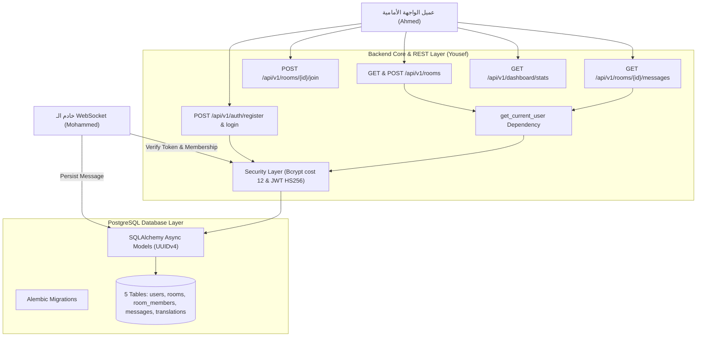
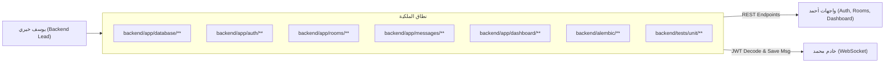
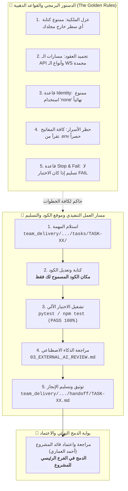
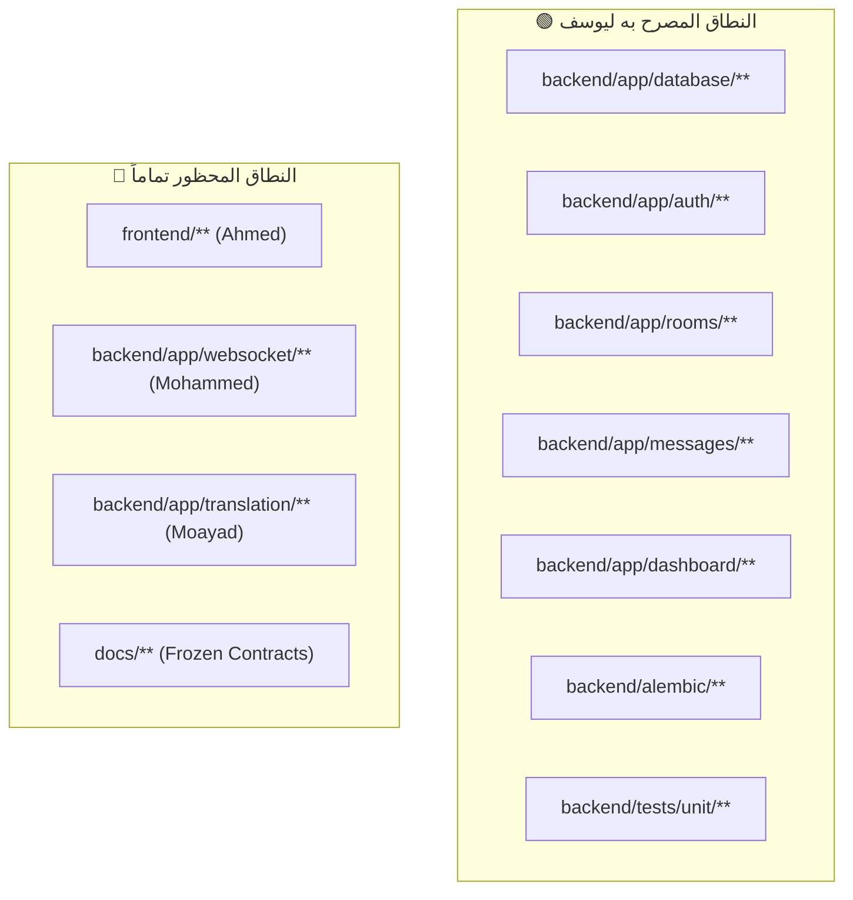
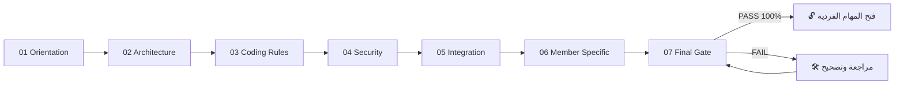
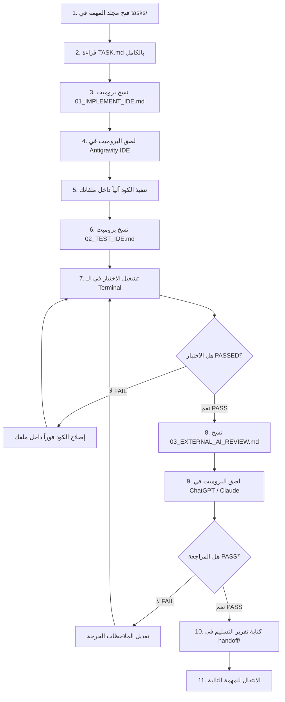
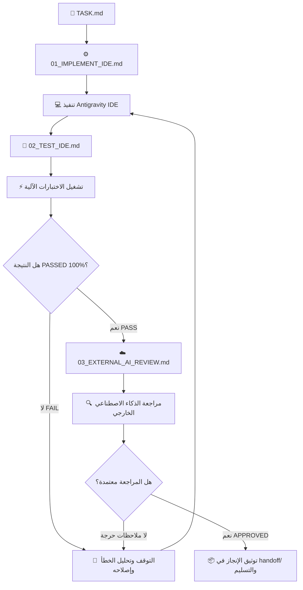
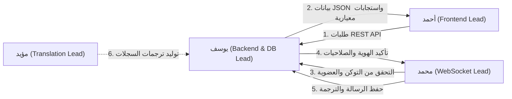
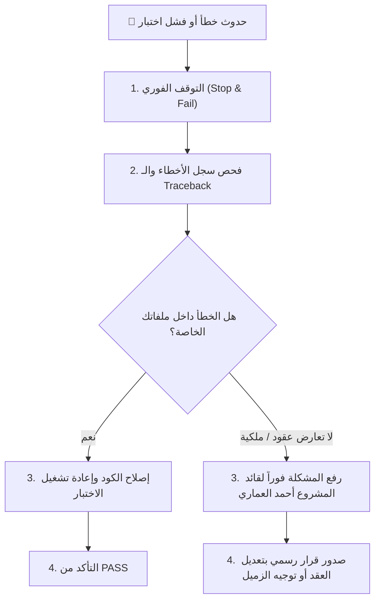
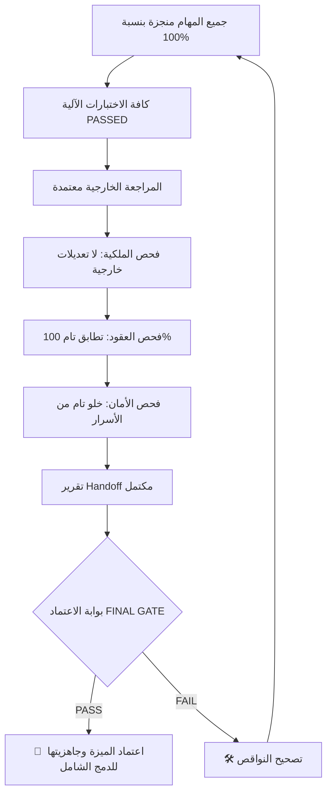

# 📘 دليل العمل الكامل — يوسف خيري (Yousef Khairy)

## 👤 العضو
**يوسف خيري (Yousef Khairy)**

## 🎯 الدور
**مهندس النواة وقواعد البيانات والمصادقة والـ REST API (Backend & Database Lead)**

## 📦 نطاق العمل والملكية البرمجية
`backend/app/database/**, backend/app/auth/**, backend/app/rooms/**, backend/app/messages/**, backend/app/dashboard/**, backend/alembic/**, team_delivery/YOUSEF/**`

## 🚦 الحالة الحالية للمهام
- **ما تم إنجازه:** تجهيز البنية التحتية، الفهرسة، وهياكل المهام الـ 12 بالكامل.
- **ما لم يبدأ بعد:** برمجة نماذج الجداول الخمسة، هجرات Alembic، تشفير Bcrypt/JWT، ومسارات Auth, Rooms, Messages, Dashboard.
- **ما ينتظر أعضاء آخرين:** جاهز للعمل، ويوفر نماذج البيانات ومسارات الـ REST لكافة أعضاء الفريق.

---

# 📑 فهرس الدليل

1. [🏗️ 1. صورة النظام كاملة](#-1-صورة-النظام-كاملة)
2. [🧭 2. مكان العضو داخل المعمارية](#-2-مكان-العضو-داخل-المعمارية)
3. [📜 3. الميثاق البصري للقواعد الذهبية ومسار التنفيذ والتسليم](#-3-الميثاق-البصري-للقواعد-الذهبية-ومسار-التنفيذ-والتسليم)
4. [🔐 4. حدود الملكية البرمجية](#-4-حدود-الملكية-البرمجية)
5. [📊 5. جدول الحصر التنفيذي لمهام العضو ومكان الكود ومسار التسليم](#-5-جدول-الحصر-التنفيذي-لمهام-العضو-ومكان-الكود-ومسار-التسليم)
6. [📚 6. الملفات المشتركة التي يجب قراءتها](#-6-الملفات-المشتركة-التي-يجب-قراءتها)
7. [🧱 7. مراحل التأسيس المشترك COMMON FOUNDATION](#-7-مراحل-التأسيس-المشترك-common-foundation)
8. [🤖 8. طريقة استخدام Antigravity IDE](#-8-طريقة-استخدام-antigravity-ide)
9. [🔄 9. دورة تنفيذ المهمة الواحدة](#-9-دورة-تنفيذ-المهمة-الواحدة)
10. [🧩 10. شرح المهام تفصيلياً خطوة بخطوة](#-10-شرح-المهام-تفصيلياً-خطوة-بخطوة)
11. [🧪 11. منظومة الاختبارات وطريقة التشغيل](#-11-منظومة-الاختبارات-وطريقة-التشغيل)
12. [🛡️ 12. الضوابط والمتطلبات الأمنية](#-12-الضوابط-والمتطلبات-الأمنية)
13. [🔌 13. مصفوفة التكامل والاعتمادية مع بقية الفريق](#-13-مصفوفة-التكامل-والاعتمادية-مع-بقية-الفريق)
14. [🚨 14. الحالات الحدية والمشاكل المحتملة](#-14-الحالات-الحدية-والمشاكل-المحتملة)
15. [🛑 15. بروتوكول التصعيد والتعامل مع الأخطاء](#-15-بروتوكول-التصعيد-والتعامل-مع-الأخطاء)
16. [📦 16. بروتوكول التسليم والاعتماد النهائي](#-16-بروتوكول-التسليم-والاعتماد-النهائي)
17. [📊 17. لوحة تتبع الإنجاز (Progress Tracker)](#-17-لوحة-تتبع-الإنجاز-progress-tracker)
18. [🏁 18. بوابة الاعتماد النهائي (FINAL GATE)](#-18-بوابة-الاعتماد-النهائي-final-gate)

---

# 🏗️ 1. صورة النظام كاملة

مشروع **LinguaChat** هو منصة محادثة جماعية فورية متعددة اللغات قائمة على معمارية معزولة تعتمد على FastAPI في الباك إند، React في الواجهة الأمامية، LibreTranslate لخدمات الترجمة الذكية، و PostgreSQL لحفظ البيانات.

### المشكلة التي يحلها النظام:
إتاحة المحادثة الفورية السلسة بين أشخاص يتحدثون لغات مختلفة، بحيث يكتب كل مستخدم بلغته الأم، ويستلم بقية الأعضاء الرسالة مترجمة تلقائياً إلى لغاتهم المفضلة في أجزاء من الثانية.



---

# 🧭 2. مكان العضو داخل المعمارية



---

# 📜 3. الميثاق البصري للقواعد الذهبية ومسار التنفيذ والتسليم

> 💡 **خريطة الطريق:** يوضح المخطط أدناه القواعد الصارمة الحاكمة لعملك، ومكان كتابة الكود، وكيفية فحص واختبار المهمة، وأين يتم تسليم التقرير النهائي تمهيداً للدمج في الفرع الرئيسي:



---

# 🔐 4. حدود الملكية البرمجية

> ⚠️ **تنبيه صارم:** لا يحق لك كتابة أو تعديل أي سطر برمجي خارج نطاق ملكيتك المباشرة المبينة في الجدول أدناه.

| المسار البرمجي | الحالة الرسمية | الشرح والمسؤولية |
|---|---|---|
| `backend/app/database/**` | 🟢 مسموح ومملوك بالكامل | نماذج الجداول، محرك PostgreSQL، وجلسات AsyncSession |
| `backend/app/auth/**` | 🟢 مسموح ومملوك بالكامل | مسارات التسجيل والدخول وتوابع get_current_user |
| `backend/app/rooms/**` | 🟢 مسموح ومملوك بالكامل | مسارات إنشاء واستعراض والانضمام للغرف |
| `backend/app/messages/**` | 🟢 مسموح ومملوك بالكامل | مسارات استرجاع سجل الرسائل المترجمة التاريخية |
| `backend/app/dashboard/**` | 🟢 مسموح ومملوك بالكامل | مسار إحصائيات النظام ومقاييس الأداء |
| `backend/alembic/**` | 🟢 مسموح ومملوك بالكامل | إدارة هجرات قاعدة البيانات وسكريبتات الترقية |
| `backend/tests/unit/**` | 🟢 مسموح | اختبارات الـ Unit لكافة مسارات ونماذج الباك إند |
| `frontend/**` | 🔴 ممنوع منعاً باتاً | ملكية أحمد العماري |
| `backend/app/websocket/**` | 🔴 ممنوع منعاً باتاً | ملكية محمد الداعس |
| `backend/app/translation/**` | 🔴 ممنوع منعاً باتاً | ملكية مؤيد الصوفي |



---

# 📊 5. جدول الحصر التنفيذي لمهام العضو ومكان الكود ومسار التسليم

> 🎯 **جدول الإدارة السريع:** يلخص هذا الجدول لكافة المهام: رقم المهمة، الهدف الهندسي، مكان الملفات المستهدفة بالكود، أمر الاختبار المطلوب، ومسار تسليم التقرير النهائي في `handoff/`:

| # | المهمة | الهدف من المهمة | مكان الكود والملفات المستهدفة | أمر الاختبار | مسار التسليم بعد الإنجاز |
|---|---|---|---|---|---|
| 01 | **`TASK-01-DATABASE-FOUNDATION`** | إعداد محرك SQLAlchemy غير المتزامن `create_async_engine` في database/session.py وإدارة سياق الجلسات `get_db`. | `backend/app/database/session.py`<br>`backend/app/database/base.py` | `فحص وتشغيل` | `team_delivery/YOUSEF/handoff/TASK-01-DATABASE-FOUNDATION.md` |
| 02 | **`TASK-02-DATABASE-MODELS`** | إنشاء نماذج الجداول الخمسة في models.py: User, Room, RoomMember, Message, MessageTranslation بمعرفات UUIDv4 والفهارس. | `backend/app/database/models.py` | `pytest backend/tests/unit/test_models.py` | `team_delivery/YOUSEF/handoff/TASK-02-DATABASE-MODELS.md` |
| 03 | **`TASK-03-DATABASE-MIGRATIONS`** | ضبط ملفات Alembic (env.py, alembic.ini) وتوليد أول هجرة أولية `001_initial_schema` وتطبيقها على قاعدة البيانات. | `backend/alembic/env.py`<br>`backend/alembic.ini` | `alembic upgrade head` | `team_delivery/YOUSEF/handoff/TASK-03-DATABASE-MIGRATIONS.md` |
| 04 | **`TASK-04-SECURITY-AND-PASSWORD-HASHING`** | برمجة دوال تجزئة كلمات المرور عبر Passlib Bcrypt (cost 12)، وتوليد وفك رموز JWT عبر PyJWT (HS256, 60 min). | `backend/app/core/security.py` | `pytest backend/tests/unit/test_security.py` | `team_delivery/YOUSEF/handoff/TASK-04-SECURITY-AND-PASSWORD-HASHING.md` |
| 05 | **`TASK-05-AUTH-REGISTRATION-API`** | برمجة مسار التسجيل: التحقق من فرادة اسم المستخدم، تشفير كلمة المرور، حفظ السجل، وإرجاع بيانات المستخدم برمز 201 Created. | `backend/app/auth/router.py`<br>`backend/app/auth/service.py` | `pytest backend/tests/unit/test_auth_register.py` | `team_delivery/YOUSEF/handoff/TASK-05-AUTH-REGISTRATION-API.md` |
| 06 | **`TASK-06-AUTH-LOGIN-JWT-API`** | برمجة مسار تسجيل الدخول: التحقق من اسم المستخدم وكلمة المرور، وإصدار رمز JWT صالح لمدة 60 دقيقة. | `backend/app/auth/router.py`<br>`backend/app/auth/service.py` | `pytest backend/tests/unit/test_auth_login.py` | `team_delivery/YOUSEF/handoff/TASK-06-AUTH-LOGIN-JWT-API.md` |
| 07 | **`TASK-07-USERS-AUTH-DEPENDENCY`** | إنشاء تابع FastAPI Dependency `get_current_user` لاستخراج الـ Bearer Token، فك تشفيره، وجلب المستخدم من قاعدة البيانات. | `backend/app/auth/dependencies.py` | `pytest backend/tests/unit/test_auth_dependencies.py` | `team_delivery/YOUSEF/handoff/TASK-07-USERS-AUTH-DEPENDENCY.md` |
| 08 | **`TASK-08-ROOMS-MANAGEMENT-API`** | برمجة مسارات إدارة الغرف: إنشاء غرفة جديدة POST /rooms، استعراض الغرف المتاحة GET /rooms، وجلب تفاصيل غرفة GET /rooms/{id}. | `backend/app/rooms/router.py`<br>`backend/app/rooms/service.py` | `pytest backend/tests/unit/test_rooms_api.py` | `team_delivery/YOUSEF/handoff/TASK-08-ROOMS-MANAGEMENT-API.md` |
| 09 | **`TASK-09-ROOM-MEMBERSHIP-API`** | برمجة مسار الانضمام للغرفة POST /rooms/{id}/join، ومسار استعراض الأعضاء GET /rooms/{id}/members. | `backend/app/rooms/router.py`<br>`backend/app/rooms/service.py` | `pytest backend/tests/unit/test_room_members.py` | `team_delivery/YOUSEF/handoff/TASK-09-ROOM-MEMBERSHIP-API.md` |
| 10 | **`TASK-10-MESSAGE-PERSISTENCE-AND-HISTORY-API`** | برمجة مسار جلب سجل الرسائل المترجمة السابقة للغرفة، مع ترقيم الصفحات (limit/offset) والتحقق من العضوية. | `backend/app/messages/router.py`<br>`backend/app/messages/service.py` | `pytest backend/tests/unit/test_messages_history.py` | `team_delivery/YOUSEF/handoff/TASK-10-MESSAGE-PERSISTENCE-AND-HISTORY-API.md` |
| 11 | **`TASK-11-DASHBOARD-STATS-API`** | برمجة مسار الإحصائيات العامة: إجمالي المستخدمين، الغرف، الرسائل، اللغات الأكثر استخداماً، ومعدلات الكاش. | `backend/app/dashboard/router.py`<br>`backend/app/dashboard/service.py` | `pytest backend/tests/unit/test_dashboard_stats.py` | `team_delivery/YOUSEF/handoff/TASK-11-DASHBOARD-STATS-API.md` |
| 12 | **`TASK-12-BACKEND-INTEGRATION-AND-FINAL-QA`** | تشغيل حزمة الاختبارات الشاملة لكافة مسارات الـ REST ونماذج قاعدة البيانات والتأكد من نجاح 100%. | `backend/tests/unit/**` | `فحص وتشغيل` | `team_delivery/YOUSEF/handoff/TASK-12-BACKEND-INTEGRATION-AND-FINAL-QA.md` |

---

# 📚 6. الملفات المشتركة التي يجب قراءتها

### 1. يجب قراءته أولاً (Mandatory First)
- **`_TEAM/00_SHARED/DATABASE_CONTRACT.md`**: العقد الحاكم لنماذج الجداول الخمسة والأنواع والـ UUIDs.
- **`_TEAM/00_SHARED/API_CONTRACT.md`**: العقد الحاكم لمسارات الـ REST API ونماذج الاستجابة الموحدة.

### 2. يجب قراءته قبل التنفيذ (Before Implementation)
- **`_TEAM/00_SHARED/SECURITY_CONTRACT.md`**: معايير تشفير Bcrypt ورموز JWT HS256.
- **`_TEAM/00_SHARED/PROJECT_CONSTITUTION.md`**: قواعد عزل التعديلات وتجميد العقود.

### 3. مرجع مستمر أثناء العمل (Ongoing Reference)
- **`_TEAM/00_SHARED/CODING_RULES.md`**: قواعد الـ Async SQLAlchemy والتعامل مع الجلسات.
- **`_TEAM/00_SHARED/DELIVERY_RULES.md`**: معايير تسليم واختبار الباك إند.

---

# 🧱 7. مراحل التأسيس المشترك COMMON FOUNDATION

قبل البدء في تنفيذ المهام الفردية، يمر العضو بمراحل التأسيس السبع لضمان استيعاب كافة القواعد والعقود:



- **01 Orientation:** استيعاب دور الباك إند كعمود فقري للبيانات والمصادقة في LinguaChat.
- **02 Architecture:** معمارية FastAPI و SQLAlchemy Async ونمط التوجيه الموديلاري.
- **03 Coding Rules:** استخدام الجلسات غير المتزامنة وإغلاقها بأمان مع `async with`.
- **04 Security:** تشفير كلمات المرور بـ Bcrypt cost 12 وحجب `hashed_password` تماماً.
- **05 Integration:** نموذج الاستجابة المعياري `data/error` وتوحيد أكواد الحالة.
- **06 Database Specific:** استخدام هجرات Alembic وتطبيق قيود المفاتيح الأجنبية والـ UUIDs.
- **07 Final Gate:** نجاح كافة اختبارات `pytest backend/tests/unit/` بنسبة 100%.

---

# 🤖 8. طريقة استخدام Antigravity IDE

اتبع هذا الدليل التفاعلي خطوة بخطوة عند تنفيذ أي مهمة داخل الـ IDE:



### الخطوات التفصيلية للعمل:
1. **افتح مجلد المهمة:** توجه إلى `team_delivery/YOUSEF/tasks/<TASK_ID>/`.
2. **اقرأ ملف `TASK.md`:** افهم الهدف، الملفات المسموحة والمحظورة، وشروط النجاح.
3. **انسخ محتوى `01_IMPLEMENT_IDE.md` بالكامل:** أرسله لمحادثة Antigravity IDE.
4. **دع الـ IDE ينفذ الكود:** راقب التعديلات وتأكد أنها تمت فقط داخل ملفاتك المصرحة.
5. **افتح `02_TEST_IDE.md`:** انسخ أمر الاختبار وشغله في الـ Terminal.
6. **تحقق من النتيجة:** ممنوع الانتقال إذا كانت النتيجة `FAIL`. أصلح الكود حتى يصبح `PASSED` باللون الأخضر.
7. **افتح `03_EXTERNAL_AI_REVIEW.md`:** انسخ البرومبت وافحصه عبر ذكاء اصطناعي خارجي مستقل.
8. **وثق الإنجاز:** أنشئ تقرير المهمة في مجلد `handoff/` وانتقل للمهمة التالية.

---

# 🔄 9. دورة تنفيذ المهمة الواحدة



---

# 🧩 10. شرح المهام تفصيلياً خطوة بخطوة

### 📌 TASK-01-DATABASE-FOUNDATION — تأسيس محرك وقاعدة بيانات PostgreSQL وجلسات SQLAlchemy غير المتزامنة

#### 🎯 الهدف الأساسي
إعداد محرك SQLAlchemy غير المتزامن `create_async_engine` في database/session.py وإدارة سياق الجلسات `get_db`.

#### 📁 مكان الكود والملفات التي سيتم تعديلها (Code Location)
- `backend/app/database/session.py`
- `backend/app/database/base.py`

#### 📄 الملفات المتوقع إنشاؤها
- `team_delivery/YOUSEF/reviews/TASK-01-ANALYSIS-REPORT.md`

#### 🔒 الملفات الممنوع لمسها أو تعديلها
- `frontend/**`
- `backend/app/websocket/**`

#### 🔗 الاعتماديات والعقود المرجعية
- `backend/app/core/config.py`
- `_TEAM/00_SHARED/DATABASE_CONTRACT.md`

#### 🧠 ماذا يجب أن يفهم المطور قبل التنفيذ؟
إدارة دورة حياة جلسات قاعدة البيانات غير المتزامنة AsyncSession، والتأكد من إغلاق الجلسات والتراجع عند الأخطاء.

#### ⚙️ ماذا سينفذ Antigravity IDE تلقائياً؟
بناء دالة التزويد `get_db` مع إدارة السياق `async with` والـ rollback التلقائي عند الاستثناءات.

#### 🧪 ماذا سيختبر المطور في خطوة الفحص؟
فحص اتصال محرك قاعدة البيانات وتشغيل اختبارات الاتصال.

#### ☁️ ماذا ستراجع أداة الذكاء الاصطناعي الخارجية (Cloud AI Review)؟
مراجعة إدارة الـ Connection Pool والتعامل مع الجلسات غير المتزامنة.

#### ⚠️ الحالات الحدية والطرفية (Edge Cases)
انقطاع الاتصال بقاعدة البيانات، استعلامات متزامنة متعددة.

#### 🔐 المتطلبات والضوابط الأمنية
حماية بيانات الاتصال بقاعدة البيانات وقراءتها من متغيرات البيئة عبر settings.

#### 🔌 متطلبات التكامل والربط مع الفريق
توفير حقن التبعيات `Depends(get_db)` لكافة مسارات الـ API.

#### ✅ شروط النجاح والانتقال للمهمة التالية (Success Criteria)
- [ ] محرك قاعدة البيانات والجلسات مهيأة بنجاح ومستقرة

#### ❌ متى تتوقف فوراً وتمنع إكمال العمل؟ (Stop & Fail Triggers)
- 🛑 استخدام جلسات متزامنة Synchronous تحظر حلقة FastAPI

#### 📦 مسار التسليم وماذا يتم توثيقه عند الانتهاء (Handoff Destination)
**أين تسلم بعد الإنجاز؟** `team_delivery/YOUSEF/handoff/TASK-01-DATABASE-FOUNDATION.md`  
**محتوى التسليم:** طبقة تأسيس قاعدة البيانات وجلسات العمل.

---

### 📌 TASK-02-DATABASE-MODELS — بناء نماذج الجداول الخمسة SQLAlchemy بالـ UUID والقيود المعيارية

#### 🎯 الهدف الأساسي
إنشاء نماذج الجداول الخمسة في models.py: User, Room, RoomMember, Message, MessageTranslation بمعرفات UUIDv4 والفهارس.

#### 📁 مكان الكود والملفات التي سيتم تعديلها (Code Location)
- `backend/app/database/models.py`

#### 📄 الملفات المتوقع إنشاؤها
- `backend/tests/unit/test_models.py`

#### 🔒 الملفات الممنوع لمسها أو تعديلها
- `frontend/**`
- `backend/app/translation/**`

#### 🔗 الاعتماديات والعقود المرجعية
- `_TEAM/00_SHARED/DATABASE_CONTRACT.md`

#### 🧠 ماذا يجب أن يفهم المطور قبل التنفيذ؟
تطبيق قيود المفاتيح الفريدة Unique، المفاتيح الأجنبية Foreign Keys، الحذف المتسلسل CASCADE، والفهارس Indexes على الحقول الشائعة.

#### ⚙️ ماذا سينفذ Antigravity IDE تلقائياً؟
كتابة نماذج الجداول الخمسة بدقة مطابقة 100% للأسماء والأنواع في عقد DATABASE_CONTRACT.md.

#### 🧪 ماذا سيختبر المطور في خطوة الفحص؟
تشغيل `pytest backend/tests/unit/test_models.py` وفحص إنشاء النماذج والقيود.

#### ☁️ ماذا ستراجع أداة الذكاء الاصطناعي الخارجية (Cloud AI Review)؟
مراجعة العلاقات بين الجداول والفهارس والحذف المتسلسل.

#### ⚠️ الحالات الحدية والطرفية (Edge Cases)
حذف مستخدم أو غرفة مرتبطة برسائل، محاولة إدخال قيم فارغة في حقول إلزامية.

#### 🔐 المتطلبات والضوابط الأمنية
تخزين كلمة المرور المشفرة فقط وعدم وجود أي حقول حساسة مكشوفة.

#### 🔌 متطلبات التكامل والربط مع الفريق
توفير النماذج لكافة خدمات الـ REST والـ WebSocket.

#### ✅ شروط النجاح والانتقال للمهمة التالية (Success Criteria)
- [ ] الجداول الخمسة مبنية بدقة ومطابقة للعقد
- [ ] اختبارات النماذج تنجح 100%

#### ❌ متى تتوقف فوراً وتمنع إكمال العمل؟ (Stop & Fail Triggers)
- 🛑 تغيير أي اسم حقل أو جدول عن العقد الرسمي

#### 📦 مسار التسليم وماذا يتم توثيقه عند الانتهاء (Handoff Destination)
**أين تسلم بعد الإنجاز؟** `team_delivery/YOUSEF/handoff/TASK-02-DATABASE-MODELS.md`  
**محتوى التسليم:** ملف models.py واختباراته.

---

### 📌 TASK-03-DATABASE-MIGRATIONS — إعداد وتوليد هجرات قاعدة البيانات عبر Alembic

#### 🎯 الهدف الأساسي
ضبط ملفات Alembic (env.py, alembic.ini) وتوليد أول هجرة أولية `001_initial_schema` وتطبيقها على قاعدة البيانات.

#### 📁 مكان الكود والملفات التي سيتم تعديلها (Code Location)
- `backend/alembic/env.py`
- `backend/alembic.ini`

#### 📄 الملفات المتوقع إنشاؤها
- `backend/alembic/versions/001_initial_schema.py`

#### 🔒 الملفات الممنوع لمسها أو تعديلها
- `frontend/**`

#### 🔗 الاعتماديات والعقود المرجعية
- `backend/app/database/models.py`

#### 🧠 ماذا يجب أن يفهم المطور قبل التنفيذ؟
إدارة هجرات قاعدة البيانات تلقائياً وتتبع التغييرات في المخطط Schema عبر Alembic.

#### ⚙️ ماذا سينفذ Antigravity IDE تلقائياً؟
ضبط `target_metadata = Base.metadata` في env.py وتوليد ملف الهجرة.

#### 🧪 ماذا سيختبر المطور في خطوة الفحص؟
تشغيل `alembic upgrade head` والتأكد من إنشاء كافة الجداول بنجاح.

#### ☁️ ماذا ستراجع أداة الذكاء الاصطناعي الخارجية (Cloud AI Review)؟
مراجعة سلامة سكريبت الهجرة والـ Upgrade/Downgrade functions.

#### ⚠️ الحالات الحدية والطرفية (Edge Cases)
تضارب هجرات سابقة، عدم تطابق الأنواع في PostgreSQL.

#### 🔐 المتطلبات والضوابط الأمنية
منع التعديلات اليدوية المباشرة على قاعدة البيانات دون هجرات موثقة.

#### 🔌 متطلبات التكامل والربط مع الفريق
تجهيز قاعدة البيانات لاستقبال بيانات المستخدمين والغرف والرسائل.

#### ✅ شروط النجاح والانتقال للمهمة التالية (Success Criteria)
- [ ] الهجرة الأولية مطبقة بنجاح وكافة الجداول منشأة بدقة

#### ❌ متى تتوقف فوراً وتمنع إكمال العمل؟ (Stop & Fail Triggers)
- 🛑 تعديل الجداول يدوياً في DB دون سكريبت migration

#### 📦 مسار التسليم وماذا يتم توثيقه عند الانتهاء (Handoff Destination)
**أين تسلم بعد الإنجاز؟** `team_delivery/YOUSEF/handoff/TASK-03-DATABASE-MIGRATIONS.md`  
**محتوى التسليم:** ملفات Alembic وسكريبت الهجرة المعتمد.

---

### 📌 TASK-04-SECURITY-AND-PASSWORD-HASHING — بناء طبقة التشفير وإدارة كلمات المرور ورموز JWT (Security & Hashing)

#### 🎯 الهدف الأساسي
برمجة دوال تجزئة كلمات المرور عبر Passlib Bcrypt (cost 12)، وتوليد وفك رموز JWT عبر PyJWT (HS256, 60 min).

#### 📁 مكان الكود والملفات التي سيتم تعديلها (Code Location)
- `backend/app/core/security.py`

#### 📄 الملفات المتوقع إنشاؤها
- `backend/tests/unit/test_security.py`

#### 🔒 الملفات الممنوع لمسها أو تعديلها
- `frontend/**`

#### 🔗 الاعتماديات والعقود المرجعية
- `_TEAM/00_SHARED/SECURITY_CONTRACT.md`

#### 🧠 ماذا يجب أن يفهم المطور قبل التنفيذ؟
التحقق من كلمة المرور ومقارنة التجزئة الثابتة زمنياً لمنع Timing Attacks، وتضمين sub و exp في الـ JWT payload.

#### ⚙️ ماذا سينفذ Antigravity IDE تلقائياً؟
تنفيذ دوال `hash_password`, `verify_password`, `create_access_token`, `decode_access_token`.

#### 🧪 ماذا سيختبر المطور في خطوة الفحص؟
تشغيل `pytest backend/tests/unit/test_security.py`.

#### ☁️ ماذا ستراجع أداة الذكاء الاصطناعي الخارجية (Cloud AI Review)؟
مراجعة معايير التشفير وصلاحية التوكن والتحقق الأمني.

#### ⚠️ الحالات الحدية والطرفية (Edge Cases)
كلمات مرور تحتوي رموزاً خاصة، توكن منتهي الصلاحية، توكن مشوه أو مفتاح سري غير صحيح.

#### 🔐 المتطلبات والضوابط الأمنية
استخدام خوارزمية Bcrypt بمعامل تكلفة 12، ومنع تشفير كلمات المرور بخوارزميات ضعيفة كالـ MD5 أو SHA1.

#### 🔌 متطلبات التكامل والربط مع الفريق
توفير دوال الأمان لمسارات المصادقة ولطبقة الـ WebSocket الخاصة بمحمد الداعس.

#### ✅ شروط النجاح والانتقال للمهمة التالية (Success Criteria)
- [ ] التشفير وتوليد وفك الـ JWT يعملان بأمان تام
- [ ] اختبارات الأمان تنجح 100%

#### ❌ متى تتوقف فوراً وتمنع إكمال العمل؟ (Stop & Fail Triggers)
- 🛑 تخزين كلمات مرور مكشوفة أو فك توكن بدون التحقق من التوقيع

#### 📦 مسار التسليم وماذا يتم توثيقه عند الانتهاء (Handoff Destination)
**أين تسلم بعد الإنجاز؟** `team_delivery/YOUSEF/handoff/TASK-04-SECURITY-AND-PASSWORD-HASHING.md`  
**محتوى التسليم:** ملف security.py واختباراته.

---

### 📌 TASK-05-AUTH-REGISTRATION-API — بناء مسار تسجيل الحساب الجديد (POST /api/v1/auth/register)

#### 🎯 الهدف الأساسي
برمجة مسار التسجيل: التحقق من فرادة اسم المستخدم، تشفير كلمة المرور، حفظ السجل، وإرجاع بيانات المستخدم برمز 201 Created.

#### 📁 مكان الكود والملفات التي سيتم تعديلها (Code Location)
- `backend/app/auth/router.py`
- `backend/app/auth/service.py`

#### 📄 الملفات المتوقع إنشاؤها
- `backend/tests/unit/test_auth_register.py`

#### 🔒 الملفات الممنوع لمسها أو تعديلها
- `frontend/**`

#### 🔗 الاعتماديات والعقود المرجعية
- `backend/app/core/security.py`
- `backend/app/database/models.py`
- `_TEAM/00_SHARED/API_CONTRACT.md`

#### 🧠 ماذا يجب أن يفهم المطور قبل التنفيذ؟
استقبال username, password, preferred_language وإرجاع نموذج الاستجابة المعياري مع حجب كلمة المرور.

#### ⚙️ ماذا سينفذ Antigravity IDE تلقائياً؟
بناء نماذج Pydantic للطلب والاستجابة، وفحص وجود المستخدم، وإرجاع كود 409 في حالة التكرار.

#### 🧪 ماذا سيختبر المطور في خطوة الفحص؟
تشغيل `pytest backend/tests/unit/test_auth_register.py`.

#### ☁️ ماذا ستراجع أداة الذكاء الاصطناعي الخارجية (Cloud AI Review)؟
مراجعة دقة نموذج الاستجابة ومطابقة أكواد الأخطاء للعقد.

#### ⚠️ الحالات الحدية والطرفية (Edge Cases)
اسم مستخدم مكرر (409 USERNAME_ALREADY_EXISTS)، حقول ناقصة (422)، كلمة مرور قصيرة.

#### 🔐 المتطلبات والضوابط الأمنية
عدم إرجاع hashed_password في الاستجابة نهائياً.

#### 🔌 متطلبات التكامل والربط مع الفريق
تكامل مع واجهة التسجيل لأحمد العماري.

#### ✅ شروط النجاح والانتقال للمهمة التالية (Success Criteria)
- [ ] مسار التسجيل يعمل بنجاح ويرجع 201 مع الاستجابة المعيارية

#### ❌ متى تتوقف فوراً وتمنع إكمال العمل؟ (Stop & Fail Triggers)
- 🛑 السماح بتسجيل أسماء مستخدمين مكررة

#### 📦 مسار التسليم وماذا يتم توثيقه عند الانتهاء (Handoff Destination)
**أين تسلم بعد الإنجاز؟** `team_delivery/YOUSEF/handoff/TASK-05-AUTH-REGISTRATION-API.md`  
**محتوى التسليم:** مسار التسجيل واختباراته.

---

### 📌 TASK-06-AUTH-LOGIN-JWT-API — بناء مسار تسجيل الدخول وإصدار رمز الدخول (POST /api/v1/auth/login)

#### 🎯 الهدف الأساسي
برمجة مسار تسجيل الدخول: التحقق من اسم المستخدم وكلمة المرور، وإصدار رمز JWT صالح لمدة 60 دقيقة.

#### 📁 مكان الكود والملفات التي سيتم تعديلها (Code Location)
- `backend/app/auth/router.py`
- `backend/app/auth/service.py`

#### 📄 الملفات المتوقع إنشاؤها
- `backend/tests/unit/test_auth_login.py`

#### 🔒 الملفات الممنوع لمسها أو تعديلها
- `frontend/**`

#### 🔗 الاعتماديات والعقود المرجعية
- `backend/app/core/security.py`
- `_TEAM/00_SHARED/API_CONTRACT.md`

#### 🧠 ماذا يجب أن يفهم المطور قبل التنفيذ؟
إرجاع token, token_type='bearer', expires_in=3600، وبيانات المستخدم ولغته المفضلة.

#### ⚙️ ماذا سينفذ Antigravity IDE تلقائياً؟
التحقق من صحة البيانات، وإرجاع كود 401 INVALID_CREDENTIALS عند الخطأ دون كشف ما إذا كان الخطأ في الاسم أو كلمة المرور.

#### 🧪 ماذا سيختبر المطور في خطوة الفحص؟
تشغيل `pytest backend/tests/unit/test_auth_login.py`.

#### ☁️ ماذا ستراجع أداة الذكاء الاصطناعي الخارجية (Cloud AI Review)؟
مراجعة مطابقة استجابة تسجيل الدخول للعقد الرسمي.

#### ⚠️ الحالات الحدية والطرفية (Edge Cases)
مستخدم غير موجود، كلمة مرور خاطئة، حساب معطل.

#### 🔐 المتطلبات والضوابط الأمنية
رسالة خطأ موحدة لمنع User Enumeration Attacks.

#### 🔌 متطلبات التكامل والربط مع الفريق
تكامل مع واجهة تسجيل الدخول لأحمد وعميل الـ API.

#### ✅ شروط النجاح والانتقال للمهمة التالية (Success Criteria)
- [ ] مسار تسجيل الدخول يصدر JWT صالح بنجاح مع كود 200

#### ❌ متى تتوقف فوراً وتمنع إكمال العمل؟ (Stop & Fail Triggers)
- 🛑 إرجاع رسائل خطأ تكشف وجود اسم المستخدم من عدمه

#### 📦 مسار التسليم وماذا يتم توثيقه عند الانتهاء (Handoff Destination)
**أين تسلم بعد الإنجاز؟** `team_delivery/YOUSEF/handoff/TASK-06-AUTH-LOGIN-JWT-API.md`  
**محتوى التسليم:** مسار تسجيل الدخول واختباراته.

---

### 📌 TASK-07-USERS-AUTH-DEPENDENCY — بناء حقن تبعية التوثيق وحماية المسارات (get_current_user Dependency)

#### 🎯 الهدف الأساسي
إنشاء تابع FastAPI Dependency `get_current_user` لاستخراج الـ Bearer Token، فك تشفيره، وجلب المستخدم من قاعدة البيانات.

#### 📁 مكان الكود والملفات التي سيتم تعديلها (Code Location)
- `backend/app/auth/dependencies.py`

#### 📄 الملفات المتوقع إنشاؤها
- `backend/tests/unit/test_auth_dependencies.py`

#### 🔒 الملفات الممنوع لمسها أو تعديلها
- `frontend/**`

#### 🔗 الاعتماديات والعقود المرجعية
- `backend/app/core/security.py`
- `backend/app/database/models.py`

#### 🧠 ماذا يجب أن يفهم المطور قبل التنفيذ؟
حماية مسارات الـ REST من الوصول غير المصرح، ورفع استثناء 401 عند غياب أو تلف التوكن.

#### ⚙️ ماذا سينفذ Antigravity IDE تلقائياً؟
بناء التابع `get_current_user` والتحقق من وجود المستخدم وصلاحية الجلسة.

#### 🧪 ماذا سيختبر المطور في خطوة الفحص؟
تشغيل `pytest backend/tests/unit/test_auth_dependencies.py`.

#### ☁️ ماذا ستراجع أداة الذكاء الاصطناعي الخارجية (Cloud AI Review)؟
مراجعة سلامة حماية المسارات وتطبيق معايير OAuth2 Bearer.

#### ⚠️ الحالات الحدية والطرفية (Edge Cases)
ترويسة Authorization غائبة، توكن غير صالح، مستخدم محذوف من قاعدة البيانات.

#### 🔐 المتطلبات والضوابط الأمنية
عزل المسارات المحمية ومنع أي وصول بدون توكن موثوق.

#### 🔌 متطلبات التكامل والربط مع الفريق
استخدامه لحماية كافة مسارات الغرف والرسائل والإحصائيات.

#### ✅ شروط النجاح والانتقال للمهمة التالية (Success Criteria)
- [ ] التابع يحمي المسارات بكفاءة ويرجع بيانات المستخدم الحالي

#### ❌ متى تتوقف فوراً وتمنع إكمال العمل؟ (Stop & Fail Triggers)
- 🛑 السماح بالوصول لمسار محمي بدون توكن صالح

#### 📦 مسار التسليم وماذا يتم توثيقه عند الانتهاء (Handoff Destination)
**أين تسلم بعد الإنجاز؟** `team_delivery/YOUSEF/handoff/TASK-07-USERS-AUTH-DEPENDENCY.md`  
**محتوى التسليم:** ملف dependencies.py واختباراته.

---

### 📌 TASK-08-ROOMS-MANAGEMENT-API — بناء مسارات إنشاء واستعراض وتفاصيل الغرف (Rooms Management API)

#### 🎯 الهدف الأساسي
برمجة مسارات إدارة الغرف: إنشاء غرفة جديدة POST /rooms، استعراض الغرف المتاحة GET /rooms، وجلب تفاصيل غرفة GET /rooms/{id}.

#### 📁 مكان الكود والملفات التي سيتم تعديلها (Code Location)
- `backend/app/rooms/router.py`
- `backend/app/rooms/service.py`

#### 📄 الملفات المتوقع إنشاؤها
- `backend/tests/unit/test_rooms_api.py`

#### 🔒 الملفات الممنوع لمسها أو تعديلها
- `frontend/**`

#### 🔗 الاعتماديات والعقود المرجعية
- `backend/app/auth/dependencies.py`
- `backend/app/database/models.py`
- `_TEAM/00_SHARED/API_CONTRACT.md`

#### 🧠 ماذا يجب أن يفهم المطور قبل التنفيذ؟
إرجاع قائمة الغرف مع عدد الأعضاء الحاليين وترقيم الصفحات Pagination.

#### ⚙️ ماذا سينفذ Antigravity IDE تلقائياً؟
بناء مسارات الغرف وخدمات الاستعلام مع تصفية الغرف وحساب الأعضاء.

#### 🧪 ماذا سيختبر المطور في خطوة الفحص؟
تشغيل `pytest backend/tests/unit/test_rooms_api.py`.

#### ☁️ ماذا ستراجع أداة الذكاء الاصطناعي الخارجية (Cloud AI Review)؟
مراجعة كفاءة استعلامات قاعدة البيانات وتجنب مشكلة N+1 Queries.

#### ⚠️ الحالات الحدية والطرفية (Edge Cases)
اسم غرفة مكرر (409)، معرف غرفة غير موجود (404 ROOM_NOT_FOUND).

#### 🔐 المتطلبات والضوابط الأمنية
التحقق من هوية منشئ الغرفة عبر get_current_user.

#### 🔌 متطلبات التكامل والربط مع الفريق
تكامل مع شاشات اللوبي والغرف لأحمد العماري.

#### ✅ شروط النجاح والانتقال للمهمة التالية (Success Criteria)
- [ ] مسارات الغرف تعمل بكفاءة وترجع بيانات مطابقة للعقد

#### ❌ متى تتوقف فوراً وتمنع إكمال العمل؟ (Stop & Fail Triggers)
- 🛑 عدم إرجاع رمز 404 عند طلب غرفة غير موجودة

#### 📦 مسار التسليم وماذا يتم توثيقه عند الانتهاء (Handoff Destination)
**أين تسلم بعد الإنجاز؟** `team_delivery/YOUSEF/handoff/TASK-08-ROOMS-MANAGEMENT-API.md`  
**محتوى التسليم:** مسارات إدارة الغرف واختباراتها.

---

### 📌 TASK-09-ROOM-MEMBERSHIP-API — بناء مسار الانضمام والمغادرة واستعراض أعضاء الغرفة (Membership API)

#### 🎯 الهدف الأساسي
برمجة مسار الانضمام للغرفة POST /rooms/{id}/join، ومسار استعراض الأعضاء GET /rooms/{id}/members.

#### 📁 مكان الكود والملفات التي سيتم تعديلها (Code Location)
- `backend/app/rooms/router.py`
- `backend/app/rooms/service.py`

#### 📄 الملفات المتوقع إنشاؤها
- `backend/tests/unit/test_room_members.py`

#### 🔒 الملفات الممنوع لمسها أو تعديلها
- `frontend/**`

#### 🔗 الاعتماديات والعقود المرجعية
- `backend/app/auth/dependencies.py`
- `backend/app/database/models.py`

#### 🧠 ماذا يجب أن يفهم المطور قبل التنفيذ؟
تسجيل عضوية المستخدم في جدول room_members، ومنع تكرار الانضمام (إرجاع 409 ALREADY_MEMBER).

#### ⚙️ ماذا سينفذ Antigravity IDE تلقائياً؟
تنفيذ عمليات الانضمام وجلب قائمة الأعضاء مع أدوارهم ولغاتهم المفضلة.

#### 🧪 ماذا سيختبر المطور في خطوة الفحص؟
تشغيل `pytest backend/tests/unit/test_room_members.py`.

#### ☁️ ماذا ستراجع أداة الذكاء الاصطناعي الخارجية (Cloud AI Review)؟
مراجعة قيود العضوية ومعالجة محاولات الانضمام المتكررة.

#### ⚠️ الحالات الحدية والطرفية (Edge Cases)
انضمام لغرفة محذوفة، انضمام متكرر لنفس الغرفة، استعراض أعضاء غرفة فارغة.

#### 🔐 المتطلبات والضوابط الأمنية
التحقق من هوية العضو ومنع انضمام مستخدم نيابة عن آخر.

#### 🔌 متطلبات التكامل والربط مع الفريق
التحقق من العضوية يستخدمه محمد الداعس قبل قبول اتصال الـ WebSocket.

#### ✅ شروط النجاح والانتقال للمهمة التالية (Success Criteria)
- [ ] مسار الانضمام يسجل العضوية بدقة ويمنع التكرار

#### ❌ متى تتوقف فوراً وتمنع إكمال العمل؟ (Stop & Fail Triggers)
- 🛑 السماح بانضمام مكرر لنفس المستخدم في نفس الغرفة

#### 📦 مسار التسليم وماذا يتم توثيقه عند الانتهاء (Handoff Destination)
**أين تسلم بعد الإنجاز؟** `team_delivery/YOUSEF/handoff/TASK-09-ROOM-MEMBERSHIP-API.md`  
**محتوى التسليم:** مسارات العضوية واختباراتها.

---

### 📌 TASK-10-MESSAGE-PERSISTENCE-AND-HISTORY-API — بناء مسار استرجاع تاريخ الرسائل المترجمة (GET /api/v1/rooms/{id}/messages)

#### 🎯 الهدف الأساسي
برمجة مسار جلب سجل الرسائل المترجمة السابقة للغرفة، مع ترقيم الصفحات (limit/offset) والتحقق من العضوية.

#### 📁 مكان الكود والملفات التي سيتم تعديلها (Code Location)
- `backend/app/messages/router.py`
- `backend/app/messages/service.py`

#### 📄 الملفات المتوقع إنشاؤها
- `backend/tests/unit/test_messages_history.py`

#### 🔒 الملفات الممنوع لمسها أو تعديلها
- `frontend/**`

#### 🔗 الاعتماديات والعقود المرجعية
- `backend/app/auth/dependencies.py`
- `backend/app/database/models.py`
- `_TEAM/00_SHARED/API_CONTRACT.md`

#### 🧠 ماذا يجب أن يفهم المطور قبل التنفيذ؟
استرجاع الرسائل وربطها بالترجمات المخزنة المناسبة للغة المستخدم الطالب للبيانات.

#### ⚙️ ماذا سينفذ Antigravity IDE تلقائياً؟
بناء استعلام الاسترجاع مع الفهرسة والترتيب الزمني وتصفية الترجمات حسب لغة المستخدم.

#### 🧪 ماذا سيختبر المطور في خطوة الفحص؟
تشغيل `pytest backend/tests/unit/test_messages_history.py`.

#### ☁️ ماذا ستراجع أداة الذكاء الاصطناعي الخارجية (Cloud AI Review)؟
مراجعة كفاءة الاستعلام وسرعة استرجاع السجلات التاريخية.

#### ⚠️ الحالات الحدية والطرفية (Edge Cases)
طلب الرسائل من مستخدم غير منضم للغرفة (403 FORBIDDEN)، غرفة بدون رسائل سابقة.

#### 🔐 المتطلبات والضوابط الأمنية
منع أي مستخدم خارج الغرفة من قراءة تاريخ الرسائل.

#### 🔌 متطلبات التكامل والربط مع الفريق
تكامل مع شاشة المحادثة لأحمد عند فتح الغرفة لتحميل السجل السابق.

#### ✅ شروط النجاح والانتقال للمهمة التالية (Success Criteria)
- [ ] استرجاع السجل التاريخي يعمل بدقة وسرعة مع مراعاة لغة المستخدم

#### ❌ متى تتوقف فوراً وتمنع إكمال العمل؟ (Stop & Fail Triggers)
- 🛑 السماح لمستخدم غير عضو بقراءة رسائل الغرفة

#### 📦 مسار التسليم وماذا يتم توثيقه عند الانتهاء (Handoff Destination)
**أين تسلم بعد الإنجاز؟** `team_delivery/YOUSEF/handoff/TASK-10-MESSAGE-PERSISTENCE-AND-HISTORY-API.md`  
**محتوى التسليم:** مسار تاريخ الرسائل واختباراته.

---

### 📌 TASK-11-DASHBOARD-STATS-API — بناء مسار إحصائيات النظام ومقاييس الأداء (GET /api/v1/dashboard/stats)

#### 🎯 الهدف الأساسي
برمجة مسار الإحصائيات العامة: إجمالي المستخدمين، الغرف، الرسائل، اللغات الأكثر استخداماً، ومعدلات الكاش.

#### 📁 مكان الكود والملفات التي سيتم تعديلها (Code Location)
- `backend/app/dashboard/router.py`
- `backend/app/dashboard/service.py`

#### 📄 الملفات المتوقع إنشاؤها
- `backend/tests/unit/test_dashboard_stats.py`

#### 🔒 الملفات الممنوع لمسها أو تعديلها
- `frontend/**`

#### 🔗 الاعتماديات والعقود المرجعية
- `backend/app/database/models.py`
- `_TEAM/00_SHARED/API_CONTRACT.md`

#### 🧠 ماذا يجب أن يفهم المطور قبل التنفيذ؟
استعلامات تجميعية سريعة Aggregate Queries تعيد مؤشرات النظام الحية بصيغة JSON معيارية.

#### ⚙️ ماذا سينفذ Antigravity IDE تلقائياً؟
تنفيذ دوال الحساب الإحصائي وتجميع البيانات في نموذج الاستجابة المعياري.

#### 🧪 ماذا سيختبر المطور في خطوة الفحص؟
تشغيل `pytest backend/tests/unit/test_dashboard_stats.py`.

#### ☁️ ماذا ستراجع أداة الذكاء الاصطناعي الخارجية (Cloud AI Review)؟
مراجعة سرعة الاستعلامات الإحصائية وعدم استهلاك الموارد.

#### ⚠️ الحالات الحدية والطرفية (Edge Cases)
قاعدة بيانات جديدة فارغة (إرجاع أصفار دون أخطاء division by zero).

#### 🔐 المتطلبات والضوابط الأمنية
حماية مسار الإحصائيات عبر التوثيق.

#### 🔌 متطلبات التكامل والربط مع الفريق
تكامل مع شاشة لوحة التحكم Dashboard لأحمد العماري.

#### ✅ شروط النجاح والانتقال للمهمة التالية (Success Criteria)
- [ ] مسار الإحصائيات يعيد مقاييس دقيقة وسريعة

#### ❌ متى تتوقف فوراً وتمنع إكمال العمل؟ (Stop & Fail Triggers)
- 🛑 حدوث خطأ حسابي عند فراغ قاعدة البيانات من السجلات

#### 📦 مسار التسليم وماذا يتم توثيقه عند الانتهاء (Handoff Destination)
**أين تسلم بعد الإنجاز؟** `team_delivery/YOUSEF/handoff/TASK-11-DASHBOARD-STATS-API.md`  
**محتوى التسليم:** مسار الإحصائيات واختباراته.

---

### 📌 TASK-12-BACKEND-INTEGRATION-AND-FINAL-QA — الفحص النهائي الشامل واختبارات تكامل الـ REST وقاعدة البيانات (Backend Final QA)

#### 🎯 الهدف الأساسي
تشغيل حزمة الاختبارات الشاملة لكافة مسارات الـ REST ونماذج قاعدة البيانات والتأكد من نجاح 100%.

#### 📁 مكان الكود والملفات التي سيتم تعديلها (Code Location)
- `backend/tests/unit/**`

#### 📄 الملفات المتوقع إنشاؤها
- `team_delivery/YOUSEF/reviews/BACKEND_QA_REPORT.md`

#### 🔒 الملفات الممنوع لمسها أو تعديلها
- `frontend/**`
- `backend/app/websocket/**`

#### 🔗 الاعتماديات والعقود المرجعية
- `_TEAM/00_SHARED/DELIVERY_RULES.md`

#### 🧠 ماذا يجب أن يفهم المطور قبل التنفيذ؟
التأكد من جاهزية نواة الـ Backend وقاعدة البيانات بنسبة 100% للدمج والتسليم النهائي.

#### ⚙️ ماذا سينفذ Antigravity IDE تلقائياً؟
تشغيل `pytest backend/tests/unit/` والتأكد من خلو النظام من أي خطأ.

#### 🧪 ماذا سيختبر المطور في خطوة الفحص؟
تأكيد نجاح 100% PASS لكافة مسارات المصادقة والغرف والرسائل والإحصائيات.

#### ☁️ ماذا ستراجع أداة الذكاء الاصطناعي الخارجية (Cloud AI Review)؟
مراجعة تقرير الجودة النهائي واعتماد طبقة الـ REST والـ Database.

#### ⚠️ الحالات الحدية والطرفية (Edge Cases)
فحص شامل لكافة الحالات الاستثنائية والـ Edge Cases في الـ REST.

#### 🔐 المتطلبات والضوابط الأمنية
مراجعة أمنية شاملة لكافة المسارات والاعتماديات.

#### 🔌 متطلبات التكامل والربط مع الفريق
جاهزية تامة للربط مع الواجهة الأمامية والـ WebSocket.

#### ✅ شروط النجاح والانتقال للمهمة التالية (Success Criteria)
- [ ] جميع اختبارات الـ Backend تمر بنسبة 100% خضراء
- [ ] تقرير QA معتمد

#### ❌ متى تتوقف فوراً وتمنع إكمال العمل؟ (Stop & Fail Triggers)
- 🛑 وجود أي اختبار فاشل أو تسريب بيانات حساسة

#### 📦 مسار التسليم وماذا يتم توثيقه عند الانتهاء (Handoff Destination)
**أين تسلم بعد الإنجاز؟** `team_delivery/YOUSEF/handoff/TASK-12-BACKEND-INTEGRATION-AND-FINAL-QA.md`  
**محتوى التسليم:** تقرير الجودة النهائي للـ Backend.

---

---

# 🧪 11. منظومة الاختبارات وطريقة التشغيل

### كيفية تشغيل واختبار الباك إند وقاعدة البيانات:
1. **تشغيل كافة اختبارات الـ REST وقاعدة البيانات والأمان:**
   ```bash
   pytest backend/tests/unit/ -v
   ```
2. **اختبار المصادقة والأمان ونماذج الجداول:**
   ```bash
   pytest backend/tests/unit/test_security.py backend/tests/unit/test_auth_*.py backend/tests/unit/test_models.py -v
   ```
3. **تطبيق هجرات قاعدة البيانات:**
   ```bash
   cd backend
   alembic upgrade head
   ```
> 💡 **معيار النجاح (PASS):** نجاح كافة الاختبارات بنسبة **100% PASSED** وتطبيق هجرات Alembic دون أي تضارب.

---

# 🛡️ 12. الضوابط والمتطلبات الأمنية

- **تشفير كلمات المرور:** استخدام خوارزمية Passlib Bcrypt بمعامل تكلفة `rounds=12`.
- **توليد رموز JWT:** استخدام خوارزمية `HS256` مع مدة صلاحية 60 دقيقة وتضمين `sub=user_id` و `exp`.
- **حجب الحقول الحساسة:** منع إرجاع `hashed_password` في أي Response للـ API نهائياً.
- **رسائل أخطاء موحدة:** إرجاع رمز 401 موحد عند فشل الدخول لمنع هجمات تخمين أسماء المستخدمين (User Enumeration).
- **حماية المسارات:** استخدام تابع `get_current_user` للتحقق من صلاحية الجلسة قبل أي عملية على الغرف أو الرسائل.

---

# 🔌 13. مصفوفة التكامل والاعتمادية مع بقية الفريق

| العضو | ماذا يحتاج يوسف منه؟ | ماذا يقدم يوسف له؟ |
|---|---|---|
| **أحمد العماري** | إرسال طلبات الـ REST بتنسيق JSON المعياري مع الـ Bearer Token | توفير مسارات المصادقة، الغرف، العضويات، تاريخ الرسائل، والإحصائيات |
| **محمد الداعس** | تمرير كائنات الرسائل لحفظها في جداول `messages` و `translations` | دوال فك التوكن `decode_access_token`، التحقق من العضوية، وخدمات حفظ الرسائل |
| **مؤيد الصوفي** | توفير دالة الترجمة `translate_message` عند الرغبة في توليد ترجمات مسبقة | تخزين واسترجاع الرسائل المترجمة في قاعدة البيانات وإتاحتها للاستعلام |



---

# 🚨 14. الحالات الحدية والمشاكل المحتملة

- **تسجيل اسم مستخدم مكرر:** إرجاع كود `409 Conflict` مع كود الخطأ `USERNAME_ALREADY_EXISTS`.
- **طلب رسائل غرفة من غير الأعضاء:** إرجاع كود `403 Forbidden` مع كود الخطأ `NOT_ROOM_MEMBER`.
- **طلب غرفة غير موجودة:** إرجاع كود `404 Not Found` مع كود الخطأ `ROOM_NOT_FOUND`.
- **حدوث خطأ أثناء استعلام SQLAlchemy:** تنفيذ `await session.rollback()` تلقائياً لمنع خطأ `PendingRollbackError`.
- **قاعدة بيانات جديدة بدون بيانات سابقة:** مسار الإحصائيات يعيد قيم صفرية بدون أي أخطاء حسابية.

---

# 🛑 15. بروتوكول التصعيد والتعامل مع الأخطاء

إذا واجهت أي خطأ برمجي أو تعارض أثناء العمل:



> ⚠️ **ممنوع قطيعاً:** محاولة عمل Workaround غير معتمد، أو تعديل ملف زميلك، أو تغيير أسماء حقول العقود لتجاوز الخطأ.

---

# 📦 16. بروتوكول التسليم والاعتماد النهائي

### شروط اعتبار المهمة منتهية وجاهزة للتسليم:
1. **الاختبارات الآلية:** نجاح كافة الاختبارات بنسبة **100% PASS** دون أي تخطٍّ.
2. **المراجعة الخارجية:** اجتياز فحص `03_EXTERNAL_AI_REVIEW.md` بدون ملاحظات حرجة.
3. **عزل التعديلات:** عدم تعديل أي ملف خارج نطاق ملكيتك المعتمد.
4. **خلو الأسرار:** خلو الكود تماماً من أي Hardcoded Keys أو كلمات مرور.
5. **تقرير التسليم:** إنشاء ملف التقرير داخل مجلد `team_delivery/YOUSEF/handoff/`.

---

# 📊 17. لوحة تتبع الإنجاز (Progress Tracker)

| # | المهمة | كود التنفيذ | الاختبار الآلي | المراجعة السحابية | حالة التسليم |
|---|--------|-------------|----------------|-------------------|--------------|
| 01 | `TASK-01-DATABASE-FOUNDATION` | ⬜ قيد التنفيذ | ⬜ غير مكتمل | ⬜ بانتظار المراجعة | ⬜ غير مسلم |
| 02 | `TASK-02-DATABASE-MODELS` | ⬜ قيد التنفيذ | ⬜ غير مكتمل | ⬜ بانتظار المراجعة | ⬜ غير مسلم |
| 03 | `TASK-03-DATABASE-MIGRATIONS` | ⬜ قيد التنفيذ | ⬜ غير مكتمل | ⬜ بانتظار المراجعة | ⬜ غير مسلم |
| 04 | `TASK-04-SECURITY-AND-PASSWORD-HASHING` | ⬜ قيد التنفيذ | ⬜ غير مكتمل | ⬜ بانتظار المراجعة | ⬜ غير مسلم |
| 05 | `TASK-05-AUTH-REGISTRATION-API` | ⬜ قيد التنفيذ | ⬜ غير مكتمل | ⬜ بانتظار المراجعة | ⬜ غير مسلم |
| 06 | `TASK-06-AUTH-LOGIN-JWT-API` | ⬜ قيد التنفيذ | ⬜ غير مكتمل | ⬜ بانتظار المراجعة | ⬜ غير مسلم |
| 07 | `TASK-07-USERS-AUTH-DEPENDENCY` | ⬜ قيد التنفيذ | ⬜ غير مكتمل | ⬜ بانتظار المراجعة | ⬜ غير مسلم |
| 08 | `TASK-08-ROOMS-MANAGEMENT-API` | ⬜ قيد التنفيذ | ⬜ غير مكتمل | ⬜ بانتظار المراجعة | ⬜ غير مسلم |
| 09 | `TASK-09-ROOM-MEMBERSHIP-API` | ⬜ قيد التنفيذ | ⬜ غير مكتمل | ⬜ بانتظار المراجعة | ⬜ غير مسلم |
| 10 | `TASK-10-MESSAGE-PERSISTENCE-AND-HISTORY-API` | ⬜ قيد التنفيذ | ⬜ غير مكتمل | ⬜ بانتظار المراجعة | ⬜ غير مسلم |
| 11 | `TASK-11-DASHBOARD-STATS-API` | ⬜ قيد التنفيذ | ⬜ غير مكتمل | ⬜ بانتظار المراجعة | ⬜ غير مسلم |
| 12 | `TASK-12-BACKEND-INTEGRATION-AND-FINAL-QA` | ⬜ قيد التنفيذ | ⬜ غير مكتمل | ⬜ بانتظار المراجعة | ⬜ غير مسلم |

---

# 🏁 18. بوابة الاعتماد النهائي (FINAL GATE)



> 🏆 **النتيجة:** بعد اجتياز بوابة الاعتماد، يكون عملك جاهزاً للدمج في الإصدار الرئيسي لمشروع LinguaChat تحت إشراف القائد أحمد العماري.
